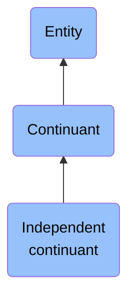

# Independent continuant

## Overview

### Definition
b is an independent continuant =Def b is a continuant & there is no c such that b specifically depends on c or b generically depends on c

### Examples
- An atom; a molecule; an organism; a heart; a chair; the bottom right portion of a human torso; a leg; the interior of your mouth; a spatial region; an orchestra

### Aliases
Not defined.

### URI
http://purl.obolibrary.org/obo/BFO_0000004

### Subclass Of
- continuant: http://purl.obolibrary.org/obo/BFO_0000002

### Ontology Reference
Not defined.

### Hierarchy

## Properties
### Data Properties
### Object Properties
| Label | Definition | Example | Domain | Range | Inverse Of |
|-------|------------|---------|--------|-------|------------|
| [exists at](https://www.commoncoreontologies.org/ont00001928) | (Elucidation) exists at is a relation between a particular and some temporal region at which the particular exists | First World War exists at 1914-1916; Mexico exists at January 1, 2000 | [entity](http://purl.obolibrary.org/obo/BFO_0000001) | [temporal region](http://purl.obolibrary.org/obo/BFO_0000008) |  |
| [continuant part of](https://www.commoncoreontologies.org/ont00001928) | b continuant part of c =Def b and c are continuants & there is some time t such that b and c exist at t & b continuant part of c at t | Milk teeth continuant part of human; surgically removed tumour continuant part of organism | [continuant](http://purl.obolibrary.org/obo/BFO_0000002) | [continuant](http://purl.obolibrary.org/obo/BFO_0000002) | [has continuant part](http://purl.obolibrary.org/obo/BFO_0000178) |
| [has continuant part](https://www.commoncoreontologies.org/ont00001928) | b has continuant part c =Def c continuant part of b |  | [continuant](http://purl.obolibrary.org/obo/BFO_0000002) | [continuant](http://purl.obolibrary.org/obo/BFO_0000002) |  |
| [is output of](https://www.commoncoreontologies.org/ont00001928) | x is_output_of y iff x is an instance of Continuant and y is an instance of Process, such that the presence of x at the end of y is a necessary condition for the completion of y. |  | [continuant](http://purl.obolibrary.org/obo/BFO_0000002) | [process](http://purl.obolibrary.org/obo/BFO_0000015) | [has output](https://www.commoncoreontologies.org/ont00001986) |
| [is input of](https://www.commoncoreontologies.org/ont00001928) | x is_input_of y iff x is an instance of Continuant and y is an instance of Process, such that the presence of x at the beginning of y is a necessary condition for the start of y. |  | [continuant](http://purl.obolibrary.org/obo/BFO_0000002) | [process](http://purl.obolibrary.org/obo/BFO_0000015) | [has input](https://www.commoncoreontologies.org/ont00001921) |
| [is affected by](https://www.commoncoreontologies.org/ont00001928) | x is_affected_by y iff x is an instance of Continuant and y is an instance of Process, and y influences x in some manner, most often by producing a change in x. |  | [continuant](http://purl.obolibrary.org/obo/BFO_0000002) | [process](http://purl.obolibrary.org/obo/BFO_0000015) |  |
| [is successor of](https://www.commoncoreontologies.org/ont00001928) | A continuant c2 is a successor of some continuant c1 iff there is some process p1 and c1 is an input to p1 and c2 is an output of p1. Inverse of is predecessor.  |  | [independent continuant](http://purl.obolibrary.org/obo/BFO_0000004) | [independent continuant](http://purl.obolibrary.org/obo/BFO_0000004) | [is predecessor of](https://www.commoncoreontologies.org/ont00001928) |
| [is predecessor of](https://www.commoncoreontologies.org/ont00001928) | A continuant c1 is a predecessor of some continuant c2 iff there is some process p1 and c1 is an input to p1 and c2 is an output of p1. |  | [independent continuant](http://purl.obolibrary.org/obo/BFO_0000004) | [independent continuant](http://purl.obolibrary.org/obo/BFO_0000004) |  |
