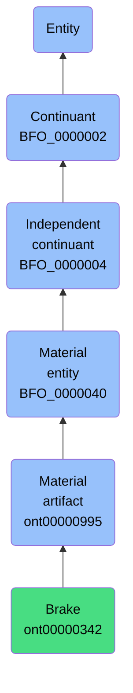

# Brake

## Overview

### Definition
A Material Artifact that is designed to inhibit the Vehicle's Motion by absorbing energy from a moving system.

### Examples
Not defined.

### Aliases
Not defined.

### URI
https://www.commoncoreontologies.org/ont00000342

### Subclass Of
- https://www.commoncoreontologies.org/ont00000995

### Ontology Reference
- https://www.commoncoreontologies.org/ArtifactOntology

### Hierarchy

## Properties
### Data Properties
| Predicate | Domain | Range | Label | Definition | Example |
|-----------|---------|--------|---------|------------|----------|

### Object Properties
| Predicate | Domain | Range | Label | Definition | Example | Inverse Of |
|-----------|---------|--------|---------|------------|----------|------------|
| http://purl.obolibrary.org/obo/BFO_0000108 | ['http://purl.obolibrary.org/obo/BFO_0000001'] | ['http://purl.obolibrary.org/obo/BFO_0000008'] | exists at | (Elucidation) exists at is a relation between a particular and some temporal region at which the particular exists | First World War exists at 1914-1916; Mexico exists at January 1, 2000 | None |
| http://purl.obolibrary.org/obo/BFO_0000115 | ['http://purl.obolibrary.org/obo/BFO_0000040'] | ['http://purl.obolibrary.org/obo/BFO_0000040'] | has member part | b has member part c =Def c member part of b |  | ['http://purl.obolibrary.org/obo/BFO_0000129'] |
| http://purl.obolibrary.org/obo/BFO_0000127 | ['http://purl.obolibrary.org/obo/BFO_0000040'] | ['http://purl.obolibrary.org/obo/BFO_0000016'] | material basis of | b material basis of c =Def c has material basis b |  | ['http://purl.obolibrary.org/obo/BFO_0000218'] |
| http://purl.obolibrary.org/obo/BFO_0000129 | ['http://purl.obolibrary.org/obo/BFO_0000040'] | ['http://purl.obolibrary.org/obo/BFO_0000040'] | member part of | b member part of c =Def b is an object & c is a material entity & there is some time t such that b continuant part of c at t & there is a mutually exhaustive and pairwise disjoint partition of c into objects x1, ..., xn (for some n ≠ 1) with b = xi (for some 1 <= i <= n) |  | None |
| http://purl.obolibrary.org/obo/BFO_0000176 | ['http://purl.obolibrary.org/obo/BFO_0000002'] | ['http://purl.obolibrary.org/obo/BFO_0000002'] | continuant part of | b continuant part of c =Def b and c are continuants & there is some time t such that b and c exist at t & b continuant part of c at t | Milk teeth continuant part of human; surgically removed tumour continuant part of organism | ['http://purl.obolibrary.org/obo/BFO_0000178'] |
| http://purl.obolibrary.org/obo/BFO_0000178 | ['http://purl.obolibrary.org/obo/BFO_0000002'] | ['http://purl.obolibrary.org/obo/BFO_0000002'] | has continuant part | b has continuant part c =Def c continuant part of b |  | None |
| http://purl.obolibrary.org/obo/BFO_0000185 | ['http://purl.obolibrary.org/obo/BFO_0000040'] | ['http://purl.obolibrary.org/obo/BFO_0000182'] | has history | b has history c =Def c history of b | This organism has history this life | None |
| https://www.commoncoreontologies.org/ont00001775 | ['http://purl.obolibrary.org/obo/BFO_0000004'] | ['http://purl.obolibrary.org/obo/BFO_0000004'] | is successor of | A continuant c2 is a successor of some continuant c1 iff there is some process p1 and c1 is an input to p1 and c2 is an output of p1. Inverse of is predecessor.  |  | ['https://www.commoncoreontologies.org/ont00001928'] |
| https://www.commoncoreontologies.org/ont00001816 | ['http://purl.obolibrary.org/obo/BFO_0000002'] | ['http://purl.obolibrary.org/obo/BFO_0000015'] | is output of | x is_output_of y iff x is an instance of Continuant and y is an instance of Process, such that the presence of x at the end of y is a necessary condition for the completion of y. |  | ['https://www.commoncoreontologies.org/ont00001986'] |
| https://www.commoncoreontologies.org/ont00001841 | ['http://purl.obolibrary.org/obo/BFO_0000002'] | ['http://purl.obolibrary.org/obo/BFO_0000015'] | is input of | x is_input_of y iff x is an instance of Continuant and y is an instance of Process, such that the presence of x at the beginning of y is a necessary condition for the start of y. |  | ['https://www.commoncoreontologies.org/ont00001921'] |
| https://www.commoncoreontologies.org/ont00001852 | ['http://purl.obolibrary.org/obo/BFO_0000040'] | ['http://purl.obolibrary.org/obo/BFO_0000015'] | accessory in | y is_accessory_in x iff x is an instance of Process and y is an instance of Agent, such that y assists another agent in the commission of x, and y was not located at the location of x when x occurred, and y was not an agent_in x. |  | ['https://www.commoncoreontologies.org/ont00001949'] |
| https://www.commoncoreontologies.org/ont00001886 | ['http://purl.obolibrary.org/obo/BFO_0000002'] | ['http://purl.obolibrary.org/obo/BFO_0000015'] | is affected by | x is_affected_by y iff x is an instance of Continuant and y is an instance of Process, and y influences x in some manner, most often by producing a change in x. |  | None |
| https://www.commoncoreontologies.org/ont00001895 | ['http://purl.obolibrary.org/obo/BFO_0000040'] | ['http://purl.obolibrary.org/obo/BFO_0000015'] | accomplice in | An agent a1 is accomplice_in some Processual Entity p1 iff a1 assists in the commission of p1, is located at the location of p1, but is not agent_in p1. |  | None |
| https://www.commoncoreontologies.org/ont00001928 | ['http://purl.obolibrary.org/obo/BFO_0000004'] | ['http://purl.obolibrary.org/obo/BFO_0000004'] | is predecessor of | A continuant c1 is a predecessor of some continuant c2 iff there is some process p1 and c1 is an input to p1 and c2 is an output of p1. |  | None |
