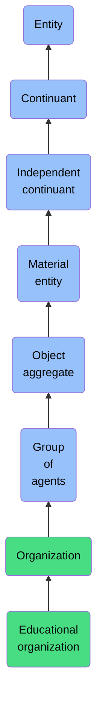

# Educational organization

## Overview

### Definition
An Organization whose primary purpose is to provide training or otherwise facilitate learning or the acquisition of knowledge, Skills, values, beliefs, or habits.

### Examples
Not defined.

### Aliases
Not defined.

### URI
https://www.commoncoreontologies.org/ont00000564

### Subclass Of
- Organization: https://www.commoncoreontologies.org/ont00001180

### Ontology Reference
- https://www.commoncoreontologies.org/AgentOntology

### Hierarchy

## Properties
### Data Properties
### Object Properties
| Label | Definition | Example | Domain | Range | Inverse Of |
|-------|------------|---------|--------|-------|------------|
| [exists at](https://www.commoncoreontologies.org/ont00001956) | (Elucidation) exists at is a relation between a particular and some temporal region at which the particular exists | First World War exists at 1914-1916; Mexico exists at January 1, 2000 | [entity](http://purl.obolibrary.org/obo/BFO_0000001) | [temporal region](http://purl.obolibrary.org/obo/BFO_0000008) |  |
| [continuant part of](https://www.commoncoreontologies.org/ont00001956) | b continuant part of c =Def b and c are continuants & there is some time t such that b and c exist at t & b continuant part of c at t | Milk teeth continuant part of human; surgically removed tumour continuant part of organism | [continuant](http://purl.obolibrary.org/obo/BFO_0000002) | [continuant](http://purl.obolibrary.org/obo/BFO_0000002) | [has continuant part](http://purl.obolibrary.org/obo/BFO_0000178) |
| [has continuant part](https://www.commoncoreontologies.org/ont00001956) | b has continuant part c =Def c continuant part of b |  | [continuant](http://purl.obolibrary.org/obo/BFO_0000002) | [continuant](http://purl.obolibrary.org/obo/BFO_0000002) |  |
| [is output of](https://www.commoncoreontologies.org/ont00001956) | x is_output_of y iff x is an instance of Continuant and y is an instance of Process, such that the presence of x at the end of y is a necessary condition for the completion of y. |  | [continuant](http://purl.obolibrary.org/obo/BFO_0000002) | [process](http://purl.obolibrary.org/obo/BFO_0000015) | [has output](https://www.commoncoreontologies.org/ont00001986) |
| [is input of](https://www.commoncoreontologies.org/ont00001956) | x is_input_of y iff x is an instance of Continuant and y is an instance of Process, such that the presence of x at the beginning of y is a necessary condition for the start of y. |  | [continuant](http://purl.obolibrary.org/obo/BFO_0000002) | [process](http://purl.obolibrary.org/obo/BFO_0000015) | [has input](https://www.commoncoreontologies.org/ont00001921) |
| [is affected by](https://www.commoncoreontologies.org/ont00001956) | x is_affected_by y iff x is an instance of Continuant and y is an instance of Process, and y influences x in some manner, most often by producing a change in x. |  | [continuant](http://purl.obolibrary.org/obo/BFO_0000002) | [process](http://purl.obolibrary.org/obo/BFO_0000015) |  |
| [is successor of](https://www.commoncoreontologies.org/ont00001956) | A continuant c2 is a successor of some continuant c1 iff there is some process p1 and c1 is an input to p1 and c2 is an output of p1. Inverse of is predecessor.  |  | [independent continuant](http://purl.obolibrary.org/obo/BFO_0000004) | [independent continuant](http://purl.obolibrary.org/obo/BFO_0000004) | [is predecessor of](https://www.commoncoreontologies.org/ont00001928) |
| [is predecessor of](https://www.commoncoreontologies.org/ont00001956) | A continuant c1 is a predecessor of some continuant c2 iff there is some process p1 and c1 is an input to p1 and c2 is an output of p1. |  | [independent continuant](http://purl.obolibrary.org/obo/BFO_0000004) | [independent continuant](http://purl.obolibrary.org/obo/BFO_0000004) |  |
| [has member part](https://www.commoncoreontologies.org/ont00001956) | b has member part c =Def c member part of b |  | [material entity](http://purl.obolibrary.org/obo/BFO_0000040) | [material entity](http://purl.obolibrary.org/obo/BFO_0000040) | [member part of](http://purl.obolibrary.org/obo/BFO_0000129) |
| [material basis of](https://www.commoncoreontologies.org/ont00001956) | b material basis of c =Def c has material basis b |  | [material entity](http://purl.obolibrary.org/obo/BFO_0000040) | [disposition](http://purl.obolibrary.org/obo/BFO_0000016) | [has material basis](http://purl.obolibrary.org/obo/BFO_0000218) |
| [member part of](https://www.commoncoreontologies.org/ont00001956) | b member part of c =Def b is an object & c is a material entity & there is some time t such that b continuant part of c at t & there is a mutually exhaustive and pairwise disjoint partition of c into objects x1, ..., xn (for some n ≠ 1) with b = xi (for some 1 <= i <= n) |  | [material entity](http://purl.obolibrary.org/obo/BFO_0000040) | [material entity](http://purl.obolibrary.org/obo/BFO_0000040) |  |
| [has history](https://www.commoncoreontologies.org/ont00001956) | b has history c =Def c history of b | This organism has history this life | [material entity](http://purl.obolibrary.org/obo/BFO_0000040) | [history](http://purl.obolibrary.org/obo/BFO_0000182) |  |
| [accessory in](https://www.commoncoreontologies.org/ont00001956) | y is_accessory_in x iff x is an instance of Process and y is an instance of Agent, such that y assists another agent in the commission of x, and y was not located at the location of x when x occurred, and y was not an agent_in x. |  | [material entity](http://purl.obolibrary.org/obo/BFO_0000040) | [process](http://purl.obolibrary.org/obo/BFO_0000015) | [has accessory](https://www.commoncoreontologies.org/ont00001949) |
| [accomplice in](https://www.commoncoreontologies.org/ont00001956) | An agent a1 is accomplice_in some Processual Entity p1 iff a1 assists in the commission of p1, is located at the location of p1, but is not agent_in p1. |  | [material entity](http://purl.obolibrary.org/obo/BFO_0000040) | [process](http://purl.obolibrary.org/obo/BFO_0000015) |  |
| [has all members located in](https://www.commoncoreontologies.org/ont00001956) | x has all members located in y iff x is an instance of Object Aggregate and y is an instance of independent continuant but not a spatial region, and every member of x is located in y. |  | [object aggregate](http://purl.obolibrary.org/obo/BFO_0000027) | {'and': {'and': ['http://purl.obolibrary.org/obo/BFO_0000004']}} |  |
| [has some member located in](https://www.commoncoreontologies.org/ont00001956) | x has some member located in y iff x is an instance of Object Aggregate and y is an instance of independent continuant but not a spatial region, and at least one member of x is located in y. |  | [object aggregate](http://purl.obolibrary.org/obo/BFO_0000027) | {'and': {'and': ['http://purl.obolibrary.org/obo/BFO_0000004']}} |  |
| [aggregate bearer of](https://www.commoncoreontologies.org/ont00001956) | x aggregate_bearer_of y iff x is an instance of Object Aggregate and y is an instance of Specifically Dependent Continuant and z is an instance of Object, such that z bearer of y, and all other members of x are bearers of a unique instance of the same type as y. |  | [object aggregate](http://purl.obolibrary.org/obo/BFO_0000027) | {'or': {'or': ['http://purl.obolibrary.org/obo/BFO_0000020']}} |  |
| [aggregate has role](https://www.commoncoreontologies.org/ont00001956) | x aggregate_has_role y iff x is an instance of Object Aggregate and y is an instance of Role, such that x aggregate_bearer_of y. |  | [object aggregate](http://purl.obolibrary.org/obo/BFO_0000027) | [role](http://purl.obolibrary.org/obo/BFO_0000023) |  |
| [aggregate has quality](https://www.commoncoreontologies.org/ont00001956) | x aggregate_has_quality y iff x is an instance of Object Aggregate and y is an instance of Quality, such that x aggregate_bearer_of y. |  | [object aggregate](http://purl.obolibrary.org/obo/BFO_0000027) | [quality](http://purl.obolibrary.org/obo/BFO_0000019) |  |
| [aggregate has disposition](https://www.commoncoreontologies.org/ont00001956) | x aggregate_has_disposition y iff x is an instance of Object Aggregate and y is an instance of Disposition, such that x aggregate_bearer_of y. |  | [object aggregate](http://purl.obolibrary.org/obo/BFO_0000027) | [disposition](http://purl.obolibrary.org/obo/BFO_0000016) |  |
| [aggregate has capability](https://www.commoncoreontologies.org/ont00001956) | x aggregate_has_capability y iff x is an instance of Object Aggregate and y is an instance of Agent Capability, such that x is aggregate bearer of y. |  | [Group of Agents](https://www.commoncoreontologies.org/ont00000300) | [Agent Capability](https://www.commoncoreontologies.org/ont00001379) |  |
| [has legal name](https://www.commoncoreontologies.org/ont00001956) | Relates an Organization to its legal name, which is a formally registered designation of the organization. |  | [Organization](https://www.commoncoreontologies.org/ont00001180) | [Legal Name](https://www.commoncoreontologies.org/ont00001331) |  |
| [has ticker](https://www.commoncoreontologies.org/ont00001956) | Relates an Organization to its ticker, which is a unique symbol assigned to a publicly traded company for identification purposes on stock exchanges. |  | [Organization](https://www.commoncoreontologies.org/ont00001180) | [Ticker](http://ontology.naas.ai/abi/Ticker) |  |
| [has website](https://www.commoncoreontologies.org/ont00001956) | Relates an organization to its website. | Microsoft's website, featuring their biography, a gallery of art pieces they've created, and a contact form for inquiries. | [Organization](https://www.commoncoreontologies.org/ont00001180) | [Website](http://ontology.naas.ai/abi/Website) |  |
| [has subsidiary](https://www.commoncoreontologies.org/ont00001956) | An Organization o1 has_subsidiary Organization o2 iff o1 controls o2 by having the capacity to determine the outcome of decisions about o2's financial and operating policies. |  | [Organization](https://www.commoncoreontologies.org/ont00001180) | [Organization](https://www.commoncoreontologies.org/ont00001180) | [is subsidiary of](https://www.commoncoreontologies.org/ont00001815) |
| [is subsidiary of](https://www.commoncoreontologies.org/ont00001956) | An Organization o2 is_subsidiary_of Organization o1 iff o1 controls o2 by having the capacity to determine the outcome of decisions about o2's financial and operating policies.  |  | [Organization](https://www.commoncoreontologies.org/ont00001180) | [Organization](https://www.commoncoreontologies.org/ont00001180) |  |
| [is organizational context of](https://www.commoncoreontologies.org/ont00001956) | x is_organizational_context_of y iff x is an instance of an Organization and y is an instance of a Role and z is an instance of a Person, such that z's affiliation with x is a prerequisite for z bearing y, or x ascribes y to the bearer of y. |  | [Organization](https://www.commoncoreontologies.org/ont00001180) | [role](http://purl.obolibrary.org/obo/BFO_0000023) | [has organizational context](https://www.commoncoreontologies.org/ont00001992) |
| [is delimited by](https://www.commoncoreontologies.org/ont00001956) | An instance of Organization o1 is_delimited_by some Delimiting Domain dd1 iff dd1 is the area within which o1 can legally operate. |  | [Organization](https://www.commoncoreontologies.org/ont00001180) | [Delimiting Domain](https://www.commoncoreontologies.org/ont00001203) | [delimits](https://www.commoncoreontologies.org/ont00001864) |
