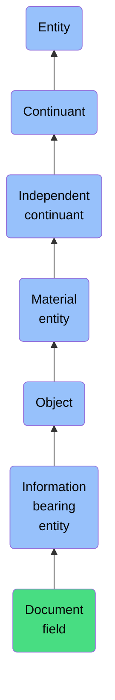

# Document field

## Overview

### Definition
An Information Bearing Entity that is a part of some document into which bearers of prescribed information can be written or selected.

### Examples
Not defined.

### Aliases
Not defined.

### URI
https://www.commoncoreontologies.org/ont00001243

### Subclass Of
- Information Bearing Entity: https://www.commoncoreontologies.org/ont00000253

### Ontology Reference
- https://www.commoncoreontologies.org/ArtifactOntology

### Hierarchy

## Properties
### Data Properties
| Label | Definition | Example | Domain | Range |
|-------|------------|---------|--------|-------|
| [has text value](https://www.commoncoreontologies.org/ont00001773) | A data property that has as its range a string value. |  | [Information Bearing Entity](https://www.commoncoreontologies.org/ont00000253) | [] |
| [has datetime value](https://www.commoncoreontologies.org/ont00001773) | A data property that has as its value a datetime value. |  | [Information Bearing Entity](https://www.commoncoreontologies.org/ont00000253) | ['http://www.w3.org/2001/XMLSchema#dateTime'] |
| [has URI value](https://www.commoncoreontologies.org/ont00001773) | A data property that has as its range a URI value. |  | [Information Bearing Entity](https://www.commoncoreontologies.org/ont00000253) | ['http://www.w3.org/2001/XMLSchema#anyURI'] |
| [has decimal value](https://www.commoncoreontologies.org/ont00001773) | A data property that has as its range a decimal value. |  | [Information Bearing Entity](https://www.commoncoreontologies.org/ont00000253) | ['http://www.w3.org/2001/XMLSchema#decimal'] |
| [has double value](https://www.commoncoreontologies.org/ont00001773) | A data property that has as its range a double value. |  | [Information Bearing Entity](https://www.commoncoreontologies.org/ont00000253) | ['http://www.w3.org/2001/XMLSchema#double'] |
| [has date value](https://www.commoncoreontologies.org/ont00001773) | A data property that has as its range a date value. |  | [Information Bearing Entity](https://www.commoncoreontologies.org/ont00000253) | [] |
| [has boolean value](https://www.commoncoreontologies.org/ont00001773) | A data property that has as its range a boolean value. |  | [Information Bearing Entity](https://www.commoncoreontologies.org/ont00000253) | ['http://www.w3.org/2001/XMLSchema#boolean'] |
| [has integer value](https://www.commoncoreontologies.org/ont00001773) | A data property that has as its range an integer value. |  | [Information Bearing Entity](https://www.commoncoreontologies.org/ont00000253) | ['http://www.w3.org/2001/XMLSchema#integer'] |

### Object Properties
| Label | Definition | Example | Domain | Range | Inverse Of |
|-------|------------|---------|--------|-------|------------|
| [exists at](https://www.commoncoreontologies.org/ont00001991) | (Elucidation) exists at is a relation between a particular and some temporal region at which the particular exists | First World War exists at 1914-1916; Mexico exists at January 1, 2000 | [entity](http://purl.obolibrary.org/obo/BFO_0000001) | [temporal region](http://purl.obolibrary.org/obo/BFO_0000008) |  |
| [continuant part of](https://www.commoncoreontologies.org/ont00001991) | b continuant part of c =Def b and c are continuants & there is some time t such that b and c exist at t & b continuant part of c at t | Milk teeth continuant part of human; surgically removed tumour continuant part of organism | [continuant](http://purl.obolibrary.org/obo/BFO_0000002) | [continuant](http://purl.obolibrary.org/obo/BFO_0000002) | [has continuant part](http://purl.obolibrary.org/obo/BFO_0000178) |
| [has continuant part](https://www.commoncoreontologies.org/ont00001991) | b has continuant part c =Def c continuant part of b |  | [continuant](http://purl.obolibrary.org/obo/BFO_0000002) | [continuant](http://purl.obolibrary.org/obo/BFO_0000002) |  |
| [is output of](https://www.commoncoreontologies.org/ont00001991) | x is_output_of y iff x is an instance of Continuant and y is an instance of Process, such that the presence of x at the end of y is a necessary condition for the completion of y. |  | [continuant](http://purl.obolibrary.org/obo/BFO_0000002) | [process](http://purl.obolibrary.org/obo/BFO_0000015) | [has output](https://www.commoncoreontologies.org/ont00001986) |
| [is input of](https://www.commoncoreontologies.org/ont00001991) | x is_input_of y iff x is an instance of Continuant and y is an instance of Process, such that the presence of x at the beginning of y is a necessary condition for the start of y. |  | [continuant](http://purl.obolibrary.org/obo/BFO_0000002) | [process](http://purl.obolibrary.org/obo/BFO_0000015) | [has input](https://www.commoncoreontologies.org/ont00001921) |
| [is affected by](https://www.commoncoreontologies.org/ont00001991) | x is_affected_by y iff x is an instance of Continuant and y is an instance of Process, and y influences x in some manner, most often by producing a change in x. |  | [continuant](http://purl.obolibrary.org/obo/BFO_0000002) | [process](http://purl.obolibrary.org/obo/BFO_0000015) |  |
| [is successor of](https://www.commoncoreontologies.org/ont00001991) | A continuant c2 is a successor of some continuant c1 iff there is some process p1 and c1 is an input to p1 and c2 is an output of p1. Inverse of is predecessor.  |  | [independent continuant](http://purl.obolibrary.org/obo/BFO_0000004) | [independent continuant](http://purl.obolibrary.org/obo/BFO_0000004) | [is predecessor of](https://www.commoncoreontologies.org/ont00001928) |
| [is predecessor of](https://www.commoncoreontologies.org/ont00001991) | A continuant c1 is a predecessor of some continuant c2 iff there is some process p1 and c1 is an input to p1 and c2 is an output of p1. |  | [independent continuant](http://purl.obolibrary.org/obo/BFO_0000004) | [independent continuant](http://purl.obolibrary.org/obo/BFO_0000004) |  |
| [has member part](https://www.commoncoreontologies.org/ont00001991) | b has member part c =Def c member part of b |  | [material entity](http://purl.obolibrary.org/obo/BFO_0000040) | [material entity](http://purl.obolibrary.org/obo/BFO_0000040) | [member part of](http://purl.obolibrary.org/obo/BFO_0000129) |
| [material basis of](https://www.commoncoreontologies.org/ont00001991) | b material basis of c =Def c has material basis b |  | [material entity](http://purl.obolibrary.org/obo/BFO_0000040) | [disposition](http://purl.obolibrary.org/obo/BFO_0000016) | [has material basis](http://purl.obolibrary.org/obo/BFO_0000218) |
| [member part of](https://www.commoncoreontologies.org/ont00001991) | b member part of c =Def b is an object & c is a material entity & there is some time t such that b continuant part of c at t & there is a mutually exhaustive and pairwise disjoint partition of c into objects x1, ..., xn (for some n ≠ 1) with b = xi (for some 1 <= i <= n) |  | [material entity](http://purl.obolibrary.org/obo/BFO_0000040) | [material entity](http://purl.obolibrary.org/obo/BFO_0000040) |  |
| [has history](https://www.commoncoreontologies.org/ont00001991) | b has history c =Def c history of b | This organism has history this life | [material entity](http://purl.obolibrary.org/obo/BFO_0000040) | [history](http://purl.obolibrary.org/obo/BFO_0000182) |  |
| [accessory in](https://www.commoncoreontologies.org/ont00001991) | y is_accessory_in x iff x is an instance of Process and y is an instance of Agent, such that y assists another agent in the commission of x, and y was not located at the location of x when x occurred, and y was not an agent_in x. |  | [material entity](http://purl.obolibrary.org/obo/BFO_0000040) | [process](http://purl.obolibrary.org/obo/BFO_0000015) | [has accessory](https://www.commoncoreontologies.org/ont00001949) |
| [accomplice in](https://www.commoncoreontologies.org/ont00001991) | An agent a1 is accomplice_in some Processual Entity p1 iff a1 assists in the commission of p1, is located at the location of p1, but is not agent_in p1. |  | [material entity](http://purl.obolibrary.org/obo/BFO_0000040) | [process](http://purl.obolibrary.org/obo/BFO_0000015) |  |
| [is material of](https://www.commoncoreontologies.org/ont00001991) | An object m is material of an object o when m is the material of which o consists and that material does not undergo a change of kind during the creation of o |  | [object](http://purl.obolibrary.org/obo/BFO_0000030) | [object](http://purl.obolibrary.org/obo/BFO_0000030) | [is made of](https://www.commoncoreontologies.org/ont00001991) |
| [is made of](https://www.commoncoreontologies.org/ont00001991) | An object o is made of an object m when m is the material that o consists of and that material does not undergo a change of kind during the creation of o |  | [object](http://purl.obolibrary.org/obo/BFO_0000030) | [object](http://purl.obolibrary.org/obo/BFO_0000030) |  |
| [is excerpted from](https://www.commoncoreontologies.org/ont00001991) | An Information Bearing Entity b1 is excerpted from another Information Bearing Entity B2 iff b1 is part of some Information Bearing Entity B1 that is carrier of some Information Content Entity C1, B2 is carrier of some Information Content Entity C2, C1 is not identical with C2, b1 is carrier of some Information Content Entity c1, b2 is an Information Bearing Entity that is part of B2 and b2 is carrier of c1 (i.e. the same Information Content Entity as borne by b1). |  | [Information Bearing Entity](https://www.commoncoreontologies.org/ont00000253) | [Information Bearing Entity](https://www.commoncoreontologies.org/ont00000253) |  |
| [uses measurement unit](https://www.commoncoreontologies.org/ont00001991) | y uses_measurement_unit x iff y is an instance of Information Bearing Entity and x is an instance of Measurement Unit, such that x describes the magnitude of measured physical quantity mentioned in y. |  | [Information Bearing Entity](https://www.commoncoreontologies.org/ont00000253) | [Measurement Unit](https://www.commoncoreontologies.org/ont00000120) | [is measurement unit of](https://www.commoncoreontologies.org/ont00001961) |
| [uses time zone identifier](https://www.commoncoreontologies.org/ont00001991) | x uses_time_zone_identifier y iff x is an instance of Information Bearing Entity and y is an instance of Time Zone Identifier, such that y designates the spatial region associated with the time zone mentioned in x. |  | [Information Bearing Entity](https://www.commoncoreontologies.org/ont00000253) | [Time Zone Identifier](https://www.commoncoreontologies.org/ont00000829) |  |
| [uses reference system](https://www.commoncoreontologies.org/ont00001991) | y uses_reference_system x iff y is an instance of Information Bearing Entity and x is an instance of Reference System, such that x describes the set of standards mentioned in y. |  | [Information Bearing Entity](https://www.commoncoreontologies.org/ont00000253) | [Reference System](https://www.commoncoreontologies.org/ont00000398) | [is reference system of](https://www.commoncoreontologies.org/ont00001997) |
| [uses geospatial coordinate reference system](https://www.commoncoreontologies.org/ont00001991) | y uses_geospatial_coordinate_reference_system x iff y is an instance of Information Bearing Entity and x is an instance of Geospatial Coordinate Reference System, such that x describes the set of standards mentioned in y. |  | [Information Bearing Entity](https://www.commoncoreontologies.org/ont00000253) | [Geospatial Coordinate Reference System](https://www.commoncoreontologies.org/ont00000469) |  |
| [uses language](https://www.commoncoreontologies.org/ont00001991) | x uses_language y iff x is an instance of an Information Bearing Entity and y is an instance of a Language such that the literal value of x is a string that is encoded according to the syntax of y. |  | [Information Bearing Entity](https://www.commoncoreontologies.org/ont00000253) | [Language](https://www.commoncoreontologies.org/ont00001175) |  |
