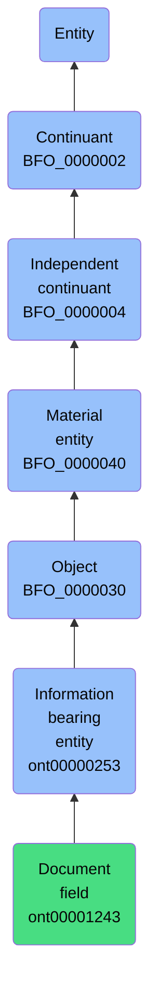

# Document field

## Overview

### Definition
An Information Bearing Entity that is a part of some document into which bearers of prescribed information can be written or selected.

### Examples
Not defined.

### Aliases
Not defined.

### URI
https://www.commoncoreontologies.org/ont00001243

### Subclass Of
- https://www.commoncoreontologies.org/ont00000253

### Ontology Reference
- https://www.commoncoreontologies.org/ArtifactOntology

### Hierarchy

## Properties
### Data Properties
| Predicate | Domain | Range | Label | Definition | Example |
|-----------|---------|--------|---------|------------|----------|
| https://www.commoncoreontologies.org/ont00001765 | ['https://www.commoncoreontologies.org/ont00000253'] | None | has text value | A data property that has as its range a string value. |  |
| https://www.commoncoreontologies.org/ont00001767 | ['https://www.commoncoreontologies.org/ont00000253'] | ['http://www.w3.org/2001/XMLSchema#dateTime'] | has datetime value | A data property that has as its value a datetime value. |  |
| https://www.commoncoreontologies.org/ont00001768 | ['https://www.commoncoreontologies.org/ont00000253'] | ['http://www.w3.org/2001/XMLSchema#anyURI'] | has URI value | A data property that has as its range a URI value. |  |
| https://www.commoncoreontologies.org/ont00001769 | ['https://www.commoncoreontologies.org/ont00000253'] | ['http://www.w3.org/2001/XMLSchema#decimal'] | has decimal value | A data property that has as its range a decimal value. |  |
| https://www.commoncoreontologies.org/ont00001770 | ['https://www.commoncoreontologies.org/ont00000253'] | ['http://www.w3.org/2001/XMLSchema#double'] | has double value | A data property that has as its range a double value. |  |
| https://www.commoncoreontologies.org/ont00001771 | ['https://www.commoncoreontologies.org/ont00000253'] | None | has date value | A data property that has as its range a date value. |  |
| https://www.commoncoreontologies.org/ont00001772 | ['https://www.commoncoreontologies.org/ont00000253'] | ['http://www.w3.org/2001/XMLSchema#boolean'] | has boolean value | A data property that has as its range a boolean value. |  |
| https://www.commoncoreontologies.org/ont00001773 | ['https://www.commoncoreontologies.org/ont00000253'] | ['http://www.w3.org/2001/XMLSchema#integer'] | has integer value | A data property that has as its range an integer value. |  |

### Object Properties
| Predicate | Domain | Range | Label | Definition | Example | Inverse Of |
|-----------|---------|--------|---------|------------|----------|------------|
| http://purl.obolibrary.org/obo/BFO_0000108 | ['http://purl.obolibrary.org/obo/BFO_0000001'] | ['http://purl.obolibrary.org/obo/BFO_0000008'] | exists at | (Elucidation) exists at is a relation between a particular and some temporal region at which the particular exists | First World War exists at 1914-1916; Mexico exists at January 1, 2000 | None |
| http://purl.obolibrary.org/obo/BFO_0000115 | ['http://purl.obolibrary.org/obo/BFO_0000040'] | ['http://purl.obolibrary.org/obo/BFO_0000040'] | has member part | b has member part c =Def c member part of b |  | ['http://purl.obolibrary.org/obo/BFO_0000129'] |
| http://purl.obolibrary.org/obo/BFO_0000127 | ['http://purl.obolibrary.org/obo/BFO_0000040'] | ['http://purl.obolibrary.org/obo/BFO_0000016'] | material basis of | b material basis of c =Def c has material basis b |  | ['http://purl.obolibrary.org/obo/BFO_0000218'] |
| http://purl.obolibrary.org/obo/BFO_0000129 | ['http://purl.obolibrary.org/obo/BFO_0000040'] | ['http://purl.obolibrary.org/obo/BFO_0000040'] | member part of | b member part of c =Def b is an object & c is a material entity & there is some time t such that b continuant part of c at t & there is a mutually exhaustive and pairwise disjoint partition of c into objects x1, ..., xn (for some n ≠ 1) with b = xi (for some 1 <= i <= n) |  | None |
| http://purl.obolibrary.org/obo/BFO_0000176 | ['http://purl.obolibrary.org/obo/BFO_0000002'] | ['http://purl.obolibrary.org/obo/BFO_0000002'] | continuant part of | b continuant part of c =Def b and c are continuants & there is some time t such that b and c exist at t & b continuant part of c at t | Milk teeth continuant part of human; surgically removed tumour continuant part of organism | ['http://purl.obolibrary.org/obo/BFO_0000178'] |
| http://purl.obolibrary.org/obo/BFO_0000178 | ['http://purl.obolibrary.org/obo/BFO_0000002'] | ['http://purl.obolibrary.org/obo/BFO_0000002'] | has continuant part | b has continuant part c =Def c continuant part of b |  | None |
| http://purl.obolibrary.org/obo/BFO_0000185 | ['http://purl.obolibrary.org/obo/BFO_0000040'] | ['http://purl.obolibrary.org/obo/BFO_0000182'] | has history | b has history c =Def c history of b | This organism has history this life | None |
| https://www.commoncoreontologies.org/ont00001775 | ['http://purl.obolibrary.org/obo/BFO_0000004'] | ['http://purl.obolibrary.org/obo/BFO_0000004'] | is successor of | A continuant c2 is a successor of some continuant c1 iff there is some process p1 and c1 is an input to p1 and c2 is an output of p1. Inverse of is predecessor.  |  | ['https://www.commoncoreontologies.org/ont00001928'] |
| https://www.commoncoreontologies.org/ont00001816 | ['http://purl.obolibrary.org/obo/BFO_0000002'] | ['http://purl.obolibrary.org/obo/BFO_0000015'] | is output of | x is_output_of y iff x is an instance of Continuant and y is an instance of Process, such that the presence of x at the end of y is a necessary condition for the completion of y. |  | ['https://www.commoncoreontologies.org/ont00001986'] |
| https://www.commoncoreontologies.org/ont00001824 | ['https://www.commoncoreontologies.org/ont00000253'] | ['https://www.commoncoreontologies.org/ont00000253'] | is excerpted from | An Information Bearing Entity b1 is excerpted from another Information Bearing Entity B2 iff b1 is part of some Information Bearing Entity B1 that is carrier of some Information Content Entity C1, B2 is carrier of some Information Content Entity C2, C1 is not identical with C2, b1 is carrier of some Information Content Entity c1, b2 is an Information Bearing Entity that is part of B2 and b2 is carrier of c1 (i.e. the same Information Content Entity as borne by b1). |  | None |
| https://www.commoncoreontologies.org/ont00001841 | ['http://purl.obolibrary.org/obo/BFO_0000002'] | ['http://purl.obolibrary.org/obo/BFO_0000015'] | is input of | x is_input_of y iff x is an instance of Continuant and y is an instance of Process, such that the presence of x at the beginning of y is a necessary condition for the start of y. |  | ['https://www.commoncoreontologies.org/ont00001921'] |
| https://www.commoncoreontologies.org/ont00001852 | ['http://purl.obolibrary.org/obo/BFO_0000040'] | ['http://purl.obolibrary.org/obo/BFO_0000015'] | accessory in | y is_accessory_in x iff x is an instance of Process and y is an instance of Agent, such that y assists another agent in the commission of x, and y was not located at the location of x when x occurred, and y was not an agent_in x. |  | ['https://www.commoncoreontologies.org/ont00001949'] |
| https://www.commoncoreontologies.org/ont00001861 | ['http://purl.obolibrary.org/obo/BFO_0000030'] | ['http://purl.obolibrary.org/obo/BFO_0000030'] | is material of | An object m is material of an object o when m is the material of which o consists and that material does not undergo a change of kind during the creation of o |  | ['https://www.commoncoreontologies.org/ont00001991'] |
| https://www.commoncoreontologies.org/ont00001863 | ['https://www.commoncoreontologies.org/ont00000253'] | ['https://www.commoncoreontologies.org/ont00000120'] | uses measurement unit | y uses_measurement_unit x iff y is an instance of Information Bearing Entity and x is an instance of Measurement Unit, such that x describes the magnitude of measured physical quantity mentioned in y. |  | ['https://www.commoncoreontologies.org/ont00001961'] |
| https://www.commoncoreontologies.org/ont00001886 | ['http://purl.obolibrary.org/obo/BFO_0000002'] | ['http://purl.obolibrary.org/obo/BFO_0000015'] | is affected by | x is_affected_by y iff x is an instance of Continuant and y is an instance of Process, and y influences x in some manner, most often by producing a change in x. |  | None |
| https://www.commoncoreontologies.org/ont00001895 | ['http://purl.obolibrary.org/obo/BFO_0000040'] | ['http://purl.obolibrary.org/obo/BFO_0000015'] | accomplice in | An agent a1 is accomplice_in some Processual Entity p1 iff a1 assists in the commission of p1, is located at the location of p1, but is not agent_in p1. |  | None |
| https://www.commoncoreontologies.org/ont00001908 | ['https://www.commoncoreontologies.org/ont00000253'] | ['https://www.commoncoreontologies.org/ont00000829'] | uses time zone identifier | x uses_time_zone_identifier y iff x is an instance of Information Bearing Entity and y is an instance of Time Zone Identifier, such that y designates the spatial region associated with the time zone mentioned in x. |  | None |
| https://www.commoncoreontologies.org/ont00001912 | ['https://www.commoncoreontologies.org/ont00000253'] | ['https://www.commoncoreontologies.org/ont00000398'] | uses reference system | y uses_reference_system x iff y is an instance of Information Bearing Entity and x is an instance of Reference System, such that x describes the set of standards mentioned in y. |  | ['https://www.commoncoreontologies.org/ont00001997'] |
| https://www.commoncoreontologies.org/ont00001913 | ['https://www.commoncoreontologies.org/ont00000253'] | ['https://www.commoncoreontologies.org/ont00000469'] | uses geospatial coordinate reference system | y uses_geospatial_coordinate_reference_system x iff y is an instance of Information Bearing Entity and x is an instance of Geospatial Coordinate Reference System, such that x describes the set of standards mentioned in y. |  | None |
| https://www.commoncoreontologies.org/ont00001928 | ['http://purl.obolibrary.org/obo/BFO_0000004'] | ['http://purl.obolibrary.org/obo/BFO_0000004'] | is predecessor of | A continuant c1 is a predecessor of some continuant c2 iff there is some process p1 and c1 is an input to p1 and c2 is an output of p1. |  | None |
| https://www.commoncoreontologies.org/ont00001976 | ['https://www.commoncoreontologies.org/ont00000253'] | ['https://www.commoncoreontologies.org/ont00001175'] | uses language | x uses_language y iff x is an instance of an Information Bearing Entity and y is an instance of a Language such that the literal value of x is a string that is encoded according to the syntax of y. |  | None |
| https://www.commoncoreontologies.org/ont00001991 | ['http://purl.obolibrary.org/obo/BFO_0000030'] | ['http://purl.obolibrary.org/obo/BFO_0000030'] | is made of | An object o is made of an object m when m is the material that o consists of and that material does not undergo a change of kind during the creation of o |  | None |
