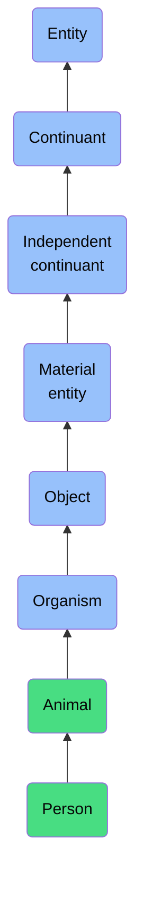

# Person

## Overview

### Definition
An Animal that is a member of the species Homo sapiens.

### Examples
Not defined.

### Aliases
- Human

### URI
https://www.commoncoreontologies.org/ont00001262

### Subclass Of
- Animal: https://www.commoncoreontologies.org/ont00000562

### Ontology Reference
- https://www.commoncoreontologies.org/AgentOntology

### Hierarchy

## Properties
### Data Properties
### Object Properties
| Label | Definition | Example | Domain | Range | Inverse Of |
|-------|------------|---------|--------|-------|------------|
| [exists at](https://www.commoncoreontologies.org/ont00001995) | (Elucidation) exists at is a relation between a particular and some temporal region at which the particular exists | First World War exists at 1914-1916; Mexico exists at January 1, 2000 | [entity](http://purl.obolibrary.org/obo/BFO_0000001) | [temporal region](http://purl.obolibrary.org/obo/BFO_0000008) |  |
| [continuant part of](https://www.commoncoreontologies.org/ont00001995) | b continuant part of c =Def b and c are continuants & there is some time t such that b and c exist at t & b continuant part of c at t | Milk teeth continuant part of human; surgically removed tumour continuant part of organism | [continuant](http://purl.obolibrary.org/obo/BFO_0000002) | [continuant](http://purl.obolibrary.org/obo/BFO_0000002) | [has continuant part](http://purl.obolibrary.org/obo/BFO_0000178) |
| [has continuant part](https://www.commoncoreontologies.org/ont00001995) | b has continuant part c =Def c continuant part of b |  | [continuant](http://purl.obolibrary.org/obo/BFO_0000002) | [continuant](http://purl.obolibrary.org/obo/BFO_0000002) |  |
| [is output of](https://www.commoncoreontologies.org/ont00001995) | x is_output_of y iff x is an instance of Continuant and y is an instance of Process, such that the presence of x at the end of y is a necessary condition for the completion of y. |  | [continuant](http://purl.obolibrary.org/obo/BFO_0000002) | [process](http://purl.obolibrary.org/obo/BFO_0000015) | [has output](https://www.commoncoreontologies.org/ont00001986) |
| [is input of](https://www.commoncoreontologies.org/ont00001995) | x is_input_of y iff x is an instance of Continuant and y is an instance of Process, such that the presence of x at the beginning of y is a necessary condition for the start of y. |  | [continuant](http://purl.obolibrary.org/obo/BFO_0000002) | [process](http://purl.obolibrary.org/obo/BFO_0000015) | [has input](https://www.commoncoreontologies.org/ont00001921) |
| [is affected by](https://www.commoncoreontologies.org/ont00001995) | x is_affected_by y iff x is an instance of Continuant and y is an instance of Process, and y influences x in some manner, most often by producing a change in x. |  | [continuant](http://purl.obolibrary.org/obo/BFO_0000002) | [process](http://purl.obolibrary.org/obo/BFO_0000015) |  |
| [is successor of](https://www.commoncoreontologies.org/ont00001995) | A continuant c2 is a successor of some continuant c1 iff there is some process p1 and c1 is an input to p1 and c2 is an output of p1. Inverse of is predecessor.  |  | [independent continuant](http://purl.obolibrary.org/obo/BFO_0000004) | [independent continuant](http://purl.obolibrary.org/obo/BFO_0000004) | [is predecessor of](https://www.commoncoreontologies.org/ont00001928) |
| [is predecessor of](https://www.commoncoreontologies.org/ont00001995) | A continuant c1 is a predecessor of some continuant c2 iff there is some process p1 and c1 is an input to p1 and c2 is an output of p1. |  | [independent continuant](http://purl.obolibrary.org/obo/BFO_0000004) | [independent continuant](http://purl.obolibrary.org/obo/BFO_0000004) |  |
| [has member part](https://www.commoncoreontologies.org/ont00001995) | b has member part c =Def c member part of b |  | [material entity](http://purl.obolibrary.org/obo/BFO_0000040) | [material entity](http://purl.obolibrary.org/obo/BFO_0000040) | [member part of](http://purl.obolibrary.org/obo/BFO_0000129) |
| [material basis of](https://www.commoncoreontologies.org/ont00001995) | b material basis of c =Def c has material basis b |  | [material entity](http://purl.obolibrary.org/obo/BFO_0000040) | [disposition](http://purl.obolibrary.org/obo/BFO_0000016) | [has material basis](http://purl.obolibrary.org/obo/BFO_0000218) |
| [member part of](https://www.commoncoreontologies.org/ont00001995) | b member part of c =Def b is an object & c is a material entity & there is some time t such that b continuant part of c at t & there is a mutually exhaustive and pairwise disjoint partition of c into objects x1, ..., xn (for some n ≠ 1) with b = xi (for some 1 <= i <= n) |  | [material entity](http://purl.obolibrary.org/obo/BFO_0000040) | [material entity](http://purl.obolibrary.org/obo/BFO_0000040) |  |
| [has history](https://www.commoncoreontologies.org/ont00001995) | b has history c =Def c history of b | This organism has history this life | [material entity](http://purl.obolibrary.org/obo/BFO_0000040) | [history](http://purl.obolibrary.org/obo/BFO_0000182) |  |
| [accessory in](https://www.commoncoreontologies.org/ont00001995) | y is_accessory_in x iff x is an instance of Process and y is an instance of Agent, such that y assists another agent in the commission of x, and y was not located at the location of x when x occurred, and y was not an agent_in x. |  | [material entity](http://purl.obolibrary.org/obo/BFO_0000040) | [process](http://purl.obolibrary.org/obo/BFO_0000015) | [has accessory](https://www.commoncoreontologies.org/ont00001949) |
| [accomplice in](https://www.commoncoreontologies.org/ont00001995) | An agent a1 is accomplice_in some Processual Entity p1 iff a1 assists in the commission of p1, is located at the location of p1, but is not agent_in p1. |  | [material entity](http://purl.obolibrary.org/obo/BFO_0000040) | [process](http://purl.obolibrary.org/obo/BFO_0000015) |  |
| [is material of](https://www.commoncoreontologies.org/ont00001995) | An object m is material of an object o when m is the material of which o consists and that material does not undergo a change of kind during the creation of o |  | [object](http://purl.obolibrary.org/obo/BFO_0000030) | [object](http://purl.obolibrary.org/obo/BFO_0000030) | [is made of](https://www.commoncoreontologies.org/ont00001991) |
| [is made of](https://www.commoncoreontologies.org/ont00001995) | An object o is made of an object m when m is the material that o consists of and that material does not undergo a change of kind during the creation of o |  | [object](http://purl.obolibrary.org/obo/BFO_0000030) | [object](http://purl.obolibrary.org/obo/BFO_0000030) |  |
| [has skill](https://www.commoncoreontologies.org/ont00001995) | A relation between a person and a professional skill they possess. | John has the skill to play the piano. | [Person](https://www.commoncoreontologies.org/ont00001262) |  |  |
| [is supervised by](https://www.commoncoreontologies.org/ont00001995) | A person p1 is supervised by a person p2 by virtue of p1 being directed, managed, or overseen by p2. |  | [Person](https://www.commoncoreontologies.org/ont00001262) | [Person](https://www.commoncoreontologies.org/ont00001262) | [supervises](https://www.commoncoreontologies.org/ont00001943) |
| [has familial relationship to](https://www.commoncoreontologies.org/ont00001995) | A relationship between persons by virtue of ancestry or legal union. |  | [Person](https://www.commoncoreontologies.org/ont00001262) | [Person](https://www.commoncoreontologies.org/ont00001262) |  |
| [supervises](https://www.commoncoreontologies.org/ont00001995) | A person p1 supervises a person p2 by virtue of p1 directing, managing, or overseeing p2. |  | [Person](https://www.commoncoreontologies.org/ont00001262) | [Person](https://www.commoncoreontologies.org/ont00001262) |  |
| [is parent of](https://www.commoncoreontologies.org/ont00001995) |  |  | [Person](https://www.commoncoreontologies.org/ont00001262) | [Person](https://www.commoncoreontologies.org/ont00001262) |  |
