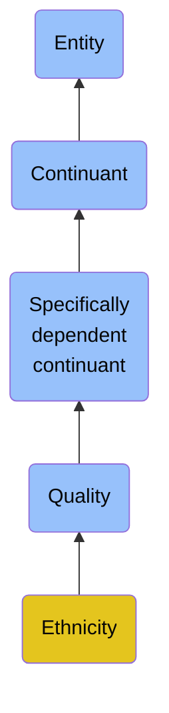

# Ethnicity

## Overview

### Definition
A Quality that inheres in its bearers by virtue of a common heritage, often consisting of a common language, a common culture (often including a shared religion) and an ideology that stresses common ancestry or endogamy.

### Examples
Not defined.

### Aliases
Not defined.

### URI
https://www.commoncoreontologies.org/ont00000780

### Subclass Of

- [Entity](/docs/ontology/reference/model/Entity/Entity.md)
- [Continuant](/docs/ontology/reference/model/Entity/Continuant/Continuant.md)
- [Specifically dependent continuant](/docs/ontology/reference/model/Entity/Continuant/Specifically%20dependent%20continuant/Specifically%20dependent%20continuant.md)
- [Quality](/docs/ontology/reference/model/Entity/Continuant/Specifically%20dependent%20continuant/Quality/Quality.md)
- [Ethnicity](/docs/ontology/reference/model/Entity/Continuant/Specifically%20dependent%20continuant/Quality/Ethnicity/Ethnicity.md)

### Ontology Reference
- [cco](https://www.commoncoreontologies.org/): [AgentOntology](https://www.commoncoreontologies.org/AgentOntology)

## Properties
### Object Properties
| Ontology | Label | Definition | Example | Domain | Range | Inverse Of |
|----------|-------|------------|---------|--------|-------|------------|
| bfo | [exists at](http://purl.obolibrary.org/obo/BFO_0000108) | (Elucidation) exists at is a relation between a particular and some temporal region at which the particular exists | First World War exists at 1914-1916; Mexico exists at January 1, 2000 | [entity](/docs/ontology/reference/model/Entity/Entity.md) | [temporal region](/docs/ontology/reference/model/Entity/Occurrent/Temporal%20region/Temporal%20region.md) |  |
| bfo | [continuant part of](http://purl.obolibrary.org/obo/BFO_0000176) | b continuant part of c =Def b and c are continuants & there is some time t such that b and c exist at t & b continuant part of c at t | Milk teeth continuant part of human; surgically removed tumour continuant part of organism | [continuant](/docs/ontology/reference/model/Entity/Continuant/Continuant.md) | [continuant](/docs/ontology/reference/model/Entity/Continuant/Continuant.md) | [has continuant part](http://purl.obolibrary.org/obo/BFO_0000178) |
| bfo | [has continuant part](http://purl.obolibrary.org/obo/BFO_0000178) | b has continuant part c =Def c continuant part of b |  | [continuant](/docs/ontology/reference/model/Entity/Continuant/Continuant.md) | [continuant](/docs/ontology/reference/model/Entity/Continuant/Continuant.md) |  |
| cco | [is output of](https://www.commoncoreontologies.org/ont00001816) | x is_output_of y iff x is an instance of Continuant and y is an instance of Process, such that the presence of x at the end of y is a necessary condition for the completion of y. |  | [continuant](/docs/ontology/reference/model/Entity/Continuant/Continuant.md) | [process](/docs/ontology/reference/model/Entity/Occurrent/Process/Process.md) | [has output](https://www.commoncoreontologies.org/ont00001986) |
| cco | [is input of](https://www.commoncoreontologies.org/ont00001841) | x is_input_of y iff x is an instance of Continuant and y is an instance of Process, such that the presence of x at the beginning of y is a necessary condition for the start of y. |  | [continuant](/docs/ontology/reference/model/Entity/Continuant/Continuant.md) | [process](/docs/ontology/reference/model/Entity/Occurrent/Process/Process.md) | [has input](https://www.commoncoreontologies.org/ont00001921) |
| cco | [is affected by](https://www.commoncoreontologies.org/ont00001886) | x is_affected_by y iff x is an instance of Continuant and y is an instance of Process, and y influences x in some manner, most often by producing a change in x. |  | [continuant](/docs/ontology/reference/model/Entity/Continuant/Continuant.md) | [process](/docs/ontology/reference/model/Entity/Occurrent/Process/Process.md) |  |
| bfo | [specifically depends on](http://purl.obolibrary.org/obo/BFO_0000195) | (Elucidation) specifically depends on is a relation between a specifically dependent continuant b and specifically dependent continuant or independent continuant that is not a spatial region c such that b and c share no parts in common & b is of a nature such that at all times t it cannot exist unless c exists & b is not a boundary of c | A shape specifically depends on the shaped object; hue, saturation and brightness of a colour sample specifically depends on each other | [specifically dependent continuant](/docs/ontology/reference/model/Entity/Continuant/Specifically%20dependent%20continuant/Specifically%20dependent%20continuant.md) |  |  |
| bfo | [inheres in](http://purl.obolibrary.org/obo/BFO_0000197) | b inheres in c =Def b is a specifically dependent continuant & c is an independent continuant that is not a spatial region & b specifically depends on c | A shape inheres in a shaped object; a mass inheres in a material entity | [specifically dependent continuant](/docs/ontology/reference/model/Entity/Continuant/Specifically%20dependent%20continuant/Specifically%20dependent%20continuant.md) |  |  |
| cco | [quality of aggregate](https://www.commoncoreontologies.org/ont00001947) | x quality_of_aggregate y iff y is an instance of Object Aggregate and x is an instance of Quality, and x inheres_in_aggregate y. |  | [quality](/docs/ontology/reference/model/Entity/Continuant/Specifically%20dependent%20continuant/Quality/Quality.md) | [object aggregate](/docs/ontology/reference/model/Entity/Continuant/Independent%20continuant/Material%20entity/Object%20aggregate/Object%20aggregate.md) |  |

