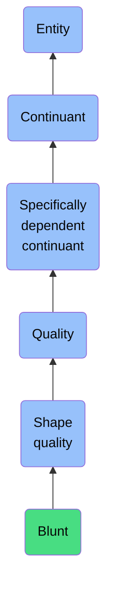

# Blunt

## Overview

### Definition
A Shape Quality inhering in a bearer in virtue of the bearer not having a sharp edge or point.

### Examples
Not defined.

### Aliases
Not defined.

### URI
https://www.commoncoreontologies.org/ont00000185

### Subclass Of
- Shape Quality: https://www.commoncoreontologies.org/ont00001059

### Ontology Reference
- https://www.commoncoreontologies.org/QualityOntology

### Hierarchy

## Properties
### Data Properties
### Object Properties
| Label | Definition | Example | Domain | Range | Inverse Of |
|-------|------------|---------|--------|-------|------------|
| [exists at](https://www.commoncoreontologies.org/ont00001947) | (Elucidation) exists at is a relation between a particular and some temporal region at which the particular exists | First World War exists at 1914-1916; Mexico exists at January 1, 2000 | [entity](http://purl.obolibrary.org/obo/BFO_0000001) | [temporal region](http://purl.obolibrary.org/obo/BFO_0000008) |  |
| [continuant part of](https://www.commoncoreontologies.org/ont00001947) | b continuant part of c =Def b and c are continuants & there is some time t such that b and c exist at t & b continuant part of c at t | Milk teeth continuant part of human; surgically removed tumour continuant part of organism | [continuant](http://purl.obolibrary.org/obo/BFO_0000002) | [continuant](http://purl.obolibrary.org/obo/BFO_0000002) | [has continuant part](http://purl.obolibrary.org/obo/BFO_0000178) |
| [has continuant part](https://www.commoncoreontologies.org/ont00001947) | b has continuant part c =Def c continuant part of b |  | [continuant](http://purl.obolibrary.org/obo/BFO_0000002) | [continuant](http://purl.obolibrary.org/obo/BFO_0000002) |  |
| [is output of](https://www.commoncoreontologies.org/ont00001947) | x is_output_of y iff x is an instance of Continuant and y is an instance of Process, such that the presence of x at the end of y is a necessary condition for the completion of y. |  | [continuant](http://purl.obolibrary.org/obo/BFO_0000002) | [process](http://purl.obolibrary.org/obo/BFO_0000015) | [has output](https://www.commoncoreontologies.org/ont00001986) |
| [is input of](https://www.commoncoreontologies.org/ont00001947) | x is_input_of y iff x is an instance of Continuant and y is an instance of Process, such that the presence of x at the beginning of y is a necessary condition for the start of y. |  | [continuant](http://purl.obolibrary.org/obo/BFO_0000002) | [process](http://purl.obolibrary.org/obo/BFO_0000015) | [has input](https://www.commoncoreontologies.org/ont00001921) |
| [is affected by](https://www.commoncoreontologies.org/ont00001947) | x is_affected_by y iff x is an instance of Continuant and y is an instance of Process, and y influences x in some manner, most often by producing a change in x. |  | [continuant](http://purl.obolibrary.org/obo/BFO_0000002) | [process](http://purl.obolibrary.org/obo/BFO_0000015) |  |
| [specifically depends on](https://www.commoncoreontologies.org/ont00001947) | (Elucidation) specifically depends on is a relation between a specifically dependent continuant b and specifically dependent continuant or independent continuant that is not a spatial region c such that b and c share no parts in common & b is of a nature such that at all times t it cannot exist unless c exists & b is not a boundary of c | A shape specifically depends on the shaped object; hue, saturation and brightness of a colour sample specifically depends on each other | [specifically dependent continuant](http://purl.obolibrary.org/obo/BFO_0000020) | {'or': {'or': ['http://purl.obolibrary.org/obo/BFO_0000020']}} |  |
| [inheres in](https://www.commoncoreontologies.org/ont00001947) | b inheres in c =Def b is a specifically dependent continuant & c is an independent continuant that is not a spatial region & b specifically depends on c | A shape inheres in a shaped object; a mass inheres in a material entity | [specifically dependent continuant](http://purl.obolibrary.org/obo/BFO_0000020) | {'and': {'and': ['http://purl.obolibrary.org/obo/BFO_0000004']}} |  |
| [quality of aggregate](https://www.commoncoreontologies.org/ont00001947) | x quality_of_aggregate y iff y is an instance of Object Aggregate and x is an instance of Quality, and x inheres_in_aggregate y. |  | [quality](http://purl.obolibrary.org/obo/BFO_0000019) | [object aggregate](http://purl.obolibrary.org/obo/BFO_0000027) |  |
