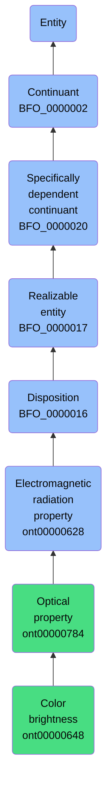

# Color brightness

## Overview

### Definition
An Optical Property that inheres in a bearer in virtue of its capacity to reflect or radiate light.

### Examples
Not defined.

### Aliases
- Color Intensity

### URI
https://www.commoncoreontologies.org/ont00000648

### Subclass Of
- https://www.commoncoreontologies.org/ont00000784

### Ontology Reference
- https://www.commoncoreontologies.org/QualityOntology

### Hierarchy

## Properties
### Data Properties
| Predicate | Domain | Range | Label | Definition | Example |
|-----------|---------|--------|---------|------------|----------|

### Object Properties
| Predicate | Domain | Range | Label | Definition | Example | Inverse Of |
|-----------|---------|--------|---------|------------|----------|------------|
| http://purl.obolibrary.org/obo/BFO_0000054 | ['http://purl.obolibrary.org/obo/BFO_0000017'] | ['http://purl.obolibrary.org/obo/BFO_0000015'] | has realization | b has realization c =Def c realizes b | As for realizes | ['http://purl.obolibrary.org/obo/BFO_0000055'] |
| http://purl.obolibrary.org/obo/BFO_0000108 | ['http://purl.obolibrary.org/obo/BFO_0000001'] | ['http://purl.obolibrary.org/obo/BFO_0000008'] | exists at | (Elucidation) exists at is a relation between a particular and some temporal region at which the particular exists | First World War exists at 1914-1916; Mexico exists at January 1, 2000 | None |
| http://purl.obolibrary.org/obo/BFO_0000176 | ['http://purl.obolibrary.org/obo/BFO_0000002'] | ['http://purl.obolibrary.org/obo/BFO_0000002'] | continuant part of | b continuant part of c =Def b and c are continuants & there is some time t such that b and c exist at t & b continuant part of c at t | Milk teeth continuant part of human; surgically removed tumour continuant part of organism | ['http://purl.obolibrary.org/obo/BFO_0000178'] |
| http://purl.obolibrary.org/obo/BFO_0000178 | ['http://purl.obolibrary.org/obo/BFO_0000002'] | ['http://purl.obolibrary.org/obo/BFO_0000002'] | has continuant part | b has continuant part c =Def c continuant part of b |  | None |
| http://purl.obolibrary.org/obo/BFO_0000195 | ['http://purl.obolibrary.org/obo/BFO_0000020'] | [{'or': {'or': ['http://purl.obolibrary.org/obo/BFO_0000020']}}] | specifically depends on | (Elucidation) specifically depends on is a relation between a specifically dependent continuant b and specifically dependent continuant or independent continuant that is not a spatial region c such that b and c share no parts in common & b is of a nature such that at all times t it cannot exist unless c exists & b is not a boundary of c | A shape specifically depends on the shaped object; hue, saturation and brightness of a colour sample specifically depends on each other | None |
| http://purl.obolibrary.org/obo/BFO_0000197 | ['http://purl.obolibrary.org/obo/BFO_0000020'] | [{'and': {'and': ['http://purl.obolibrary.org/obo/BFO_0000004']}}] | inheres in | b inheres in c =Def b is a specifically dependent continuant & c is an independent continuant that is not a spatial region & b specifically depends on c | A shape inheres in a shaped object; a mass inheres in a material entity | None |
| http://purl.obolibrary.org/obo/BFO_0000218 | ['http://purl.obolibrary.org/obo/BFO_0000016'] | ['http://purl.obolibrary.org/obo/BFO_0000040'] | has material basis | b has material basis c =Def b is a disposition & c is a material entity & there is some d bearer of b & there is some time t such that c is a continuant part of d at t & d has disposition b because c is a continuant part of d at t |  | None |
| https://www.commoncoreontologies.org/ont00001816 | ['http://purl.obolibrary.org/obo/BFO_0000002'] | ['http://purl.obolibrary.org/obo/BFO_0000015'] | is output of | x is_output_of y iff x is an instance of Continuant and y is an instance of Process, such that the presence of x at the end of y is a necessary condition for the completion of y. |  | ['https://www.commoncoreontologies.org/ont00001986'] |
| https://www.commoncoreontologies.org/ont00001829 | ['http://purl.obolibrary.org/obo/BFO_0000016'] | ['http://purl.obolibrary.org/obo/BFO_0000027'] | disposition of aggregate | x disposition_of_aggregate y iff y is an instance of Object Aggregate and x is an instance of Disposition, and x inheres_in_aggregate y. |  | ['https://www.commoncoreontologies.org/ont00001956'] |
| https://www.commoncoreontologies.org/ont00001841 | ['http://purl.obolibrary.org/obo/BFO_0000002'] | ['http://purl.obolibrary.org/obo/BFO_0000015'] | is input of | x is_input_of y iff x is an instance of Continuant and y is an instance of Process, such that the presence of x at the beginning of y is a necessary condition for the start of y. |  | ['https://www.commoncoreontologies.org/ont00001921'] |
| https://www.commoncoreontologies.org/ont00001886 | ['http://purl.obolibrary.org/obo/BFO_0000002'] | ['http://purl.obolibrary.org/obo/BFO_0000015'] | is affected by | x is_affected_by y iff x is an instance of Continuant and y is an instance of Process, and y influences x in some manner, most often by producing a change in x. |  | None |
