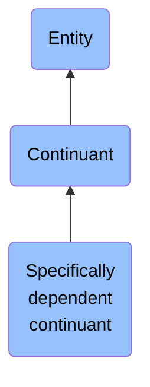

# Specifically dependent continuant

## Overview

### Definition
b is a specifically dependent continuant =Def b is a continuant & there is some independent continuant c which is not a spatial region & which is such that b specifically depends on c

### Examples
- (with multiple bearers) John's love for Mary; the ownership relation between John and this statue; the relation of authority between John and his subordinates
- (with one bearer) The mass of this tomato; the pink colour of a medium rare piece of grilled filet mignon at its centre; the smell of this portion of mozzarella; the disposition of this fish to decay; the role of being a doctor; the function of this heart to pump blood; the shape of this hole

### Aliases
Not defined.

### URI
http://purl.obolibrary.org/obo/BFO_0000020

### Subclass Of
- continuant: http://purl.obolibrary.org/obo/BFO_0000002

### Ontology Reference
Not defined.

### Hierarchy

## Properties
### Data Properties
### Object Properties
| Label | Definition | Example | Domain | Range | Inverse Of |
|-------|------------|---------|--------|-------|------------|
| [exists at](https://www.commoncoreontologies.org/ont00001886) | (Elucidation) exists at is a relation between a particular and some temporal region at which the particular exists | First World War exists at 1914-1916; Mexico exists at January 1, 2000 | [entity](http://purl.obolibrary.org/obo/BFO_0000001) | [temporal region](http://purl.obolibrary.org/obo/BFO_0000008) |  |
| [continuant part of](https://www.commoncoreontologies.org/ont00001886) | b continuant part of c =Def b and c are continuants & there is some time t such that b and c exist at t & b continuant part of c at t | Milk teeth continuant part of human; surgically removed tumour continuant part of organism | [continuant](http://purl.obolibrary.org/obo/BFO_0000002) | [continuant](http://purl.obolibrary.org/obo/BFO_0000002) | [has continuant part](http://purl.obolibrary.org/obo/BFO_0000178) |
| [has continuant part](https://www.commoncoreontologies.org/ont00001886) | b has continuant part c =Def c continuant part of b |  | [continuant](http://purl.obolibrary.org/obo/BFO_0000002) | [continuant](http://purl.obolibrary.org/obo/BFO_0000002) |  |
| [is output of](https://www.commoncoreontologies.org/ont00001886) | x is_output_of y iff x is an instance of Continuant and y is an instance of Process, such that the presence of x at the end of y is a necessary condition for the completion of y. |  | [continuant](http://purl.obolibrary.org/obo/BFO_0000002) | [process](http://purl.obolibrary.org/obo/BFO_0000015) | [has output](https://www.commoncoreontologies.org/ont00001986) |
| [is input of](https://www.commoncoreontologies.org/ont00001886) | x is_input_of y iff x is an instance of Continuant and y is an instance of Process, such that the presence of x at the beginning of y is a necessary condition for the start of y. |  | [continuant](http://purl.obolibrary.org/obo/BFO_0000002) | [process](http://purl.obolibrary.org/obo/BFO_0000015) | [has input](https://www.commoncoreontologies.org/ont00001921) |
| [is affected by](https://www.commoncoreontologies.org/ont00001886) | x is_affected_by y iff x is an instance of Continuant and y is an instance of Process, and y influences x in some manner, most often by producing a change in x. |  | [continuant](http://purl.obolibrary.org/obo/BFO_0000002) | [process](http://purl.obolibrary.org/obo/BFO_0000015) |  |
| [specifically depends on](https://www.commoncoreontologies.org/ont00001886) | (Elucidation) specifically depends on is a relation between a specifically dependent continuant b and specifically dependent continuant or independent continuant that is not a spatial region c such that b and c share no parts in common & b is of a nature such that at all times t it cannot exist unless c exists & b is not a boundary of c | A shape specifically depends on the shaped object; hue, saturation and brightness of a colour sample specifically depends on each other | [specifically dependent continuant](http://purl.obolibrary.org/obo/BFO_0000020) | {'or': {'or': ['http://purl.obolibrary.org/obo/BFO_0000020']}} |  |
| [inheres in](https://www.commoncoreontologies.org/ont00001886) | b inheres in c =Def b is a specifically dependent continuant & c is an independent continuant that is not a spatial region & b specifically depends on c | A shape inheres in a shaped object; a mass inheres in a material entity | [specifically dependent continuant](http://purl.obolibrary.org/obo/BFO_0000020) | {'and': {'and': ['http://purl.obolibrary.org/obo/BFO_0000004']}} |  |
