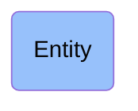

# Entity

## Overview

### Definition
(Elucidation) An entity is anything that exists or has existed or will exist

### Examples
Julius Caesar; the Second World War; your body mass index; Verdi's Requiem

### Aliases
Not defined.

### URI
http://purl.obolibrary.org/obo/BFO_0000001

### Subclass Of

- [Entity](/docs/ontology/reference/model/Entity/Entity.md)

### Ontology Reference
- [bfo](http://purl.obolibrary.org/obo/)

## Properties
### Data Properties
| Ontology | Label | Definition | Example | Domain | Range |
|----------|-------|------------|---------|--------|-------|
| abi | [is curated in foundry](http://ontology.naas.ai/abi/is_curated_in_foundry) | Relates a class to the foundry it is curated in. | The class cco:ont00001262 is curated in the foundry 'entreprise_management_foundry' and 'personal_ai_foundry'. | [entity](/docs/ontology/reference/model/Entity/Entity.md) | [string](http://www.w3.org/2001/XMLSchema#string) |

### Object Properties
| Ontology | Label | Definition | Example | Domain | Range | Inverse Of |
|----------|-------|------------|---------|--------|-------|------------|
| bfo | [exists at](http://purl.obolibrary.org/obo/BFO_0000108) | (Elucidation) exists at is a relation between a particular and some temporal region at which the particular exists | First World War exists at 1914-1916; Mexico exists at January 1, 2000 | [entity](/docs/ontology/reference/model/Entity/Entity.md) | [temporal region](/docs/ontology/reference/model/Entity/Occurrent/Temporal%20region/Temporal%20region.md) |  |

