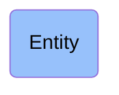

# Entity

## Overview

### Definition
(Elucidation) An entity is anything that exists or has existed or will exist

### Examples
- Julius Caesar; the Second World War; your body mass index; Verdi's Requiem

### Aliases
Not defined.

### URI
http://purl.obolibrary.org/obo/BFO_0000001

### Subclass Of
Not defined.

### Ontology Reference
Not defined.

### Hierarchy

## Properties
### Data Properties
| Predicate | Domain | Range | Label | Definition | Example |
|-----------|---------|--------|---------|------------|----------|

### Object Properties
| Predicate | Domain | Range | Label | Definition | Example | Inverse Of |
|-----------|---------|--------|---------|------------|----------|------------|
| http://purl.obolibrary.org/obo/BFO_0000108 | ['http://purl.obolibrary.org/obo/BFO_0000001'] | ['http://purl.obolibrary.org/obo/BFO_0000008'] | exists at | (Elucidation) exists at is a relation between a particular and some temporal region at which the particular exists | First World War exists at 1914-1916; Mexico exists at January 1, 2000 | None |
