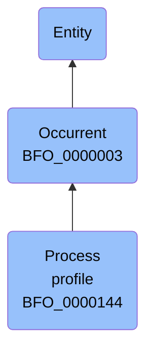

# Process profile

## Overview

### Definition
An occurrent that is an occurrent part of some process by virtue of the rate, or pattern, or amplitude of change in an attribute of one or more participants of said process.

### Examples
- On a somewhat higher level of complexity are what we shall call rate process profiles, which are the targets of selective abstraction focused not on determinate quality magnitudes plotted over time, but rather on certain ratios between these magnitudes and elapsed times. A speed process profile, for example, is represented by a graph plotting against time the ratio of distance covered per unit of time. Since rates may change, and since such changes, too, may have rates of change, we have to deal here with a hierarchy of process profile universals at successive levels; One important sub-family of rate process profiles is illustrated by the beat or frequency profiles of cyclical processes, illustrated by the 60 beats per minute beating process of John’s heart, or the 120 beats per minute drumming process involved in one of John’s performances in a rock band, and so on. Each such process includes what we shall call a beat process profile instance as part, a subtype of rate process profile in which the salient ratio is not distance covered but rather number of beat cycles per unit of time. Each beat process profile instance instantiates the determinable universal beat process profile. But it also instantiates multiple more specialized universals at lower levels of generality, selected from rate process profilebeat process profileregular beat process profile3 bpm beat process profile4 bpm beat process profileirregular beat process profileincreasing beat process profileand so on.In the case of a regular beat process profile, a rate can be assigned in the simplest possible fashion by dividing the number of cycles by the length of the temporal region occupied by the beating process profile as a whole. Irregular process profiles of this sort, for example as identified in the clinic, or in the readings on an aircraft instrument panel, are often of diagnostic significance.; The simplest type of process profiles are what we shall call ‘quality process profiles’, which are the process profiles which serve as the foci of the sort of selective abstraction that is involved when measurements are made of changes in single qualities, as illustrated, for example, by process profiles of mass, temperature, aortic pressure, and so on.

### Aliases
Not defined.

### URI
http://purl.obolibrary.org/obo/BFO_0000144

### Subclass Of
- http://purl.obolibrary.org/obo/BFO_0000003

### Ontology Reference
- https://www.commoncoreontologies.org/EventOntology

### Hierarchy

## Properties
### Data Properties
| Predicate | Domain | Range | Label | Definition | Example |
|-----------|---------|--------|---------|------------|----------|

### Object Properties
| Predicate | Domain | Range | Label | Definition | Example | Inverse Of |
|-----------|---------|--------|---------|------------|----------|------------|
| http://purl.obolibrary.org/obo/BFO_0000062 | ['http://purl.obolibrary.org/obo/BFO_0000003'] | ['http://purl.obolibrary.org/obo/BFO_0000003'] | preceded by | b preceded by c =Def b precedes c | The temporal region occupied by the second half of the match is preceded by the temporal region occupied by the first half of the match | ['http://purl.obolibrary.org/obo/BFO_0000063'] |
| http://purl.obolibrary.org/obo/BFO_0000063 | ['http://purl.obolibrary.org/obo/BFO_0000003'] | ['http://purl.obolibrary.org/obo/BFO_0000003'] | precedes | (Elucidation) precedes is a relation between occurrents o, o' such that if t is the temporal extent of o & t' is the temporal extent of o' then either the last instant of o is before the first instant of o' or the last instant of o is the first instant of o' & neither o nor o' are temporal instants | The temporal region occupied by Mary's birth precedes the temporal region occupied by Mary's death. | None |
| http://purl.obolibrary.org/obo/BFO_0000108 | ['http://purl.obolibrary.org/obo/BFO_0000001'] | ['http://purl.obolibrary.org/obo/BFO_0000008'] | exists at | (Elucidation) exists at is a relation between a particular and some temporal region at which the particular exists | First World War exists at 1914-1916; Mexico exists at January 1, 2000 | None |
| http://purl.obolibrary.org/obo/BFO_0000117 | ['http://purl.obolibrary.org/obo/BFO_0000003'] | ['http://purl.obolibrary.org/obo/BFO_0000003'] | has occurrent part | b has occurrent part c =Def c occurrent part of b | Mary's life has occurrent part Mary's 5th birthday | ['http://purl.obolibrary.org/obo/BFO_0000132'] |
| http://purl.obolibrary.org/obo/BFO_0000121 | ['http://purl.obolibrary.org/obo/BFO_0000003'] | ['http://purl.obolibrary.org/obo/BFO_0000003'] | has temporal part | b has temporal part c =Def c temporal part of b | Your life has temporal part the first year of your life | ['http://purl.obolibrary.org/obo/BFO_0000139'] |
| http://purl.obolibrary.org/obo/BFO_0000132 | ['http://purl.obolibrary.org/obo/BFO_0000003'] | ['http://purl.obolibrary.org/obo/BFO_0000003'] | occurrent part of | (Elucidation) occurrent part of is a relation between occurrents b and c when b is part of c | Mary's 5th birthday is an occurrent part of Mary's life; the first set of the tennis match is an occurrent part of the tennis match | None |
| http://purl.obolibrary.org/obo/BFO_0000139 | ['http://purl.obolibrary.org/obo/BFO_0000003'] | ['http://purl.obolibrary.org/obo/BFO_0000003'] | temporal part of | b temporal part of c =Def b occurrent part of c & (b and c are temporal regions) or (b and c are spatiotemporal regions & b temporally projects onto an occurrent part of the temporal region that c temporally projects onto) or (b and c are processes or process boundaries & b occupies a temporal region that is an occurrent part of the temporal region that c occupies) | Your heart beating from 4pm to 5pm today is a temporal part of the process of your heart beating; the 4th year of your life is a temporal part of your life, as is the process boundary which separates the 3rd and 4th years of your life; the first quarter of a game of football is a temporal part of the whole game | None |
| https://www.commoncoreontologies.org/ont00001803 | ['http://purl.obolibrary.org/obo/BFO_0000003'] | ['http://purl.obolibrary.org/obo/BFO_0000003'] | is cause of | x is_cause_of y iff x and y are instances of Occurrent, and y is a consequence of x. |  | ['https://www.commoncoreontologies.org/ont00001819'] |
| https://www.commoncoreontologies.org/ont00001819 | ['http://purl.obolibrary.org/obo/BFO_0000003'] | ['http://purl.obolibrary.org/obo/BFO_0000003'] | caused by | x caused_by y iff x and y are instances of Occurrent, and x is a consequence of y. |  | None |
