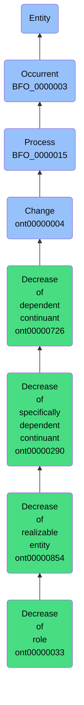

# Decrease of role

## Overview

### Definition
A Decrease of Realizable Entity in which some Independent Continuant has a decrease of some Role that it bears.

### Examples
Not defined.

### Aliases
Not defined.

### URI
https://www.commoncoreontologies.org/ont00000033

### Subclass Of
- https://www.commoncoreontologies.org/ont00000854

### Ontology Reference
- https://www.commoncoreontologies.org/EventOntology

### Hierarchy

## Properties
### Data Properties
| Predicate | Domain | Range | Label | Definition | Example |
|-----------|---------|--------|---------|------------|----------|

### Object Properties
| Predicate | Domain | Range | Label | Definition | Example | Inverse Of |
|-----------|---------|--------|---------|------------|----------|------------|
| http://purl.obolibrary.org/obo/BFO_0000055 | ['http://purl.obolibrary.org/obo/BFO_0000015'] | ['http://purl.obolibrary.org/obo/BFO_0000017'] | realizes | (Elucidation) realizes is a relation between a process b and realizable entity c such that c inheres in some d & for all t, if b has participant d then c exists & the type instantiated by b is correlated with the type instantiated by c | A balding process realizes a disposition to go bald; a studying process realizes a student role; a process of pumping blood realizes the pumping function of a heart | None |
| http://purl.obolibrary.org/obo/BFO_0000057 | ['http://purl.obolibrary.org/obo/BFO_0000015'] | [{'or': {'or': ['http://purl.obolibrary.org/obo/BFO_0000020']}}] | has participant | p has participant c =Def c participates in p |  | None |
| http://purl.obolibrary.org/obo/BFO_0000062 | ['http://purl.obolibrary.org/obo/BFO_0000003'] | ['http://purl.obolibrary.org/obo/BFO_0000003'] | preceded by | b preceded by c =Def b precedes c | The temporal region occupied by the second half of the match is preceded by the temporal region occupied by the first half of the match | ['http://purl.obolibrary.org/obo/BFO_0000063'] |
| http://purl.obolibrary.org/obo/BFO_0000063 | ['http://purl.obolibrary.org/obo/BFO_0000003'] | ['http://purl.obolibrary.org/obo/BFO_0000003'] | precedes | (Elucidation) precedes is a relation between occurrents o, o' such that if t is the temporal extent of o & t' is the temporal extent of o' then either the last instant of o is before the first instant of o' or the last instant of o is the first instant of o' & neither o nor o' are temporal instants | The temporal region occupied by Mary's birth precedes the temporal region occupied by Mary's death. | None |
| http://purl.obolibrary.org/obo/BFO_0000108 | ['http://purl.obolibrary.org/obo/BFO_0000001'] | ['http://purl.obolibrary.org/obo/BFO_0000008'] | exists at | (Elucidation) exists at is a relation between a particular and some temporal region at which the particular exists | First World War exists at 1914-1916; Mexico exists at January 1, 2000 | None |
| http://purl.obolibrary.org/obo/BFO_0000117 | ['http://purl.obolibrary.org/obo/BFO_0000003'] | ['http://purl.obolibrary.org/obo/BFO_0000003'] | has occurrent part | b has occurrent part c =Def c occurrent part of b | Mary's life has occurrent part Mary's 5th birthday | ['http://purl.obolibrary.org/obo/BFO_0000132'] |
| http://purl.obolibrary.org/obo/BFO_0000121 | ['http://purl.obolibrary.org/obo/BFO_0000003'] | ['http://purl.obolibrary.org/obo/BFO_0000003'] | has temporal part | b has temporal part c =Def c temporal part of b | Your life has temporal part the first year of your life | ['http://purl.obolibrary.org/obo/BFO_0000139'] |
| http://purl.obolibrary.org/obo/BFO_0000132 | ['http://purl.obolibrary.org/obo/BFO_0000003'] | ['http://purl.obolibrary.org/obo/BFO_0000003'] | occurrent part of | (Elucidation) occurrent part of is a relation between occurrents b and c when b is part of c | Mary's 5th birthday is an occurrent part of Mary's life; the first set of the tennis match is an occurrent part of the tennis match | None |
| http://purl.obolibrary.org/obo/BFO_0000139 | ['http://purl.obolibrary.org/obo/BFO_0000003'] | ['http://purl.obolibrary.org/obo/BFO_0000003'] | temporal part of | b temporal part of c =Def b occurrent part of c & (b and c are temporal regions) or (b and c are spatiotemporal regions & b temporally projects onto an occurrent part of the temporal region that c temporally projects onto) or (b and c are processes or process boundaries & b occupies a temporal region that is an occurrent part of the temporal region that c occupies) | Your heart beating from 4pm to 5pm today is a temporal part of the process of your heart beating; the 4th year of your life is a temporal part of your life, as is the process boundary which separates the 3rd and 4th years of your life; the first quarter of a game of football is a temporal part of the whole game | None |
| https://www.commoncoreontologies.org/ont00001777 | ['http://purl.obolibrary.org/obo/BFO_0000015'] | ['http://purl.obolibrary.org/obo/BFO_0000015'] | has process part | x has_process_part y iff x and y are instances of Process, such that y occurs during the temporal interval of x, and y either provides an input to x or receives an output of x, or both. |  | ['https://www.commoncoreontologies.org/ont00001857'] |
| https://www.commoncoreontologies.org/ont00001803 | ['http://purl.obolibrary.org/obo/BFO_0000003'] | ['http://purl.obolibrary.org/obo/BFO_0000003'] | is cause of | x is_cause_of y iff x and y are instances of Occurrent, and y is a consequence of x. |  | ['https://www.commoncoreontologies.org/ont00001819'] |
| https://www.commoncoreontologies.org/ont00001805 | ['http://purl.obolibrary.org/obo/BFO_0000015'] | ['http://purl.obolibrary.org/obo/BFO_0000015'] | is disrupted by | Inverse of disrupts. |  | ['https://www.commoncoreontologies.org/ont00001888'] |
| https://www.commoncoreontologies.org/ont00001807 | ['http://purl.obolibrary.org/obo/BFO_0000015'] | ['https://www.commoncoreontologies.org/ont00001324'] | is required by | y is_required_by x at t iff: x is an instance of Process Regulation at time t, and y is an instance of Process at time t, and x prescribes that y must occur. |  | ['https://www.commoncoreontologies.org/ont00001974'] |
| https://www.commoncoreontologies.org/ont00001817 | ['http://purl.obolibrary.org/obo/BFO_0000015'] | ['https://www.commoncoreontologies.org/ont00001324'] | is prohibited by | y is_prohibited_by y at t iff: x is an instance of Process Regulation at time t, and y is an instance of Process at time t, and x prescribes that y must not occur. |  | None |
| https://www.commoncoreontologies.org/ont00001819 | ['http://purl.obolibrary.org/obo/BFO_0000003'] | ['http://purl.obolibrary.org/obo/BFO_0000003'] | caused by | x caused_by y iff x and y are instances of Occurrent, and x is a consequence of y. |  | None |
| https://www.commoncoreontologies.org/ont00001830 | ['http://purl.obolibrary.org/obo/BFO_0000015'] | ['http://purl.obolibrary.org/obo/BFO_0000040'] | has accomplice | A Processual Entity p1 has_accomplice some agent a1 iff a1 assists in the commission of p1, is located at the location of p1, but is not agent_in p1. |  | ['https://www.commoncoreontologies.org/ont00001895'] |
| https://www.commoncoreontologies.org/ont00001834 | ['http://purl.obolibrary.org/obo/BFO_0000015'] | ['http://purl.obolibrary.org/obo/BFO_0000002'] | affects | x affects y iff x is an instance of Process and y is an instance of Continuant, and x influences y in some manner, most often by producing a change in y. |  | ['https://www.commoncoreontologies.org/ont00001886'] |
| https://www.commoncoreontologies.org/ont00001857 | ['http://purl.obolibrary.org/obo/BFO_0000015'] | ['http://purl.obolibrary.org/obo/BFO_0000015'] | is part of process | x is_part_of_process y iff x and y are instances of Process, such that x occurs during the temporal interval of y, and x either provides an input to y or receives an output of y. |  | None |
| https://www.commoncoreontologies.org/ont00001866 | ['http://purl.obolibrary.org/obo/BFO_0000015'] | ['https://www.commoncoreontologies.org/ont00001017'] | is interest of | The inverse of has_interest_in.  |  | ['https://www.commoncoreontologies.org/ont00001984'] |
| https://www.commoncoreontologies.org/ont00001888 | ['http://purl.obolibrary.org/obo/BFO_0000015'] | ['http://purl.obolibrary.org/obo/BFO_0000015'] | disrupts | A relation where one process disrupts another process from occurring as it would have. |  | None |
| https://www.commoncoreontologies.org/ont00001918 | ['http://purl.obolibrary.org/obo/BFO_0000015'] | ['http://purl.obolibrary.org/obo/BFO_0000029'] | occurs at | x occurs_at y iff x is an instance of Process and y is an instance of Site, such that x occurs in y. |  | None |
| https://www.commoncoreontologies.org/ont00001921 | ['http://purl.obolibrary.org/obo/BFO_0000015'] | ['http://purl.obolibrary.org/obo/BFO_0000002'] | has input | y has_input x iff x is an instance of Continuant and y is an instance of Process, such that the presence of x at the beginning of y is a necessary condition for the start of y. |  | None |
| https://www.commoncoreontologies.org/ont00001949 | ['http://purl.obolibrary.org/obo/BFO_0000015'] | ['http://purl.obolibrary.org/obo/BFO_0000040'] | has accessory | x has_accessory y iff x is an instance of Process and y is an instance of Agent, such that y assists another agent in the commission of x, and y was not located at the location of x when x occurred, and y was not an agent_in x. |  | None |
| https://www.commoncoreontologies.org/ont00001959 | ['http://purl.obolibrary.org/obo/BFO_0000015'] | ['http://purl.obolibrary.org/obo/BFO_0000015'] | inhibits | x inhibits y iff x and y are non-identical Processes, d is a Decrease of Realizable Entity, and x is_cause_of d, and r is a Realizable Entity, and d has_participant r, and r realized_in y. |  | ['https://www.commoncoreontologies.org/ont00001970'] |
| https://www.commoncoreontologies.org/ont00001970 | ['http://purl.obolibrary.org/obo/BFO_0000015'] | ['http://purl.obolibrary.org/obo/BFO_0000015'] | inhibited by | y inhibited_by x iff x and y are non-identical Processes, d is a Decrease of Realizable Entity, and x is_cause_of d, and r is a Realizable Entity, and d has_participant r, and r realized_in y. |  | None |
| https://www.commoncoreontologies.org/ont00001986 | ['http://purl.obolibrary.org/obo/BFO_0000015'] | ['http://purl.obolibrary.org/obo/BFO_0000002'] | has output | y has_output x iff x is an instance of Continuant and y is an instance of Process, such that the presence of x at the end of y is a necessary condition for the completion of y. |  | None |
| https://www.commoncoreontologies.org/ont00001998 | ['http://purl.obolibrary.org/obo/BFO_0000015'] | ['https://www.commoncoreontologies.org/ont00001324'] | is permitted by | y is_permitted_by x at t iff: x is an instance of Process Regulation at time t, and y is an instance of Process at time t, and x prescribes that y may occur. |  | None |
