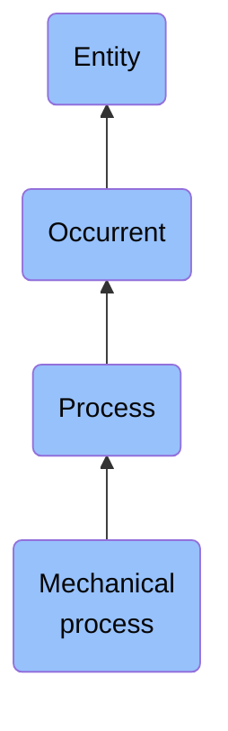

# Mechanical process

## Overview

### Definition
A Process that is the realization of some Disposition of an Artifact

### Examples
Not defined.

### Aliases
Not defined.

### URI
https://www.commoncoreontologies.org/ont00000110

### Subclass Of
- process: http://purl.obolibrary.org/obo/BFO_0000015

### Ontology Reference
- https://www.commoncoreontologies.org/EventOntology

### Hierarchy

## Properties
### Data Properties
### Object Properties
| Label | Definition | Example | Domain | Range | Inverse Of |
|-------|------------|---------|--------|-------|------------|
| [exists at](https://www.commoncoreontologies.org/ont00001998) | (Elucidation) exists at is a relation between a particular and some temporal region at which the particular exists | First World War exists at 1914-1916; Mexico exists at January 1, 2000 | [entity](http://purl.obolibrary.org/obo/BFO_0000001) | [temporal region](http://purl.obolibrary.org/obo/BFO_0000008) |  |
| [preceded by](https://www.commoncoreontologies.org/ont00001998) | b preceded by c =Def b precedes c | The temporal region occupied by the second half of the match is preceded by the temporal region occupied by the first half of the match | [occurrent](http://purl.obolibrary.org/obo/BFO_0000003) | [occurrent](http://purl.obolibrary.org/obo/BFO_0000003) | [precedes](http://purl.obolibrary.org/obo/BFO_0000063) |
| [precedes](https://www.commoncoreontologies.org/ont00001998) | (Elucidation) precedes is a relation between occurrents o, o' such that if t is the temporal extent of o & t' is the temporal extent of o' then either the last instant of o is before the first instant of o' or the last instant of o is the first instant of o' & neither o nor o' are temporal instants | The temporal region occupied by Mary's birth precedes the temporal region occupied by Mary's death. | [occurrent](http://purl.obolibrary.org/obo/BFO_0000003) | [occurrent](http://purl.obolibrary.org/obo/BFO_0000003) |  |
| [has occurrent part](https://www.commoncoreontologies.org/ont00001998) | b has occurrent part c =Def c occurrent part of b | Mary's life has occurrent part Mary's 5th birthday | [occurrent](http://purl.obolibrary.org/obo/BFO_0000003) | [occurrent](http://purl.obolibrary.org/obo/BFO_0000003) | [occurrent part of](http://purl.obolibrary.org/obo/BFO_0000132) |
| [has temporal part](https://www.commoncoreontologies.org/ont00001998) | b has temporal part c =Def c temporal part of b | Your life has temporal part the first year of your life | [occurrent](http://purl.obolibrary.org/obo/BFO_0000003) | [occurrent](http://purl.obolibrary.org/obo/BFO_0000003) | [temporal part of](http://purl.obolibrary.org/obo/BFO_0000139) |
| [occurrent part of](https://www.commoncoreontologies.org/ont00001998) | (Elucidation) occurrent part of is a relation between occurrents b and c when b is part of c | Mary's 5th birthday is an occurrent part of Mary's life; the first set of the tennis match is an occurrent part of the tennis match | [occurrent](http://purl.obolibrary.org/obo/BFO_0000003) | [occurrent](http://purl.obolibrary.org/obo/BFO_0000003) |  |
| [temporal part of](https://www.commoncoreontologies.org/ont00001998) | b temporal part of c =Def b occurrent part of c & (b and c are temporal regions) or (b and c are spatiotemporal regions & b temporally projects onto an occurrent part of the temporal region that c temporally projects onto) or (b and c are processes or process boundaries & b occupies a temporal region that is an occurrent part of the temporal region that c occupies) | Your heart beating from 4pm to 5pm today is a temporal part of the process of your heart beating; the 4th year of your life is a temporal part of your life, as is the process boundary which separates the 3rd and 4th years of your life; the first quarter of a game of football is a temporal part of the whole game | [occurrent](http://purl.obolibrary.org/obo/BFO_0000003) | [occurrent](http://purl.obolibrary.org/obo/BFO_0000003) |  |
| [is cause of](https://www.commoncoreontologies.org/ont00001998) | x is_cause_of y iff x and y are instances of Occurrent, and y is a consequence of x. |  | [occurrent](http://purl.obolibrary.org/obo/BFO_0000003) | [occurrent](http://purl.obolibrary.org/obo/BFO_0000003) | [caused by](https://www.commoncoreontologies.org/ont00001819) |
| [caused by](https://www.commoncoreontologies.org/ont00001998) | x caused_by y iff x and y are instances of Occurrent, and x is a consequence of y. |  | [occurrent](http://purl.obolibrary.org/obo/BFO_0000003) | [occurrent](http://purl.obolibrary.org/obo/BFO_0000003) |  |
| [realizes](https://www.commoncoreontologies.org/ont00001998) | (Elucidation) realizes is a relation between a process b and realizable entity c such that c inheres in some d & for all t, if b has participant d then c exists & the type instantiated by b is correlated with the type instantiated by c | A balding process realizes a disposition to go bald; a studying process realizes a student role; a process of pumping blood realizes the pumping function of a heart | [process](http://purl.obolibrary.org/obo/BFO_0000015) | [realizable entity](http://purl.obolibrary.org/obo/BFO_0000017) |  |
| [has participant](https://www.commoncoreontologies.org/ont00001998) | p has participant c =Def c participates in p |  | [process](http://purl.obolibrary.org/obo/BFO_0000015) | {'or': {'or': ['http://purl.obolibrary.org/obo/BFO_0000020']}} |  |
| [has process part](https://www.commoncoreontologies.org/ont00001998) | x has_process_part y iff x and y are instances of Process, such that y occurs during the temporal interval of x, and y either provides an input to x or receives an output of x, or both. |  | [process](http://purl.obolibrary.org/obo/BFO_0000015) | [process](http://purl.obolibrary.org/obo/BFO_0000015) | [is part of process](https://www.commoncoreontologies.org/ont00001857) |
| [is disrupted by](https://www.commoncoreontologies.org/ont00001998) | Inverse of disrupts. |  | [process](http://purl.obolibrary.org/obo/BFO_0000015) | [process](http://purl.obolibrary.org/obo/BFO_0000015) | [disrupts](https://www.commoncoreontologies.org/ont00001888) |
| [is required by](https://www.commoncoreontologies.org/ont00001998) | y is_required_by x at t iff: x is an instance of Process Regulation at time t, and y is an instance of Process at time t, and x prescribes that y must occur. |  | [process](http://purl.obolibrary.org/obo/BFO_0000015) | [Process Regulation](https://www.commoncoreontologies.org/ont00001324) | [requires](https://www.commoncoreontologies.org/ont00001974) |
| [is prohibited by](https://www.commoncoreontologies.org/ont00001998) | y is_prohibited_by y at t iff: x is an instance of Process Regulation at time t, and y is an instance of Process at time t, and x prescribes that y must not occur. |  | [process](http://purl.obolibrary.org/obo/BFO_0000015) | [Process Regulation](https://www.commoncoreontologies.org/ont00001324) |  |
| [has accomplice](https://www.commoncoreontologies.org/ont00001998) | A Processual Entity p1 has_accomplice some agent a1 iff a1 assists in the commission of p1, is located at the location of p1, but is not agent_in p1. |  | [process](http://purl.obolibrary.org/obo/BFO_0000015) | [material entity](http://purl.obolibrary.org/obo/BFO_0000040) | [accomplice in](https://www.commoncoreontologies.org/ont00001895) |
| [affects](https://www.commoncoreontologies.org/ont00001998) | x affects y iff x is an instance of Process and y is an instance of Continuant, and x influences y in some manner, most often by producing a change in y. |  | [process](http://purl.obolibrary.org/obo/BFO_0000015) | [continuant](http://purl.obolibrary.org/obo/BFO_0000002) | [is affected by](https://www.commoncoreontologies.org/ont00001886) |
| [is part of process](https://www.commoncoreontologies.org/ont00001998) | x is_part_of_process y iff x and y are instances of Process, such that x occurs during the temporal interval of y, and x either provides an input to y or receives an output of y. |  | [process](http://purl.obolibrary.org/obo/BFO_0000015) | [process](http://purl.obolibrary.org/obo/BFO_0000015) |  |
| [is interest of](https://www.commoncoreontologies.org/ont00001998) | The inverse of has_interest_in.  |  | [process](http://purl.obolibrary.org/obo/BFO_0000015) | [Agent](https://www.commoncoreontologies.org/ont00001017) | [has interest in](https://www.commoncoreontologies.org/ont00001984) |
| [disrupts](https://www.commoncoreontologies.org/ont00001998) | A relation where one process disrupts another process from occurring as it would have. |  | [process](http://purl.obolibrary.org/obo/BFO_0000015) | [process](http://purl.obolibrary.org/obo/BFO_0000015) |  |
| [occurs at](https://www.commoncoreontologies.org/ont00001998) | x occurs_at y iff x is an instance of Process and y is an instance of Site, such that x occurs in y. |  | [process](http://purl.obolibrary.org/obo/BFO_0000015) | [site](http://purl.obolibrary.org/obo/BFO_0000029) |  |
| [has input](https://www.commoncoreontologies.org/ont00001998) | y has_input x iff x is an instance of Continuant and y is an instance of Process, such that the presence of x at the beginning of y is a necessary condition for the start of y. |  | [process](http://purl.obolibrary.org/obo/BFO_0000015) | [continuant](http://purl.obolibrary.org/obo/BFO_0000002) |  |
| [has accessory](https://www.commoncoreontologies.org/ont00001998) | x has_accessory y iff x is an instance of Process and y is an instance of Agent, such that y assists another agent in the commission of x, and y was not located at the location of x when x occurred, and y was not an agent_in x. |  | [process](http://purl.obolibrary.org/obo/BFO_0000015) | [material entity](http://purl.obolibrary.org/obo/BFO_0000040) |  |
| [inhibits](https://www.commoncoreontologies.org/ont00001998) | x inhibits y iff x and y are non-identical Processes, d is a Decrease of Realizable Entity, and x is_cause_of d, and r is a Realizable Entity, and d has_participant r, and r realized_in y. |  | [process](http://purl.obolibrary.org/obo/BFO_0000015) | [process](http://purl.obolibrary.org/obo/BFO_0000015) | [inhibited by](https://www.commoncoreontologies.org/ont00001970) |
| [inhibited by](https://www.commoncoreontologies.org/ont00001998) | y inhibited_by x iff x and y are non-identical Processes, d is a Decrease of Realizable Entity, and x is_cause_of d, and r is a Realizable Entity, and d has_participant r, and r realized_in y. |  | [process](http://purl.obolibrary.org/obo/BFO_0000015) | [process](http://purl.obolibrary.org/obo/BFO_0000015) |  |
| [has output](https://www.commoncoreontologies.org/ont00001998) | y has_output x iff x is an instance of Continuant and y is an instance of Process, such that the presence of x at the end of y is a necessary condition for the completion of y. |  | [process](http://purl.obolibrary.org/obo/BFO_0000015) | [continuant](http://purl.obolibrary.org/obo/BFO_0000002) |  |
| [is permitted by](https://www.commoncoreontologies.org/ont00001998) | y is_permitted_by x at t iff: x is an instance of Process Regulation at time t, and y is an instance of Process at time t, and x prescribes that y may occur. |  | [process](http://purl.obolibrary.org/obo/BFO_0000015) | [Process Regulation](https://www.commoncoreontologies.org/ont00001324) |  |
