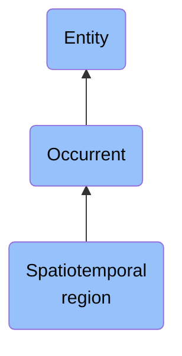

# Spatiotemporal region

## Overview

### Definition
(Elucidation) A spatiotemporal region is an occurrent that is an occurrent part of spacetime

### Examples
- The spatiotemporal region occupied by the development of a cancer tumour; the spatiotemporal region occupied by an orbiting satellite

### Aliases
Not defined.

### URI
http://purl.obolibrary.org/obo/BFO_0000011

### Subclass Of
- occurrent: http://purl.obolibrary.org/obo/BFO_0000003

### Ontology Reference
Not defined.

### Hierarchy

## Properties
### Data Properties
### Object Properties
| Label | Definition | Example | Domain | Range | Inverse Of |
|-------|------------|---------|--------|-------|------------|
| [exists at](https://www.commoncoreontologies.org/ont00001819) | (Elucidation) exists at is a relation between a particular and some temporal region at which the particular exists | First World War exists at 1914-1916; Mexico exists at January 1, 2000 | [entity](http://purl.obolibrary.org/obo/BFO_0000001) | [temporal region](http://purl.obolibrary.org/obo/BFO_0000008) |  |
| [preceded by](https://www.commoncoreontologies.org/ont00001819) | b preceded by c =Def b precedes c | The temporal region occupied by the second half of the match is preceded by the temporal region occupied by the first half of the match | [occurrent](http://purl.obolibrary.org/obo/BFO_0000003) | [occurrent](http://purl.obolibrary.org/obo/BFO_0000003) | [precedes](http://purl.obolibrary.org/obo/BFO_0000063) |
| [precedes](https://www.commoncoreontologies.org/ont00001819) | (Elucidation) precedes is a relation between occurrents o, o' such that if t is the temporal extent of o & t' is the temporal extent of o' then either the last instant of o is before the first instant of o' or the last instant of o is the first instant of o' & neither o nor o' are temporal instants | The temporal region occupied by Mary's birth precedes the temporal region occupied by Mary's death. | [occurrent](http://purl.obolibrary.org/obo/BFO_0000003) | [occurrent](http://purl.obolibrary.org/obo/BFO_0000003) |  |
| [has occurrent part](https://www.commoncoreontologies.org/ont00001819) | b has occurrent part c =Def c occurrent part of b | Mary's life has occurrent part Mary's 5th birthday | [occurrent](http://purl.obolibrary.org/obo/BFO_0000003) | [occurrent](http://purl.obolibrary.org/obo/BFO_0000003) | [occurrent part of](http://purl.obolibrary.org/obo/BFO_0000132) |
| [has temporal part](https://www.commoncoreontologies.org/ont00001819) | b has temporal part c =Def c temporal part of b | Your life has temporal part the first year of your life | [occurrent](http://purl.obolibrary.org/obo/BFO_0000003) | [occurrent](http://purl.obolibrary.org/obo/BFO_0000003) | [temporal part of](http://purl.obolibrary.org/obo/BFO_0000139) |
| [occurrent part of](https://www.commoncoreontologies.org/ont00001819) | (Elucidation) occurrent part of is a relation between occurrents b and c when b is part of c | Mary's 5th birthday is an occurrent part of Mary's life; the first set of the tennis match is an occurrent part of the tennis match | [occurrent](http://purl.obolibrary.org/obo/BFO_0000003) | [occurrent](http://purl.obolibrary.org/obo/BFO_0000003) |  |
| [temporal part of](https://www.commoncoreontologies.org/ont00001819) | b temporal part of c =Def b occurrent part of c & (b and c are temporal regions) or (b and c are spatiotemporal regions & b temporally projects onto an occurrent part of the temporal region that c temporally projects onto) or (b and c are processes or process boundaries & b occupies a temporal region that is an occurrent part of the temporal region that c occupies) | Your heart beating from 4pm to 5pm today is a temporal part of the process of your heart beating; the 4th year of your life is a temporal part of your life, as is the process boundary which separates the 3rd and 4th years of your life; the first quarter of a game of football is a temporal part of the whole game | [occurrent](http://purl.obolibrary.org/obo/BFO_0000003) | [occurrent](http://purl.obolibrary.org/obo/BFO_0000003) |  |
| [is cause of](https://www.commoncoreontologies.org/ont00001819) | x is_cause_of y iff x and y are instances of Occurrent, and y is a consequence of x. |  | [occurrent](http://purl.obolibrary.org/obo/BFO_0000003) | [occurrent](http://purl.obolibrary.org/obo/BFO_0000003) | [caused by](https://www.commoncoreontologies.org/ont00001819) |
| [caused by](https://www.commoncoreontologies.org/ont00001819) | x caused_by y iff x and y are instances of Occurrent, and x is a consequence of y. |  | [occurrent](http://purl.obolibrary.org/obo/BFO_0000003) | [occurrent](http://purl.obolibrary.org/obo/BFO_0000003) |  |
| [temporally projects onto](https://www.commoncoreontologies.org/ont00001819) | (Elucidation) temporally projects onto is a relation between a spatiotemporal region s and some temporal region which is the temporal extent of s | The world line of a particle temporally projects onto the temporal region extending from the beginning to the end of the existence of the particle | [spatiotemporal region](http://purl.obolibrary.org/obo/BFO_0000011) | [temporal region](http://purl.obolibrary.org/obo/BFO_0000008) |  |
| [spatially projects onto](https://www.commoncoreontologies.org/ont00001819) | (Elucidation) spatially projects onto is a relation between some spatiotemporal region b and spatial region c such that at some time t, c is the spatial extent of b at t |  | [spatiotemporal region](http://purl.obolibrary.org/obo/BFO_0000011) | [spatial region](http://purl.obolibrary.org/obo/BFO_0000006) |  |
