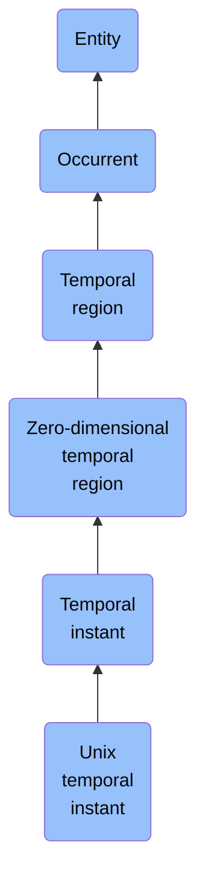

# Unix temporal instant

## Overview

### Definition
A Temporal Instant as specified by the number of Seconds that have elapsed since the specified Epoch Time as described by an implementation of Unix Time.

### Examples
Not defined.

### Aliases
Not defined.

### URI
https://www.commoncoreontologies.org/ont00000114

### Subclass Of
- temporal instant: http://purl.obolibrary.org/obo/BFO_0000203

### Ontology Reference
- https://www.commoncoreontologies.org/TimeOntology

### Hierarchy

## Properties
### Data Properties
### Object Properties
| Label | Definition | Example | Domain | Range | Inverse Of |
|-------|------------|---------|--------|-------|------------|
| [exists at](https://www.commoncoreontologies.org/ont00001990) | (Elucidation) exists at is a relation between a particular and some temporal region at which the particular exists | First World War exists at 1914-1916; Mexico exists at January 1, 2000 | [entity](http://purl.obolibrary.org/obo/BFO_0000001) | [temporal region](http://purl.obolibrary.org/obo/BFO_0000008) |  |
| [preceded by](https://www.commoncoreontologies.org/ont00001990) | b preceded by c =Def b precedes c | The temporal region occupied by the second half of the match is preceded by the temporal region occupied by the first half of the match | [occurrent](http://purl.obolibrary.org/obo/BFO_0000003) | [occurrent](http://purl.obolibrary.org/obo/BFO_0000003) | [precedes](http://purl.obolibrary.org/obo/BFO_0000063) |
| [precedes](https://www.commoncoreontologies.org/ont00001990) | (Elucidation) precedes is a relation between occurrents o, o' such that if t is the temporal extent of o & t' is the temporal extent of o' then either the last instant of o is before the first instant of o' or the last instant of o is the first instant of o' & neither o nor o' are temporal instants | The temporal region occupied by Mary's birth precedes the temporal region occupied by Mary's death. | [occurrent](http://purl.obolibrary.org/obo/BFO_0000003) | [occurrent](http://purl.obolibrary.org/obo/BFO_0000003) |  |
| [has occurrent part](https://www.commoncoreontologies.org/ont00001990) | b has occurrent part c =Def c occurrent part of b | Mary's life has occurrent part Mary's 5th birthday | [occurrent](http://purl.obolibrary.org/obo/BFO_0000003) | [occurrent](http://purl.obolibrary.org/obo/BFO_0000003) | [occurrent part of](http://purl.obolibrary.org/obo/BFO_0000132) |
| [has temporal part](https://www.commoncoreontologies.org/ont00001990) | b has temporal part c =Def c temporal part of b | Your life has temporal part the first year of your life | [occurrent](http://purl.obolibrary.org/obo/BFO_0000003) | [occurrent](http://purl.obolibrary.org/obo/BFO_0000003) | [temporal part of](http://purl.obolibrary.org/obo/BFO_0000139) |
| [occurrent part of](https://www.commoncoreontologies.org/ont00001990) | (Elucidation) occurrent part of is a relation between occurrents b and c when b is part of c | Mary's 5th birthday is an occurrent part of Mary's life; the first set of the tennis match is an occurrent part of the tennis match | [occurrent](http://purl.obolibrary.org/obo/BFO_0000003) | [occurrent](http://purl.obolibrary.org/obo/BFO_0000003) |  |
| [temporal part of](https://www.commoncoreontologies.org/ont00001990) | b temporal part of c =Def b occurrent part of c & (b and c are temporal regions) or (b and c are spatiotemporal regions & b temporally projects onto an occurrent part of the temporal region that c temporally projects onto) or (b and c are processes or process boundaries & b occupies a temporal region that is an occurrent part of the temporal region that c occupies) | Your heart beating from 4pm to 5pm today is a temporal part of the process of your heart beating; the 4th year of your life is a temporal part of your life, as is the process boundary which separates the 3rd and 4th years of your life; the first quarter of a game of football is a temporal part of the whole game | [occurrent](http://purl.obolibrary.org/obo/BFO_0000003) | [occurrent](http://purl.obolibrary.org/obo/BFO_0000003) |  |
| [is cause of](https://www.commoncoreontologies.org/ont00001990) | x is_cause_of y iff x and y are instances of Occurrent, and y is a consequence of x. |  | [occurrent](http://purl.obolibrary.org/obo/BFO_0000003) | [occurrent](http://purl.obolibrary.org/obo/BFO_0000003) | [caused by](https://www.commoncoreontologies.org/ont00001819) |
| [caused by](https://www.commoncoreontologies.org/ont00001990) | x caused_by y iff x and y are instances of Occurrent, and x is a consequence of y. |  | [occurrent](http://purl.obolibrary.org/obo/BFO_0000003) | [occurrent](http://purl.obolibrary.org/obo/BFO_0000003) |  |
| [has first instant](https://www.commoncoreontologies.org/ont00001990) | t has first instant t' =Def t' first instant of t | The first hour of a year has first instant midnight on December 31 | [temporal region](http://purl.obolibrary.org/obo/BFO_0000008) | [temporal instant](http://purl.obolibrary.org/obo/BFO_0000203) |  |
| [has last instant](https://www.commoncoreontologies.org/ont00001990) | t has last instant t' =Def t' last instant of t | The last hour of a year has last instant midnight December 31 | [temporal region](http://purl.obolibrary.org/obo/BFO_0000008) | [temporal instant](http://purl.obolibrary.org/obo/BFO_0000203) |  |
| [is temporal region of](https://www.commoncoreontologies.org/ont00001990) | t is temporal region of p iff p occupies temporal region t. |  | [temporal region](http://purl.obolibrary.org/obo/BFO_0000008) | {'or': {'or': ['http://purl.obolibrary.org/obo/BFO_0000015']}} |  |
| [is inside instant of](https://www.commoncoreontologies.org/ont00001990) | For Temporal Instant t1 and Temporal Interval t2, t1 is inside instant of t2 if and only if there are Temporal Instants t3 and t4 non-identical to t1 and part of t2 such that t3 is before t1 and t4 is after t1. |  | [zero-dimensional temporal region](http://purl.obolibrary.org/obo/BFO_0000148) | [one-dimensional temporal region](http://purl.obolibrary.org/obo/BFO_0000038) |  |
| [instant is after](https://www.commoncoreontologies.org/ont00001990) | A temporal instant t2 (a instance of a zero-dimensional temporal region) is after another temporal instant t1 iff there exists some instance of a temporal interval ti1 such that t1 is the starting instant of ti1 and t2 is the ending instant of ti1. |  | [zero-dimensional temporal region](http://purl.obolibrary.org/obo/BFO_0000148) | [zero-dimensional temporal region](http://purl.obolibrary.org/obo/BFO_0000148) | [instant is before](https://www.commoncoreontologies.org/ont00001990) |
| [instant is before](https://www.commoncoreontologies.org/ont00001990) | A temporal instant t1 (a instance of a zero-dimensional temporal region) is before another temporal instant t2 iff there exists some instance of a temporal interval ti1 such that t1 is the starting instant of ti1 and t2 is the ending instant of ti1. |  | [zero-dimensional temporal region](http://purl.obolibrary.org/obo/BFO_0000148) | [zero-dimensional temporal region](http://purl.obolibrary.org/obo/BFO_0000148) |  |
| [first instant of](https://www.commoncoreontologies.org/ont00001990) | t first instant of t' =Def t is a temporal instant & t' is a temporal region t' & t precedes all temporal parts of t' other than t | An hour starting at midnight yesterday has first instant midnight yesterday | [temporal instant](http://purl.obolibrary.org/obo/BFO_0000203) | [temporal region](http://purl.obolibrary.org/obo/BFO_0000008) | [has first instant](http://purl.obolibrary.org/obo/BFO_0000222) |
| [last instant of](https://www.commoncoreontologies.org/ont00001990) | t last instant of t' =Def t is a temporal instant & t' is a temporal region & all temporal parts of t' other than t precede t | Last midnight is the last instant of yesterday | [temporal instant](http://purl.obolibrary.org/obo/BFO_0000203) | [temporal region](http://purl.obolibrary.org/obo/BFO_0000008) | [has last instant](http://purl.obolibrary.org/obo/BFO_0000224) |
