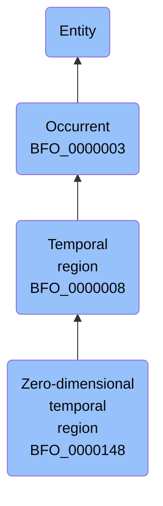

# Zero-dimensional temporal region

## Overview

### Definition
(Elucidation) A zero-dimensional temporal region is a temporal region that is a whole consisting of one or more separated temporal instants as parts

### Examples
- A temporal region that is occupied by a process boundary; the moment at which a finger is detached in an industrial accident

### Aliases
Not defined.

### URI
http://purl.obolibrary.org/obo/BFO_0000148

### Subclass Of
- http://purl.obolibrary.org/obo/BFO_0000008

### Ontology Reference
Not defined.

### Hierarchy

## Properties
### Data Properties
| Predicate | Domain | Range | Label | Definition | Example |
|-----------|---------|--------|---------|------------|----------|

### Object Properties
| Predicate | Domain | Range | Label | Definition | Example | Inverse Of |
|-----------|---------|--------|---------|------------|----------|------------|
| http://purl.obolibrary.org/obo/BFO_0000062 | ['http://purl.obolibrary.org/obo/BFO_0000003'] | ['http://purl.obolibrary.org/obo/BFO_0000003'] | preceded by | b preceded by c =Def b precedes c | The temporal region occupied by the second half of the match is preceded by the temporal region occupied by the first half of the match | ['http://purl.obolibrary.org/obo/BFO_0000063'] |
| http://purl.obolibrary.org/obo/BFO_0000063 | ['http://purl.obolibrary.org/obo/BFO_0000003'] | ['http://purl.obolibrary.org/obo/BFO_0000003'] | precedes | (Elucidation) precedes is a relation between occurrents o, o' such that if t is the temporal extent of o & t' is the temporal extent of o' then either the last instant of o is before the first instant of o' or the last instant of o is the first instant of o' & neither o nor o' are temporal instants | The temporal region occupied by Mary's birth precedes the temporal region occupied by Mary's death. | None |
| http://purl.obolibrary.org/obo/BFO_0000108 | ['http://purl.obolibrary.org/obo/BFO_0000001'] | ['http://purl.obolibrary.org/obo/BFO_0000008'] | exists at | (Elucidation) exists at is a relation between a particular and some temporal region at which the particular exists | First World War exists at 1914-1916; Mexico exists at January 1, 2000 | None |
| http://purl.obolibrary.org/obo/BFO_0000117 | ['http://purl.obolibrary.org/obo/BFO_0000003'] | ['http://purl.obolibrary.org/obo/BFO_0000003'] | has occurrent part | b has occurrent part c =Def c occurrent part of b | Mary's life has occurrent part Mary's 5th birthday | ['http://purl.obolibrary.org/obo/BFO_0000132'] |
| http://purl.obolibrary.org/obo/BFO_0000121 | ['http://purl.obolibrary.org/obo/BFO_0000003'] | ['http://purl.obolibrary.org/obo/BFO_0000003'] | has temporal part | b has temporal part c =Def c temporal part of b | Your life has temporal part the first year of your life | ['http://purl.obolibrary.org/obo/BFO_0000139'] |
| http://purl.obolibrary.org/obo/BFO_0000132 | ['http://purl.obolibrary.org/obo/BFO_0000003'] | ['http://purl.obolibrary.org/obo/BFO_0000003'] | occurrent part of | (Elucidation) occurrent part of is a relation between occurrents b and c when b is part of c | Mary's 5th birthday is an occurrent part of Mary's life; the first set of the tennis match is an occurrent part of the tennis match | None |
| http://purl.obolibrary.org/obo/BFO_0000139 | ['http://purl.obolibrary.org/obo/BFO_0000003'] | ['http://purl.obolibrary.org/obo/BFO_0000003'] | temporal part of | b temporal part of c =Def b occurrent part of c & (b and c are temporal regions) or (b and c are spatiotemporal regions & b temporally projects onto an occurrent part of the temporal region that c temporally projects onto) or (b and c are processes or process boundaries & b occupies a temporal region that is an occurrent part of the temporal region that c occupies) | Your heart beating from 4pm to 5pm today is a temporal part of the process of your heart beating; the 4th year of your life is a temporal part of your life, as is the process boundary which separates the 3rd and 4th years of your life; the first quarter of a game of football is a temporal part of the whole game | None |
| http://purl.obolibrary.org/obo/BFO_0000222 | ['http://purl.obolibrary.org/obo/BFO_0000008'] | ['http://purl.obolibrary.org/obo/BFO_0000203'] | has first instant | t has first instant t' =Def t' first instant of t | The first hour of a year has first instant midnight on December 31 | None |
| http://purl.obolibrary.org/obo/BFO_0000224 | ['http://purl.obolibrary.org/obo/BFO_0000008'] | ['http://purl.obolibrary.org/obo/BFO_0000203'] | has last instant | t has last instant t' =Def t' last instant of t | The last hour of a year has last instant midnight December 31 | None |
| https://www.commoncoreontologies.org/ont00001803 | ['http://purl.obolibrary.org/obo/BFO_0000003'] | ['http://purl.obolibrary.org/obo/BFO_0000003'] | is cause of | x is_cause_of y iff x and y are instances of Occurrent, and y is a consequence of x. |  | ['https://www.commoncoreontologies.org/ont00001819'] |
| https://www.commoncoreontologies.org/ont00001819 | ['http://purl.obolibrary.org/obo/BFO_0000003'] | ['http://purl.obolibrary.org/obo/BFO_0000003'] | caused by | x caused_by y iff x and y are instances of Occurrent, and x is a consequence of y. |  | None |
| https://www.commoncoreontologies.org/ont00001848 | ['http://purl.obolibrary.org/obo/BFO_0000148'] | ['http://purl.obolibrary.org/obo/BFO_0000038'] | is inside instant of | For Temporal Instant t1 and Temporal Interval t2, t1 is inside instant of t2 if and only if there are Temporal Instants t3 and t4 non-identical to t1 and part of t2 such that t3 is before t1 and t4 is after t1. |  | None |
| https://www.commoncoreontologies.org/ont00001874 | ['http://purl.obolibrary.org/obo/BFO_0000008'] | [{'or': {'or': ['http://purl.obolibrary.org/obo/BFO_0000015']}}] | is temporal region of | t is temporal region of p iff p occupies temporal region t. |  | None |
| https://www.commoncoreontologies.org/ont00001893 | ['http://purl.obolibrary.org/obo/BFO_0000148'] | ['http://purl.obolibrary.org/obo/BFO_0000148'] | instant is after | A temporal instant t2 (a instance of a zero-dimensional temporal region) is after another temporal instant t1 iff there exists some instance of a temporal interval ti1 such that t1 is the starting instant of ti1 and t2 is the ending instant of ti1. |  | ['https://www.commoncoreontologies.org/ont00001990'] |
| https://www.commoncoreontologies.org/ont00001990 | ['http://purl.obolibrary.org/obo/BFO_0000148'] | ['http://purl.obolibrary.org/obo/BFO_0000148'] | instant is before | A temporal instant t1 (a instance of a zero-dimensional temporal region) is before another temporal instant t2 iff there exists some instance of a temporal interval ti1 such that t1 is the starting instant of ti1 and t2 is the ending instant of ti1. |  | None |
