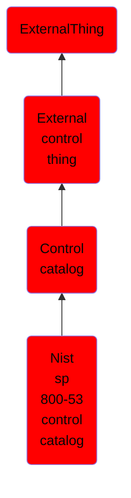

# Nist sp 800-53 control catalog

## Overview

### Definition
A NIST SP 800-53 control catalog provides the entire set of security and privacy controls for a version of NIST SP 800-53.

### Examples
Not defined.

### Aliases
Not defined.

### URI
http://d3fend.mitre.org/ontologies/d3fend.owl#NISTSP800-53ControlCatalog

### Subclass Of

- [ExternalThing](/docs/ontology/reference/model/ExternalThing/ExternalThing.md)
- [External control thing](/docs/ontology/reference/model/ExternalThing/External%20control%20thing/External%20control%20thing.md)
- [Control catalog](/docs/ontology/reference/model/ExternalThing/External%20control%20thing/Control%20catalog/Control%20catalog.md)
- [Nist sp 800-53 control catalog](/docs/ontology/reference/model/ExternalThing/External%20control%20thing/Control%20catalog/Nist%20sp%20800-53%20control%20catalog/Nist%20sp%20800-53%20control%20catalog.md)

### Ontology Reference
- [d3fend](http://d3fend.mitre.org/ontologies/d3fend.owl#)

## Properties
