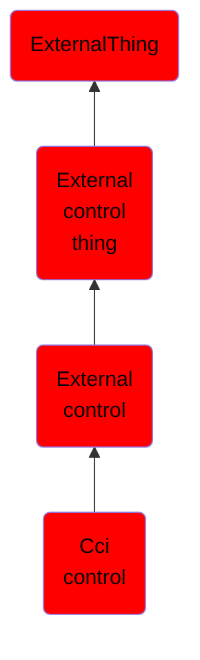

# Cci control

## Overview

### Definition
Not defined.

### Examples
Not defined.

### Aliases
Not defined.

### URI
http://d3fend.mitre.org/ontologies/d3fend.owl#CCIControl

### Subclass Of

- [ExternalThing](/docs/ontology/reference/model/ExternalThing/ExternalThing.md)
- [External control thing](/docs/ontology/reference/model/ExternalThing/External%20control%20thing/External%20control%20thing.md)
- [External control](/docs/ontology/reference/model/ExternalThing/External%20control%20thing/External%20control/External%20control.md)
- [Cci control](/docs/ontology/reference/model/ExternalThing/External%20control%20thing/External%20control/Cci%20control/Cci%20control.md)

### Ontology Reference
- [d3fend](http://d3fend.mitre.org/ontologies/d3fend.owl#)

## Properties
