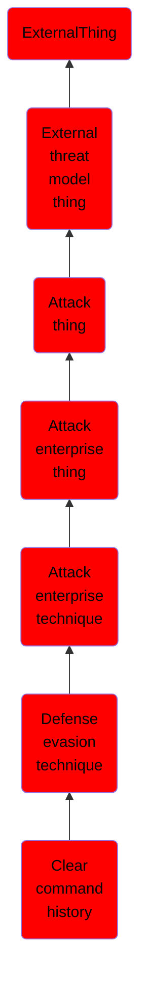

# Clear command history

## Overview

### Definition
In addition to clearing system logs, an adversary may clear the command history of a compromised account to conceal the actions undertaken during an intrusion. macOS and Linux both keep track of the commands users type in their terminal so that users can retrace what they've done. These logs can be accessed in a few different ways. While logged in, this command history is tracked in a file pointed to by the environment variable <code>HISTFILE</code>. When a user logs off a system, this information is flushed to a file in the user's home directory called <code>~/.bash_history</code>. The benefit of this is that it allows users to go back to commands they've used before in different sessions. Since everything typed on the command-line is saved, passwords passed in on the command line are also saved. Adversaries can abuse this by searching these files for cleartext passwords. Additionally, adversaries can use a variety of methods to prevent their own commands from appear in these logs such as <code>unset HISTFILE</code>, <code>export HISTFILESIZE=0</code>, <code>history -c</code>, <code>rm ~/.bash_history</code>.

### Examples
Not defined.

### Aliases
Not defined.

### URI
http://d3fend.mitre.org/ontologies/d3fend.owl#T1146

### Subclass Of

- [ExternalThing](/docs/ontology/reference/model/ExternalThing/ExternalThing.md)
- [External threat model thing](/docs/ontology/reference/model/ExternalThing/External%20threat%20model%20thing/External%20threat%20model%20thing.md)
- [Attack thing](/docs/ontology/reference/model/ExternalThing/External%20threat%20model%20thing/Attack%20thing/Attack%20thing.md)
- [Attack enterprise thing](/docs/ontology/reference/model/ExternalThing/External%20threat%20model%20thing/Attack%20thing/Attack%20enterprise%20thing/Attack%20enterprise%20thing.md)
- [Attack enterprise technique](/docs/ontology/reference/model/ExternalThing/External%20threat%20model%20thing/Attack%20thing/Attack%20enterprise%20thing/Attack%20enterprise%20technique/Attack%20enterprise%20technique.md)
- [Defense evasion technique](/docs/ontology/reference/model/ExternalThing/External%20threat%20model%20thing/Attack%20thing/Attack%20enterprise%20thing/Attack%20enterprise%20technique/Defense%20evasion%20technique/Defense%20evasion%20technique.md)
- [Clear command history](/docs/ontology/reference/model/ExternalThing/External%20threat%20model%20thing/Attack%20thing/Attack%20enterprise%20thing/Attack%20enterprise%20technique/Defense%20evasion%20technique/Clear%20command%20history/Clear%20command%20history.md)

### Ontology Reference
- [d3fend](http://d3fend.mitre.org/ontologies/d3fend.owl#)

## Properties
