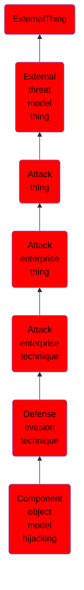

# Component object model hijacking

## Overview

### Definition
The Component Object Model (COM) is a system within Windows to enable interaction between software components through the operating system. (Citation: Microsoft Component Object Model) Adversaries can use this system to insert malicious code that can be executed in place of legitimate software through hijacking the COM references and relationships as a means for persistence. Hijacking a COM object requires a change in the Windows Registry to replace a reference to a legitimate system component which may cause that component to not work when executed. When that system component is executed through normal system operation the adversary's code will be executed instead. (Citation: GDATA COM Hijacking) An adversary is likely to hijack objects that are used frequently enough to maintain a consistent level of persistence, but are unlikely to break noticeable functionality within the system as to avoid system instability that could lead to detection.

### Examples
Not defined.

### Aliases
Not defined.

### URI
http://d3fend.mitre.org/ontologies/d3fend.owl#T1122

### Subclass Of

- [ExternalThing](/docs/ontology/reference/model/ExternalThing/ExternalThing.md)
- [External threat model thing](/docs/ontology/reference/model/ExternalThing/External%20threat%20model%20thing/External%20threat%20model%20thing.md)
- [Attack thing](/docs/ontology/reference/model/ExternalThing/External%20threat%20model%20thing/Attack%20thing/Attack%20thing.md)
- [Attack enterprise thing](/docs/ontology/reference/model/ExternalThing/External%20threat%20model%20thing/Attack%20thing/Attack%20enterprise%20thing/Attack%20enterprise%20thing.md)
- [Attack enterprise technique](/docs/ontology/reference/model/ExternalThing/External%20threat%20model%20thing/Attack%20thing/Attack%20enterprise%20thing/Attack%20enterprise%20technique/Attack%20enterprise%20technique.md)
- [Defense evasion technique](/docs/ontology/reference/model/ExternalThing/External%20threat%20model%20thing/Attack%20thing/Attack%20enterprise%20thing/Attack%20enterprise%20technique/Defense%20evasion%20technique/Defense%20evasion%20technique.md)
- [Component object model hijacking](/docs/ontology/reference/model/ExternalThing/External%20threat%20model%20thing/Attack%20thing/Attack%20enterprise%20thing/Attack%20enterprise%20technique/Defense%20evasion%20technique/Component%20object%20model%20hijacking/Component%20object%20model%20hijacking.md)

### Ontology Reference
- [d3fend](http://d3fend.mitre.org/ontologies/d3fend.owl#)

## Properties
