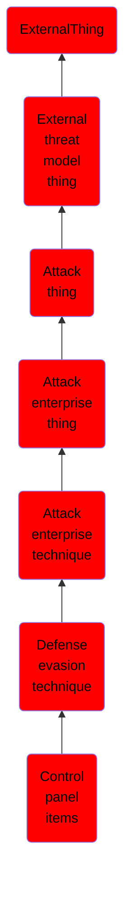

# Control panel items

## Overview

### Definition
Windows Control Panel items are utilities that allow users to view and adjust computer settings. Control Panel items are registered executable (.exe) or Control Panel (.cpl) files, the latter are actually renamed dynamic-link library (.dll) files that export a CPlApplet function. (Citation: Microsoft Implementing CPL) (Citation: TrendMicro CPL Malware Jan 2014) Control Panel items can be executed directly from the command line, programmatically via an application programming interface (API) call, or by simply double-clicking the file. (Citation: Microsoft Implementing CPL) (Citation: TrendMicro CPL Malware Jan 2014) (Citation: TrendMicro CPL Malware Dec 2013)

### Examples
Not defined.

### Aliases
Not defined.

### URI
http://d3fend.mitre.org/ontologies/d3fend.owl#T1196

### Subclass Of

- [ExternalThing](/docs/ontology/reference/model/ExternalThing/ExternalThing.md)
- [External threat model thing](/docs/ontology/reference/model/ExternalThing/External%20threat%20model%20thing/External%20threat%20model%20thing.md)
- [Attack thing](/docs/ontology/reference/model/ExternalThing/External%20threat%20model%20thing/Attack%20thing/Attack%20thing.md)
- [Attack enterprise thing](/docs/ontology/reference/model/ExternalThing/External%20threat%20model%20thing/Attack%20thing/Attack%20enterprise%20thing/Attack%20enterprise%20thing.md)
- [Attack enterprise technique](/docs/ontology/reference/model/ExternalThing/External%20threat%20model%20thing/Attack%20thing/Attack%20enterprise%20thing/Attack%20enterprise%20technique/Attack%20enterprise%20technique.md)
- [Defense evasion technique](/docs/ontology/reference/model/ExternalThing/External%20threat%20model%20thing/Attack%20thing/Attack%20enterprise%20thing/Attack%20enterprise%20technique/Defense%20evasion%20technique/Defense%20evasion%20technique.md)
- [Control panel items](/docs/ontology/reference/model/ExternalThing/External%20threat%20model%20thing/Attack%20thing/Attack%20enterprise%20thing/Attack%20enterprise%20technique/Defense%20evasion%20technique/Control%20panel%20items/Control%20panel%20items.md)

### Ontology Reference
- [d3fend](http://d3fend.mitre.org/ontologies/d3fend.owl#)

## Properties
