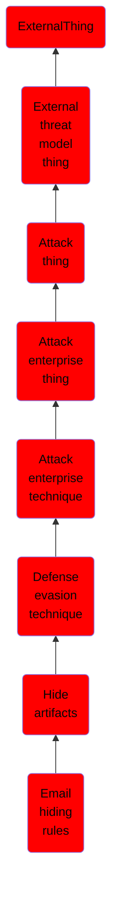

# Email hiding rules

## Overview

### Definition
Adversaries may use email rules to hide inbound emails in a compromised user's mailbox. Many email clients allow users to create inbox rules for various email functions, including moving emails to other folders, marking emails as read, or deleting emails. Rules may be created or modified within email clients or through external features such as the <code>New-InboxRule</code> or <code>Set-InboxRule</code> [PowerShell](https://attack.mitre.org/techniques/T1059/001) cmdlets on Windows systems.(Citation: Microsoft Inbox Rules)(Citation: MacOS Email Rules)(Citation: Microsoft New-InboxRule)(Citation: Microsoft Set-InboxRule)

### Examples
Not defined.

### Aliases
Not defined.

### URI
http://d3fend.mitre.org/ontologies/d3fend.owl#T1564.008

### Subclass Of

- [ExternalThing](/docs/ontology/reference/model/ExternalThing/ExternalThing.md)
- [External threat model thing](/docs/ontology/reference/model/ExternalThing/External%20threat%20model%20thing/External%20threat%20model%20thing.md)
- [Attack thing](/docs/ontology/reference/model/ExternalThing/External%20threat%20model%20thing/Attack%20thing/Attack%20thing.md)
- [Attack enterprise thing](/docs/ontology/reference/model/ExternalThing/External%20threat%20model%20thing/Attack%20thing/Attack%20enterprise%20thing/Attack%20enterprise%20thing.md)
- [Attack enterprise technique](/docs/ontology/reference/model/ExternalThing/External%20threat%20model%20thing/Attack%20thing/Attack%20enterprise%20thing/Attack%20enterprise%20technique/Attack%20enterprise%20technique.md)
- [Defense evasion technique](/docs/ontology/reference/model/ExternalThing/External%20threat%20model%20thing/Attack%20thing/Attack%20enterprise%20thing/Attack%20enterprise%20technique/Defense%20evasion%20technique/Defense%20evasion%20technique.md)
- [Hide artifacts](/docs/ontology/reference/model/ExternalThing/External%20threat%20model%20thing/Attack%20thing/Attack%20enterprise%20thing/Attack%20enterprise%20technique/Defense%20evasion%20technique/Hide%20artifacts/Hide%20artifacts.md)
- [Email hiding rules](/docs/ontology/reference/model/ExternalThing/External%20threat%20model%20thing/Attack%20thing/Attack%20enterprise%20thing/Attack%20enterprise%20technique/Defense%20evasion%20technique/Hide%20artifacts/Email%20hiding%20rules/Email%20hiding%20rules.md)

### Ontology Reference
- [d3fend](http://d3fend.mitre.org/ontologies/d3fend.owl#)

## Properties
