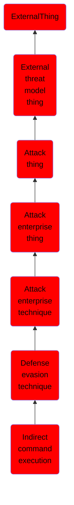

# Indirect command execution

## Overview

### Definition
Adversaries may abuse utilities that allow for command execution to bypass security restrictions that limit the use of command-line interpreters. Various Windows utilities may be used to execute commands, possibly without invoking [cmd](https://attack.mitre.org/software/S0106). For example, [Forfiles](https://attack.mitre.org/software/S0193), the Program Compatibility Assistant (pcalua.exe), components of the Windows Subsystem for Linux (WSL), as well as other utilities may invoke the execution of programs and commands from a [Command and Scripting Interpreter](https://attack.mitre.org/techniques/T1059), Run window, or via scripts. (Citation: VectorSec ForFiles Aug 2017) (Citation: Evi1cg Forfiles Nov 2017)

### Examples
Not defined.

### Aliases
Not defined.

### URI
http://d3fend.mitre.org/ontologies/d3fend.owl#T1202

### Subclass Of

- [ExternalThing](/docs/ontology/reference/model/ExternalThing/ExternalThing.md)
- [External threat model thing](/docs/ontology/reference/model/ExternalThing/External%20threat%20model%20thing/External%20threat%20model%20thing.md)
- [Attack thing](/docs/ontology/reference/model/ExternalThing/External%20threat%20model%20thing/Attack%20thing/Attack%20thing.md)
- [Attack enterprise thing](/docs/ontology/reference/model/ExternalThing/External%20threat%20model%20thing/Attack%20thing/Attack%20enterprise%20thing/Attack%20enterprise%20thing.md)
- [Attack enterprise technique](/docs/ontology/reference/model/ExternalThing/External%20threat%20model%20thing/Attack%20thing/Attack%20enterprise%20thing/Attack%20enterprise%20technique/Attack%20enterprise%20technique.md)
- [Defense evasion technique](/docs/ontology/reference/model/ExternalThing/External%20threat%20model%20thing/Attack%20thing/Attack%20enterprise%20thing/Attack%20enterprise%20technique/Defense%20evasion%20technique/Defense%20evasion%20technique.md)
- [Indirect command execution](/docs/ontology/reference/model/ExternalThing/External%20threat%20model%20thing/Attack%20thing/Attack%20enterprise%20thing/Attack%20enterprise%20technique/Defense%20evasion%20technique/Indirect%20command%20execution/Indirect%20command%20execution.md)

### Ontology Reference
- [d3fend](http://d3fend.mitre.org/ontologies/d3fend.owl#)

## Properties
