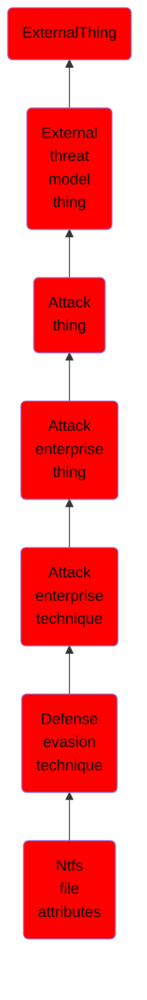

# Ntfs file attributes

## Overview

### Definition
Every New Technology File System (NTFS) formatted partition contains a Master File Table (MFT) that maintains a record for every file/directory on the partition. (Citation: SpectorOps Host-Based Jul 2017) Within MFT entries are file attributes, (Citation: Microsoft NTFS File Attributes Aug 2010) such as Extended Attributes (EA) and Data [known as Alternate Data Streams (ADSs) when more than one Data attribute is present], that can be used to store arbitrary data (and even complete files). (Citation: SpectorOps Host-Based Jul 2017) (Citation: Microsoft File Streams) (Citation: MalwareBytes ADS July 2015) (Citation: Microsoft ADS Mar 2014)

### Examples
Not defined.

### Aliases
Not defined.

### URI
http://d3fend.mitre.org/ontologies/d3fend.owl#T1096

### Subclass Of

- [ExternalThing](/docs/ontology/reference/model/ExternalThing/ExternalThing.md)
- [External threat model thing](/docs/ontology/reference/model/ExternalThing/External%20threat%20model%20thing/External%20threat%20model%20thing.md)
- [Attack thing](/docs/ontology/reference/model/ExternalThing/External%20threat%20model%20thing/Attack%20thing/Attack%20thing.md)
- [Attack enterprise thing](/docs/ontology/reference/model/ExternalThing/External%20threat%20model%20thing/Attack%20thing/Attack%20enterprise%20thing/Attack%20enterprise%20thing.md)
- [Attack enterprise technique](/docs/ontology/reference/model/ExternalThing/External%20threat%20model%20thing/Attack%20thing/Attack%20enterprise%20thing/Attack%20enterprise%20technique/Attack%20enterprise%20technique.md)
- [Defense evasion technique](/docs/ontology/reference/model/ExternalThing/External%20threat%20model%20thing/Attack%20thing/Attack%20enterprise%20thing/Attack%20enterprise%20technique/Defense%20evasion%20technique/Defense%20evasion%20technique.md)
- [Ntfs file attributes](/docs/ontology/reference/model/ExternalThing/External%20threat%20model%20thing/Attack%20thing/Attack%20enterprise%20thing/Attack%20enterprise%20technique/Defense%20evasion%20technique/Ntfs%20file%20attributes/Ntfs%20file%20attributes.md)

### Ontology Reference
- [d3fend](http://d3fend.mitre.org/ontologies/d3fend.owl#)

## Properties
