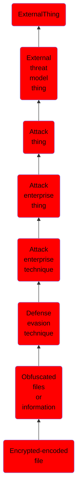

# Encrypted/encoded file

## Overview

### Definition
Adversaries may encrypt or encode files to obfuscate strings, bytes, and other specific patterns to impede detection. Encrypting and/or encoding file content aims to conceal malicious artifacts within a file used in an intrusion. Many other techniques, such as [Software Packing](https://attack.mitre.org/techniques/T1027/002), [Steganography](https://attack.mitre.org/techniques/T1027/003), and [Embedded Payloads](https://attack.mitre.org/techniques/T1027/009), share this same broad objective. Encrypting and/or encoding files could lead to a lapse in detection of static signatures, only for this malicious content to be revealed (i.e., [Deobfuscate/Decode Files or Information](https://attack.mitre.org/techniques/T1140)) at the time of execution/use.

### Examples
Not defined.

### Aliases
Not defined.

### URI
http://d3fend.mitre.org/ontologies/d3fend.owl#T1027.013

### Subclass Of

- [ExternalThing](/docs/ontology/reference/model/ExternalThing/ExternalThing.md)
- [External threat model thing](/docs/ontology/reference/model/ExternalThing/External%20threat%20model%20thing/External%20threat%20model%20thing.md)
- [Attack thing](/docs/ontology/reference/model/ExternalThing/External%20threat%20model%20thing/Attack%20thing/Attack%20thing.md)
- [Attack enterprise thing](/docs/ontology/reference/model/ExternalThing/External%20threat%20model%20thing/Attack%20thing/Attack%20enterprise%20thing/Attack%20enterprise%20thing.md)
- [Attack enterprise technique](/docs/ontology/reference/model/ExternalThing/External%20threat%20model%20thing/Attack%20thing/Attack%20enterprise%20thing/Attack%20enterprise%20technique/Attack%20enterprise%20technique.md)
- [Defense evasion technique](/docs/ontology/reference/model/ExternalThing/External%20threat%20model%20thing/Attack%20thing/Attack%20enterprise%20thing/Attack%20enterprise%20technique/Defense%20evasion%20technique/Defense%20evasion%20technique.md)
- [Obfuscated files or information](/docs/ontology/reference/model/ExternalThing/External%20threat%20model%20thing/Attack%20thing/Attack%20enterprise%20thing/Attack%20enterprise%20technique/Defense%20evasion%20technique/Obfuscated%20files%20or%20information/Obfuscated%20files%20or%20information.md)
- [Encrypted-encoded file](/docs/ontology/reference/model/ExternalThing/External%20threat%20model%20thing/Attack%20thing/Attack%20enterprise%20thing/Attack%20enterprise%20technique/Defense%20evasion%20technique/Obfuscated%20files%20or%20information/Encrypted-encoded%20file/Encrypted-encoded%20file.md)

### Ontology Reference
- [d3fend](http://d3fend.mitre.org/ontologies/d3fend.owl#)

## Properties
