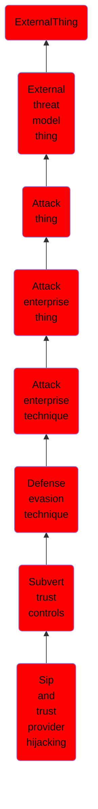

# Sip and trust provider hijacking

## Overview

### Definition
Adversaries may tamper with SIP and trust provider components to mislead the operating system and application control tools when conducting signature validation checks. In user mode, Windows Authenticode (Citation: Microsoft Authenticode) digital signatures are used to verify a file's origin and integrity, variables that may be used to establish trust in signed code (ex: a driver with a valid Microsoft signature may be handled as safe). The signature validation process is handled via the WinVerifyTrust application programming interface (API) function,  (Citation: Microsoft WinVerifyTrust) which accepts an inquiry and coordinates with the appropriate trust provider, which is responsible for validating parameters of a signature. (Citation: SpectorOps Subverting Trust Sept 2017)

### Examples
Not defined.

### Aliases
Not defined.

### URI
http://d3fend.mitre.org/ontologies/d3fend.owl#T1553.003

### Subclass Of

- [ExternalThing](/docs/ontology/reference/model/ExternalThing/ExternalThing.md)
- [External threat model thing](/docs/ontology/reference/model/ExternalThing/External%20threat%20model%20thing/External%20threat%20model%20thing.md)
- [Attack thing](/docs/ontology/reference/model/ExternalThing/External%20threat%20model%20thing/Attack%20thing/Attack%20thing.md)
- [Attack enterprise thing](/docs/ontology/reference/model/ExternalThing/External%20threat%20model%20thing/Attack%20thing/Attack%20enterprise%20thing/Attack%20enterprise%20thing.md)
- [Attack enterprise technique](/docs/ontology/reference/model/ExternalThing/External%20threat%20model%20thing/Attack%20thing/Attack%20enterprise%20thing/Attack%20enterprise%20technique/Attack%20enterprise%20technique.md)
- [Defense evasion technique](/docs/ontology/reference/model/ExternalThing/External%20threat%20model%20thing/Attack%20thing/Attack%20enterprise%20thing/Attack%20enterprise%20technique/Defense%20evasion%20technique/Defense%20evasion%20technique.md)
- [Subvert trust controls](/docs/ontology/reference/model/ExternalThing/External%20threat%20model%20thing/Attack%20thing/Attack%20enterprise%20thing/Attack%20enterprise%20technique/Defense%20evasion%20technique/Subvert%20trust%20controls/Subvert%20trust%20controls.md)
- [Sip and trust provider hijacking](/docs/ontology/reference/model/ExternalThing/External%20threat%20model%20thing/Attack%20thing/Attack%20enterprise%20thing/Attack%20enterprise%20technique/Defense%20evasion%20technique/Subvert%20trust%20controls/Sip%20and%20trust%20provider%20hijacking/Sip%20and%20trust%20provider%20hijacking.md)

### Ontology Reference
- [d3fend](http://d3fend.mitre.org/ontologies/d3fend.owl#)

## Properties
