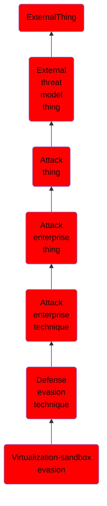

# Virtualization/sandbox evasion

## Overview

### Definition
Adversaries may employ various means to detect and avoid virtualization and analysis environments. This may include changing behaviors based on the results of checks for the presence of artifacts indicative of a virtual machine environment (VME) or sandbox. If the adversary detects a VME, they may alter their malware to disengage from the victim or conceal the core functions of the implant. They may also search for VME artifacts before dropping secondary or additional payloads. Adversaries may use the information learned from [Virtualization/Sandbox Evasion](https://attack.mitre.org/techniques/T1497) during automated discovery to shape follow-on behaviors.(Citation: Deloitte Environment Awareness)

### Examples
Not defined.

### Aliases
Not defined.

### URI
http://d3fend.mitre.org/ontologies/d3fend.owl#T1497

### Subclass Of

- [ExternalThing](/docs/ontology/reference/model/ExternalThing/ExternalThing.md)
- [External threat model thing](/docs/ontology/reference/model/ExternalThing/External%20threat%20model%20thing/External%20threat%20model%20thing.md)
- [Attack thing](/docs/ontology/reference/model/ExternalThing/External%20threat%20model%20thing/Attack%20thing/Attack%20thing.md)
- [Attack enterprise thing](/docs/ontology/reference/model/ExternalThing/External%20threat%20model%20thing/Attack%20thing/Attack%20enterprise%20thing/Attack%20enterprise%20thing.md)
- [Attack enterprise technique](/docs/ontology/reference/model/ExternalThing/External%20threat%20model%20thing/Attack%20thing/Attack%20enterprise%20thing/Attack%20enterprise%20technique/Attack%20enterprise%20technique.md)
- [Defense evasion technique](/docs/ontology/reference/model/ExternalThing/External%20threat%20model%20thing/Attack%20thing/Attack%20enterprise%20thing/Attack%20enterprise%20technique/Defense%20evasion%20technique/Defense%20evasion%20technique.md)
- [Virtualization-sandbox evasion](/docs/ontology/reference/model/ExternalThing/External%20threat%20model%20thing/Attack%20thing/Attack%20enterprise%20thing/Attack%20enterprise%20technique/Defense%20evasion%20technique/Virtualization-sandbox%20evasion/Virtualization-sandbox%20evasion.md)

### Ontology Reference
- [d3fend](http://d3fend.mitre.org/ontologies/d3fend.owl#)

## Properties
