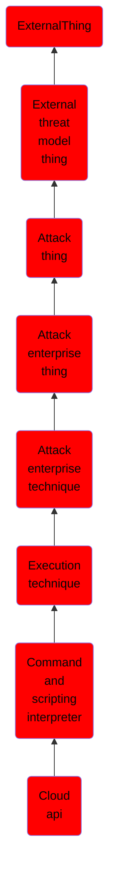

# Cloud api

## Overview

### Definition
Adversaries may abuse cloud APIs to execute malicious commands. APIs available in cloud environments provide various functionalities and are a feature-rich method for programmatic access to nearly all aspects of a tenant. These APIs may be utilized through various methods such as command line interpreters (CLIs), in-browser Cloud Shells, [PowerShell](https://attack.mitre.org/techniques/T1059/001) modules like Azure for PowerShell(Citation: Microsoft - Azure PowerShell), or software developer kits (SDKs) available for languages such as [Python](https://attack.mitre.org/techniques/T1059/006).

### Examples
Not defined.

### Aliases
Not defined.

### URI
http://d3fend.mitre.org/ontologies/d3fend.owl#T1059.009

### Subclass Of

- [ExternalThing](/docs/ontology/reference/model/ExternalThing/ExternalThing.md)
- [External threat model thing](/docs/ontology/reference/model/ExternalThing/External%20threat%20model%20thing/External%20threat%20model%20thing.md)
- [Attack thing](/docs/ontology/reference/model/ExternalThing/External%20threat%20model%20thing/Attack%20thing/Attack%20thing.md)
- [Attack enterprise thing](/docs/ontology/reference/model/ExternalThing/External%20threat%20model%20thing/Attack%20thing/Attack%20enterprise%20thing/Attack%20enterprise%20thing.md)
- [Attack enterprise technique](/docs/ontology/reference/model/ExternalThing/External%20threat%20model%20thing/Attack%20thing/Attack%20enterprise%20thing/Attack%20enterprise%20technique/Attack%20enterprise%20technique.md)
- [Execution technique](/docs/ontology/reference/model/ExternalThing/External%20threat%20model%20thing/Attack%20thing/Attack%20enterprise%20thing/Attack%20enterprise%20technique/Execution%20technique/Execution%20technique.md)
- [Command and scripting interpreter](/docs/ontology/reference/model/ExternalThing/External%20threat%20model%20thing/Attack%20thing/Attack%20enterprise%20thing/Attack%20enterprise%20technique/Execution%20technique/Command%20and%20scripting%20interpreter/Command%20and%20scripting%20interpreter.md)
- [Cloud api](/docs/ontology/reference/model/ExternalThing/External%20threat%20model%20thing/Attack%20thing/Attack%20enterprise%20thing/Attack%20enterprise%20technique/Execution%20technique/Command%20and%20scripting%20interpreter/Cloud%20api/Cloud%20api.md)

### Ontology Reference
- [d3fend](http://d3fend.mitre.org/ontologies/d3fend.owl#)

## Properties
