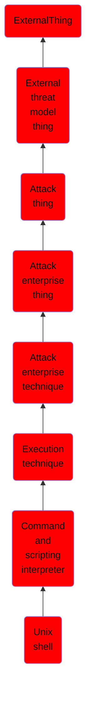

# Unix shell

## Overview

### Definition
Adversaries may abuse Unix shell commands and scripts for execution. Unix shells are the primary command prompt on Linux and macOS systems, though many variations of the Unix shell exist (e.g. sh, bash, zsh, etc.) depending on the specific OS or distribution.(Citation: DieNet Bash)(Citation: Apple ZShell) Unix shells can control every aspect of a system, with certain commands requiring elevated privileges.

### Examples
Not defined.

### Aliases
Bash Execution

### URI
http://d3fend.mitre.org/ontologies/d3fend.owl#T1059.004

### Subclass Of

- [ExternalThing](/docs/ontology/reference/model/ExternalThing/ExternalThing.md)
- [External threat model thing](/docs/ontology/reference/model/ExternalThing/External%20threat%20model%20thing/External%20threat%20model%20thing.md)
- [Attack thing](/docs/ontology/reference/model/ExternalThing/External%20threat%20model%20thing/Attack%20thing/Attack%20thing.md)
- [Attack enterprise thing](/docs/ontology/reference/model/ExternalThing/External%20threat%20model%20thing/Attack%20thing/Attack%20enterprise%20thing/Attack%20enterprise%20thing.md)
- [Attack enterprise technique](/docs/ontology/reference/model/ExternalThing/External%20threat%20model%20thing/Attack%20thing/Attack%20enterprise%20thing/Attack%20enterprise%20technique/Attack%20enterprise%20technique.md)
- [Execution technique](/docs/ontology/reference/model/ExternalThing/External%20threat%20model%20thing/Attack%20thing/Attack%20enterprise%20thing/Attack%20enterprise%20technique/Execution%20technique/Execution%20technique.md)
- [Command and scripting interpreter](/docs/ontology/reference/model/ExternalThing/External%20threat%20model%20thing/Attack%20thing/Attack%20enterprise%20thing/Attack%20enterprise%20technique/Execution%20technique/Command%20and%20scripting%20interpreter/Command%20and%20scripting%20interpreter.md)
- [Unix shell](/docs/ontology/reference/model/ExternalThing/External%20threat%20model%20thing/Attack%20thing/Attack%20enterprise%20thing/Attack%20enterprise%20technique/Execution%20technique/Command%20and%20scripting%20interpreter/Unix%20shell/Unix%20shell.md)

### Ontology Reference
- [d3fend](http://d3fend.mitre.org/ontologies/d3fend.owl#)

## Properties
