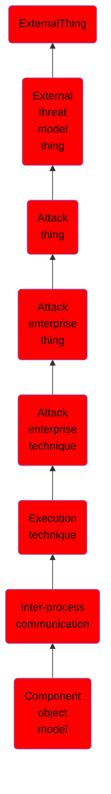

# Component object model

## Overview

### Definition
Adversaries may use the Windows Component Object Model (COM) for local code execution. COM is an inter-process communication (IPC) component of the native Windows application programming interface (API) that enables interaction between software objects, or executable code that implements one or more interfaces.(Citation: Fireeye Hunting COM June 2019) Through COM, a client object can call methods of server objects, which are typically binary Dynamic Link Libraries (DLL) or executables (EXE).(Citation: Microsoft COM) Remote COM execution is facilitated by [Remote Services](https://attack.mitre.org/techniques/T1021) such as  [Distributed Component Object Model](https://attack.mitre.org/techniques/T1021/003) (DCOM).(Citation: Fireeye Hunting COM June 2019)

### Examples
Not defined.

### Aliases
Not defined.

### URI
http://d3fend.mitre.org/ontologies/d3fend.owl#T1559.001

### Subclass Of

- [ExternalThing](/docs/ontology/reference/model/ExternalThing/ExternalThing.md)
- [External threat model thing](/docs/ontology/reference/model/ExternalThing/External%20threat%20model%20thing/External%20threat%20model%20thing.md)
- [Attack thing](/docs/ontology/reference/model/ExternalThing/External%20threat%20model%20thing/Attack%20thing/Attack%20thing.md)
- [Attack enterprise thing](/docs/ontology/reference/model/ExternalThing/External%20threat%20model%20thing/Attack%20thing/Attack%20enterprise%20thing/Attack%20enterprise%20thing.md)
- [Attack enterprise technique](/docs/ontology/reference/model/ExternalThing/External%20threat%20model%20thing/Attack%20thing/Attack%20enterprise%20thing/Attack%20enterprise%20technique/Attack%20enterprise%20technique.md)
- [Execution technique](/docs/ontology/reference/model/ExternalThing/External%20threat%20model%20thing/Attack%20thing/Attack%20enterprise%20thing/Attack%20enterprise%20technique/Execution%20technique/Execution%20technique.md)
- [Inter-process communication](/docs/ontology/reference/model/ExternalThing/External%20threat%20model%20thing/Attack%20thing/Attack%20enterprise%20thing/Attack%20enterprise%20technique/Execution%20technique/Inter-process%20communication/Inter-process%20communication.md)
- [Component object model](/docs/ontology/reference/model/ExternalThing/External%20threat%20model%20thing/Attack%20thing/Attack%20enterprise%20thing/Attack%20enterprise%20technique/Execution%20technique/Inter-process%20communication/Component%20object%20model/Component%20object%20model.md)

### Ontology Reference
- [d3fend](http://d3fend.mitre.org/ontologies/d3fend.owl#)

## Properties
