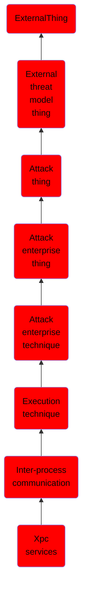

# Xpc services

## Overview

### Definition
Adversaries can provide malicious content to an XPC service daemon for local code execution. macOS uses XPC services for basic inter-process communication between various processes, such as between the XPC Service daemon and third-party application privileged helper tools. Applications can send messages to the XPC Service daemon, which runs as root, using the low-level XPC Service <code>C API</code> or the high level <code>NSXPCConnection API</code> in order to handle tasks that require elevated privileges (such as network connections). Applications are responsible for providing the protocol definition which serves as a blueprint of the XPC services. Developers typically use XPC Services to provide applications stability and privilege separation between the application client and the daemon.(Citation: creatingXPCservices)(Citation: Designing Daemons Apple Dev)

### Examples
Not defined.

### Aliases
Not defined.

### URI
http://d3fend.mitre.org/ontologies/d3fend.owl#T1559.003

### Subclass Of

- [ExternalThing](/docs/ontology/reference/model/ExternalThing/ExternalThing.md)
- [External threat model thing](/docs/ontology/reference/model/ExternalThing/External%20threat%20model%20thing/External%20threat%20model%20thing.md)
- [Attack thing](/docs/ontology/reference/model/ExternalThing/External%20threat%20model%20thing/Attack%20thing/Attack%20thing.md)
- [Attack enterprise thing](/docs/ontology/reference/model/ExternalThing/External%20threat%20model%20thing/Attack%20thing/Attack%20enterprise%20thing/Attack%20enterprise%20thing.md)
- [Attack enterprise technique](/docs/ontology/reference/model/ExternalThing/External%20threat%20model%20thing/Attack%20thing/Attack%20enterprise%20thing/Attack%20enterprise%20technique/Attack%20enterprise%20technique.md)
- [Execution technique](/docs/ontology/reference/model/ExternalThing/External%20threat%20model%20thing/Attack%20thing/Attack%20enterprise%20thing/Attack%20enterprise%20technique/Execution%20technique/Execution%20technique.md)
- [Inter-process communication](/docs/ontology/reference/model/ExternalThing/External%20threat%20model%20thing/Attack%20thing/Attack%20enterprise%20thing/Attack%20enterprise%20technique/Execution%20technique/Inter-process%20communication/Inter-process%20communication.md)
- [Xpc services](/docs/ontology/reference/model/ExternalThing/External%20threat%20model%20thing/Attack%20thing/Attack%20enterprise%20thing/Attack%20enterprise%20technique/Execution%20technique/Inter-process%20communication/Xpc%20services/Xpc%20services.md)

### Ontology Reference
- [d3fend](http://d3fend.mitre.org/ontologies/d3fend.owl#)

## Properties
