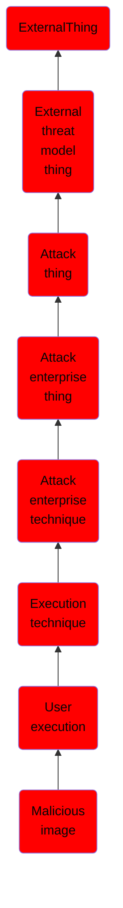

# Malicious image

## Overview

### Definition
Adversaries may rely on a user running a malicious image to facilitate execution. Amazon Web Services (AWS) Amazon Machine Images (AMIs), Google Cloud Platform (GCP) Images, and Azure Images as well as popular container runtimes such as Docker can be backdoored. Backdoored images may be uploaded to a public repository via [Upload Malware](https://attack.mitre.org/techniques/T1608/001), and users may then download and deploy an instance or container from the image without realizing the image is malicious, thus bypassing techniques that specifically achieve Initial Access. This can lead to the execution of malicious code, such as code that executes cryptocurrency mining, in the instance or container.(Citation: Summit Route Malicious AMIs)

### Examples
Not defined.

### Aliases
Not defined.

### URI
http://d3fend.mitre.org/ontologies/d3fend.owl#T1204.003

### Subclass Of

- [ExternalThing](/docs/ontology/reference/model/ExternalThing/ExternalThing.md)
- [External threat model thing](/docs/ontology/reference/model/ExternalThing/External%20threat%20model%20thing/External%20threat%20model%20thing.md)
- [Attack thing](/docs/ontology/reference/model/ExternalThing/External%20threat%20model%20thing/Attack%20thing/Attack%20thing.md)
- [Attack enterprise thing](/docs/ontology/reference/model/ExternalThing/External%20threat%20model%20thing/Attack%20thing/Attack%20enterprise%20thing/Attack%20enterprise%20thing.md)
- [Attack enterprise technique](/docs/ontology/reference/model/ExternalThing/External%20threat%20model%20thing/Attack%20thing/Attack%20enterprise%20thing/Attack%20enterprise%20technique/Attack%20enterprise%20technique.md)
- [Execution technique](/docs/ontology/reference/model/ExternalThing/External%20threat%20model%20thing/Attack%20thing/Attack%20enterprise%20thing/Attack%20enterprise%20technique/Execution%20technique/Execution%20technique.md)
- [User execution](/docs/ontology/reference/model/ExternalThing/External%20threat%20model%20thing/Attack%20thing/Attack%20enterprise%20thing/Attack%20enterprise%20technique/Execution%20technique/User%20execution/User%20execution.md)
- [Malicious image](/docs/ontology/reference/model/ExternalThing/External%20threat%20model%20thing/Attack%20thing/Attack%20enterprise%20thing/Attack%20enterprise%20technique/Execution%20technique/User%20execution/Malicious%20image/Malicious%20image.md)

### Ontology Reference
- [d3fend](http://d3fend.mitre.org/ontologies/d3fend.owl#)

## Properties
