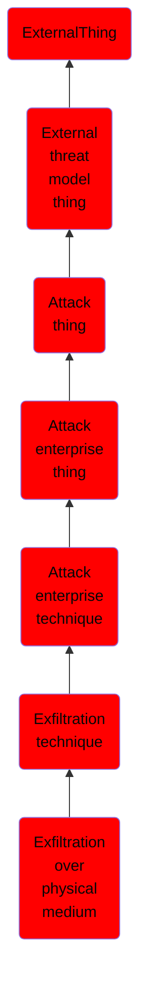

# Exfiltration over physical medium

## Overview

### Definition
Adversaries may attempt to exfiltrate data via a physical medium, such as a removable drive. In certain circumstances, such as an air-gapped network compromise, exfiltration could occur via a physical medium or device introduced by a user. Such media could be an external hard drive, USB drive, cellular phone, MP3 player, or other removable storage and processing device. The physical medium or device could be used as the final exfiltration point or to hop between otherwise disconnected systems.

### Examples
Not defined.

### Aliases
Not defined.

### URI
http://d3fend.mitre.org/ontologies/d3fend.owl#T1052

### Subclass Of

- [ExternalThing](/docs/ontology/reference/model/ExternalThing/ExternalThing.md)
- [External threat model thing](/docs/ontology/reference/model/ExternalThing/External%20threat%20model%20thing/External%20threat%20model%20thing.md)
- [Attack thing](/docs/ontology/reference/model/ExternalThing/External%20threat%20model%20thing/Attack%20thing/Attack%20thing.md)
- [Attack enterprise thing](/docs/ontology/reference/model/ExternalThing/External%20threat%20model%20thing/Attack%20thing/Attack%20enterprise%20thing/Attack%20enterprise%20thing.md)
- [Attack enterprise technique](/docs/ontology/reference/model/ExternalThing/External%20threat%20model%20thing/Attack%20thing/Attack%20enterprise%20thing/Attack%20enterprise%20technique/Attack%20enterprise%20technique.md)
- [Exfiltration technique](/docs/ontology/reference/model/ExternalThing/External%20threat%20model%20thing/Attack%20thing/Attack%20enterprise%20thing/Attack%20enterprise%20technique/Exfiltration%20technique/Exfiltration%20technique.md)
- [Exfiltration over physical medium](/docs/ontology/reference/model/ExternalThing/External%20threat%20model%20thing/Attack%20thing/Attack%20enterprise%20thing/Attack%20enterprise%20technique/Exfiltration%20technique/Exfiltration%20over%20physical%20medium/Exfiltration%20over%20physical%20medium.md)

### Ontology Reference
- [d3fend](http://d3fend.mitre.org/ontologies/d3fend.owl#)

## Properties
