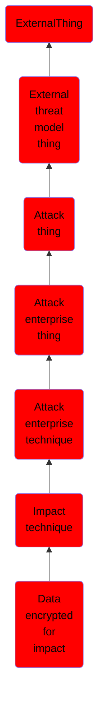

# Data encrypted for impact

## Overview

### Definition
Adversaries may encrypt data on target systems or on large numbers of systems in a network to interrupt availability to system and network resources. They can attempt to render stored data inaccessible by encrypting files or data on local and remote drives and withholding access to a decryption key. This may be done in order to extract monetary compensation from a victim in exchange for decryption or a decryption key (ransomware) or to render data permanently inaccessible in cases where the key is not saved or transmitted.(Citation: US-CERT Ransomware 2016)(Citation: FireEye WannaCry 2017)(Citation: US-CERT NotPetya 2017)(Citation: US-CERT SamSam 2018)

### Examples
Not defined.

### Aliases
Not defined.

### URI
http://d3fend.mitre.org/ontologies/d3fend.owl#T1486

### Subclass Of

- [ExternalThing](/docs/ontology/reference/model/ExternalThing/ExternalThing.md)
- [External threat model thing](/docs/ontology/reference/model/ExternalThing/External%20threat%20model%20thing/External%20threat%20model%20thing.md)
- [Attack thing](/docs/ontology/reference/model/ExternalThing/External%20threat%20model%20thing/Attack%20thing/Attack%20thing.md)
- [Attack enterprise thing](/docs/ontology/reference/model/ExternalThing/External%20threat%20model%20thing/Attack%20thing/Attack%20enterprise%20thing/Attack%20enterprise%20thing.md)
- [Attack enterprise technique](/docs/ontology/reference/model/ExternalThing/External%20threat%20model%20thing/Attack%20thing/Attack%20enterprise%20thing/Attack%20enterprise%20technique/Attack%20enterprise%20technique.md)
- [Impact technique](/docs/ontology/reference/model/ExternalThing/External%20threat%20model%20thing/Attack%20thing/Attack%20enterprise%20thing/Attack%20enterprise%20technique/Impact%20technique/Impact%20technique.md)
- [Data encrypted for impact](/docs/ontology/reference/model/ExternalThing/External%20threat%20model%20thing/Attack%20thing/Attack%20enterprise%20thing/Attack%20enterprise%20technique/Impact%20technique/Data%20encrypted%20for%20impact/Data%20encrypted%20for%20impact.md)

### Ontology Reference
- [d3fend](http://d3fend.mitre.org/ontologies/d3fend.owl#)

## Properties
