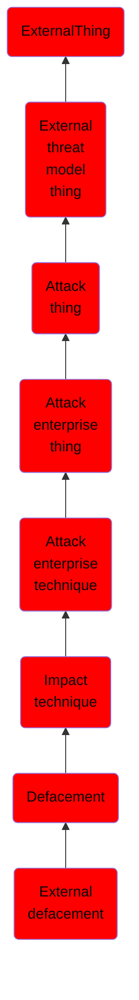

# External defacement

## Overview

### Definition
An adversary may deface systems external to an organization in an attempt to deliver messaging, intimidate, or otherwise mislead an organization or users. [External Defacement](https://attack.mitre.org/techniques/T1491/002) may ultimately cause users to distrust the systems and to question/discredit the system’s integrity. Externally-facing websites are a common victim of defacement; often targeted by adversary and hacktivist groups in order to push a political message or spread propaganda.(Citation: FireEye Cyber Threats to Media Industries)(Citation: Kevin Mandia Statement to US Senate Committee on Intelligence)(Citation: Anonymous Hackers Deface Russian Govt Site) [External Defacement](https://attack.mitre.org/techniques/T1491/002) may be used as a catalyst to trigger events, or as a response to actions taken by an organization or government. Similarly, website defacement may also be used as setup, or a precursor, for future attacks such as [Drive-by Compromise](https://attack.mitre.org/techniques/T1189).(Citation: Trend Micro Deep Dive Into Defacement)

### Examples
Not defined.

### Aliases
Not defined.

### URI
http://d3fend.mitre.org/ontologies/d3fend.owl#T1491.002

### Subclass Of

- [ExternalThing](/docs/ontology/reference/model/ExternalThing/ExternalThing.md)
- [External threat model thing](/docs/ontology/reference/model/ExternalThing/External%20threat%20model%20thing/External%20threat%20model%20thing.md)
- [Attack thing](/docs/ontology/reference/model/ExternalThing/External%20threat%20model%20thing/Attack%20thing/Attack%20thing.md)
- [Attack enterprise thing](/docs/ontology/reference/model/ExternalThing/External%20threat%20model%20thing/Attack%20thing/Attack%20enterprise%20thing/Attack%20enterprise%20thing.md)
- [Attack enterprise technique](/docs/ontology/reference/model/ExternalThing/External%20threat%20model%20thing/Attack%20thing/Attack%20enterprise%20thing/Attack%20enterprise%20technique/Attack%20enterprise%20technique.md)
- [Impact technique](/docs/ontology/reference/model/ExternalThing/External%20threat%20model%20thing/Attack%20thing/Attack%20enterprise%20thing/Attack%20enterprise%20technique/Impact%20technique/Impact%20technique.md)
- [Defacement](/docs/ontology/reference/model/ExternalThing/External%20threat%20model%20thing/Attack%20thing/Attack%20enterprise%20thing/Attack%20enterprise%20technique/Impact%20technique/Defacement/Defacement.md)
- [External defacement](/docs/ontology/reference/model/ExternalThing/External%20threat%20model%20thing/Attack%20thing/Attack%20enterprise%20thing/Attack%20enterprise%20technique/Impact%20technique/Defacement/External%20defacement/External%20defacement.md)

### Ontology Reference
- [d3fend](http://d3fend.mitre.org/ontologies/d3fend.owl#)

## Properties
