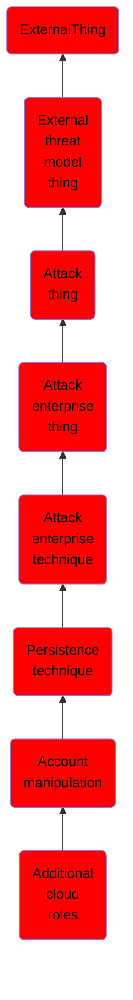

# Additional cloud roles

## Overview

### Definition
An adversary may add additional roles or permissions to an adversary-controlled cloud account to maintain persistent access to a tenant. For example, adversaries may update IAM policies in cloud-based environments or add a new global administrator in Office 365 environments.(Citation: AWS IAM Policies and Permissions)(Citation: Google Cloud IAM Policies)(Citation: Microsoft Support O365 Add Another Admin, October 2019)(Citation: Microsoft O365 Admin Roles) With sufficient permissions, a compromised account can gain almost unlimited access to data and settings (including the ability to reset the passwords of other admins).(Citation: Expel AWS Attacker)

### Examples
Not defined.

### Aliases
Not defined.

### URI
http://d3fend.mitre.org/ontologies/d3fend.owl#T1098.003

### Subclass Of

- [ExternalThing](/docs/ontology/reference/model/ExternalThing/ExternalThing.md)
- [External threat model thing](/docs/ontology/reference/model/ExternalThing/External%20threat%20model%20thing/External%20threat%20model%20thing.md)
- [Attack thing](/docs/ontology/reference/model/ExternalThing/External%20threat%20model%20thing/Attack%20thing/Attack%20thing.md)
- [Attack enterprise thing](/docs/ontology/reference/model/ExternalThing/External%20threat%20model%20thing/Attack%20thing/Attack%20enterprise%20thing/Attack%20enterprise%20thing.md)
- [Attack enterprise technique](/docs/ontology/reference/model/ExternalThing/External%20threat%20model%20thing/Attack%20thing/Attack%20enterprise%20thing/Attack%20enterprise%20technique/Attack%20enterprise%20technique.md)
- [Persistence technique](/docs/ontology/reference/model/ExternalThing/External%20threat%20model%20thing/Attack%20thing/Attack%20enterprise%20thing/Attack%20enterprise%20technique/Persistence%20technique/Persistence%20technique.md)
- [Account manipulation](/docs/ontology/reference/model/ExternalThing/External%20threat%20model%20thing/Attack%20thing/Attack%20enterprise%20thing/Attack%20enterprise%20technique/Persistence%20technique/Account%20manipulation/Account%20manipulation.md)
- [Additional cloud roles](/docs/ontology/reference/model/ExternalThing/External%20threat%20model%20thing/Attack%20thing/Attack%20enterprise%20thing/Attack%20enterprise%20technique/Persistence%20technique/Account%20manipulation/Additional%20cloud%20roles/Additional%20cloud%20roles.md)

### Ontology Reference
- [d3fend](http://d3fend.mitre.org/ontologies/d3fend.owl#)

## Properties
