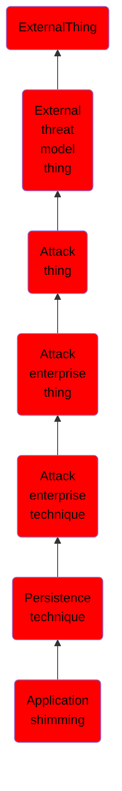

# Application shimming

## Overview

### Definition
The Microsoft Windows Application Compatibility Infrastructure/Framework (Application Shim) was created to allow for backward compatibility of software as the operating system codebase changes over time. For example, the application shimming feature allows developers to apply fixes to applications (without rewriting code) that were created for Windows XP so that it will work with Windows 10. (Citation: Elastic Process Injection July 2017) Within the framework, shims are created to act as a buffer between the program (or more specifically, the Import Address Table) and the Windows OS. When a program is executed, the shim cache is referenced to determine if the program requires the use of the shim database (.sdb). If so, the shim database uses [Hooking](https://attack.mitre.org/techniques/T1179) to redirect the code as necessary in order to communicate with the OS.

### Examples
Not defined.

### Aliases
Not defined.

### URI
http://d3fend.mitre.org/ontologies/d3fend.owl#T1138

### Subclass Of

- [ExternalThing](/docs/ontology/reference/model/ExternalThing/ExternalThing.md)
- [External threat model thing](/docs/ontology/reference/model/ExternalThing/External%20threat%20model%20thing/External%20threat%20model%20thing.md)
- [Attack thing](/docs/ontology/reference/model/ExternalThing/External%20threat%20model%20thing/Attack%20thing/Attack%20thing.md)
- [Attack enterprise thing](/docs/ontology/reference/model/ExternalThing/External%20threat%20model%20thing/Attack%20thing/Attack%20enterprise%20thing/Attack%20enterprise%20thing.md)
- [Attack enterprise technique](/docs/ontology/reference/model/ExternalThing/External%20threat%20model%20thing/Attack%20thing/Attack%20enterprise%20thing/Attack%20enterprise%20technique/Attack%20enterprise%20technique.md)
- [Persistence technique](/docs/ontology/reference/model/ExternalThing/External%20threat%20model%20thing/Attack%20thing/Attack%20enterprise%20thing/Attack%20enterprise%20technique/Persistence%20technique/Persistence%20technique.md)
- [Application shimming](/docs/ontology/reference/model/ExternalThing/External%20threat%20model%20thing/Attack%20thing/Attack%20enterprise%20thing/Attack%20enterprise%20technique/Persistence%20technique/Application%20shimming/Application%20shimming.md)

### Ontology Reference
- [d3fend](http://d3fend.mitre.org/ontologies/d3fend.owl#)

## Properties
