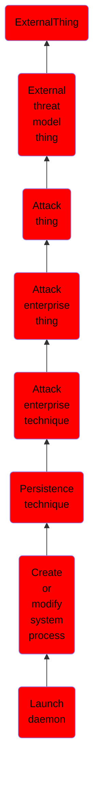

# Launch daemon

## Overview

### Definition
Adversaries may create or modify Launch Daemons to execute malicious payloads as part of persistence. Launch Daemons are plist files used to interact with Launchd, the service management framework used by macOS. Launch Daemons require elevated privileges to install, are executed for every user on a system prior to login, and run in the background without the need for user interaction. During the macOS initialization startup, the launchd process loads the parameters for launch-on-demand system-level daemons from plist files found in <code>/System/Library/LaunchDaemons/</code> and <code>/Library/LaunchDaemons/</code>. Required Launch Daemons parameters include a <code>Label</code> to identify the task, <code>Program</code> to provide a path to the executable, and <code>RunAtLoad</code> to specify when the task is run. Launch Daemons are often used to provide access to shared resources, updates to software, or conduct automation tasks.(Citation: AppleDocs Launch Agent Daemons)(Citation: Methods of Mac Malware Persistence)(Citation: launchd Keywords for plists)

### Examples
Not defined.

### Aliases
Not defined.

### URI
http://d3fend.mitre.org/ontologies/d3fend.owl#T1543.004

### Subclass Of

- [ExternalThing](/docs/ontology/reference/model/ExternalThing/ExternalThing.md)
- [External threat model thing](/docs/ontology/reference/model/ExternalThing/External%20threat%20model%20thing/External%20threat%20model%20thing.md)
- [Attack thing](/docs/ontology/reference/model/ExternalThing/External%20threat%20model%20thing/Attack%20thing/Attack%20thing.md)
- [Attack enterprise thing](/docs/ontology/reference/model/ExternalThing/External%20threat%20model%20thing/Attack%20thing/Attack%20enterprise%20thing/Attack%20enterprise%20thing.md)
- [Attack enterprise technique](/docs/ontology/reference/model/ExternalThing/External%20threat%20model%20thing/Attack%20thing/Attack%20enterprise%20thing/Attack%20enterprise%20technique/Attack%20enterprise%20technique.md)
- [Persistence technique](/docs/ontology/reference/model/ExternalThing/External%20threat%20model%20thing/Attack%20thing/Attack%20enterprise%20thing/Attack%20enterprise%20technique/Persistence%20technique/Persistence%20technique.md)
- [Create or modify system process](/docs/ontology/reference/model/ExternalThing/External%20threat%20model%20thing/Attack%20thing/Attack%20enterprise%20thing/Attack%20enterprise%20technique/Persistence%20technique/Create%20or%20modify%20system%20process/Create%20or%20modify%20system%20process.md)
- [Launch daemon](/docs/ontology/reference/model/ExternalThing/External%20threat%20model%20thing/Attack%20thing/Attack%20enterprise%20thing/Attack%20enterprise%20technique/Persistence%20technique/Create%20or%20modify%20system%20process/Launch%20daemon/Launch%20daemon.md)

### Ontology Reference
- [d3fend](http://d3fend.mitre.org/ontologies/d3fend.owl#)

## Properties
