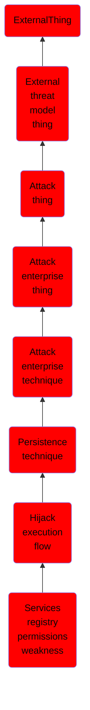

# Services registry permissions weakness

## Overview

### Definition
Adversaries may execute their own malicious payloads by hijacking the Registry entries used by services. Adversaries may use flaws in the permissions for Registry keys related to services to redirect from the originally specified executable to one that they control, in order to launch their own code when a service starts. Windows stores local service configuration information in the Registry under <code>HKLM\SYSTEM\CurrentControlSet\Services</code>. The information stored under a service's Registry keys can be manipulated to modify a service's execution parameters through tools such as the service controller, sc.exe,  [PowerShell](https://attack.mitre.org/techniques/T1059/001), or [Reg](https://attack.mitre.org/software/S0075). Access to Registry keys is controlled through access control lists and user permissions. (Citation: Registry Key Security)(Citation: malware_hides_service)

### Examples
Not defined.

### Aliases
Not defined.

### URI
http://d3fend.mitre.org/ontologies/d3fend.owl#T1574.011

### Subclass Of

- [ExternalThing](/docs/ontology/reference/model/ExternalThing/ExternalThing.md)
- [External threat model thing](/docs/ontology/reference/model/ExternalThing/External%20threat%20model%20thing/External%20threat%20model%20thing.md)
- [Attack thing](/docs/ontology/reference/model/ExternalThing/External%20threat%20model%20thing/Attack%20thing/Attack%20thing.md)
- [Attack enterprise thing](/docs/ontology/reference/model/ExternalThing/External%20threat%20model%20thing/Attack%20thing/Attack%20enterprise%20thing/Attack%20enterprise%20thing.md)
- [Attack enterprise technique](/docs/ontology/reference/model/ExternalThing/External%20threat%20model%20thing/Attack%20thing/Attack%20enterprise%20thing/Attack%20enterprise%20technique/Attack%20enterprise%20technique.md)
- [Persistence technique](/docs/ontology/reference/model/ExternalThing/External%20threat%20model%20thing/Attack%20thing/Attack%20enterprise%20thing/Attack%20enterprise%20technique/Persistence%20technique/Persistence%20technique.md)
- [Hijack execution flow](/docs/ontology/reference/model/ExternalThing/External%20threat%20model%20thing/Attack%20thing/Attack%20enterprise%20thing/Attack%20enterprise%20technique/Persistence%20technique/Hijack%20execution%20flow/Hijack%20execution%20flow.md)
- [Services registry permissions weakness](/docs/ontology/reference/model/ExternalThing/External%20threat%20model%20thing/Attack%20thing/Attack%20enterprise%20thing/Attack%20enterprise%20technique/Persistence%20technique/Hijack%20execution%20flow/Services%20registry%20permissions%20weakness/Services%20registry%20permissions%20weakness.md)

### Ontology Reference
- [d3fend](http://d3fend.mitre.org/ontologies/d3fend.owl#)

## Properties
