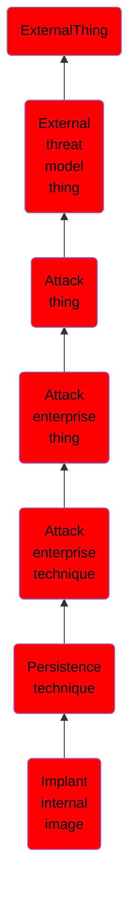

# Implant internal image

## Overview

### Definition
Adversaries may implant cloud or container images with malicious code to establish persistence after gaining access to an environment. Amazon Web Services (AWS) Amazon Machine Images (AMIs), Google Cloud Platform (GCP) Images, and Azure Images as well as popular container runtimes such as Docker can be implanted or backdoored. Unlike [Upload Malware](https://attack.mitre.org/techniques/T1608/001), this technique focuses on adversaries implanting an image in a registry within a victim’s environment. Depending on how the infrastructure is provisioned, this could provide persistent access if the infrastructure provisioning tool is instructed to always use the latest image.(Citation: Rhino Labs Cloud Image Backdoor Technique Sept 2019)

### Examples
Not defined.

### Aliases
Not defined.

### URI
http://d3fend.mitre.org/ontologies/d3fend.owl#T1525

### Subclass Of

- [ExternalThing](/docs/ontology/reference/model/ExternalThing/ExternalThing.md)
- [External threat model thing](/docs/ontology/reference/model/ExternalThing/External%20threat%20model%20thing/External%20threat%20model%20thing.md)
- [Attack thing](/docs/ontology/reference/model/ExternalThing/External%20threat%20model%20thing/Attack%20thing/Attack%20thing.md)
- [Attack enterprise thing](/docs/ontology/reference/model/ExternalThing/External%20threat%20model%20thing/Attack%20thing/Attack%20enterprise%20thing/Attack%20enterprise%20thing.md)
- [Attack enterprise technique](/docs/ontology/reference/model/ExternalThing/External%20threat%20model%20thing/Attack%20thing/Attack%20enterprise%20thing/Attack%20enterprise%20technique/Attack%20enterprise%20technique.md)
- [Persistence technique](/docs/ontology/reference/model/ExternalThing/External%20threat%20model%20thing/Attack%20thing/Attack%20enterprise%20thing/Attack%20enterprise%20technique/Persistence%20technique/Persistence%20technique.md)
- [Implant internal image](/docs/ontology/reference/model/ExternalThing/External%20threat%20model%20thing/Attack%20thing/Attack%20enterprise%20thing/Attack%20enterprise%20technique/Persistence%20technique/Implant%20internal%20image/Implant%20internal%20image.md)

### Ontology Reference
- [d3fend](http://d3fend.mitre.org/ontologies/d3fend.owl#)

## Properties
