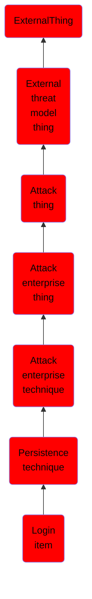

# Login item

## Overview

### Definition
MacOS provides the option to list specific applications to run when a user logs in. These applications run under the logged in user's context, and will be started every time the user logs in. Login items installed using the Service Management Framework are not visible in the System Preferences and can only be removed by the application that created them (Citation: Adding Login Items). Users have direct control over login items installed using a shared file list which are also visible in System Preferences (Citation: Adding Login Items). These login items are stored in the user's <code>~/Library/Preferences/</code> directory in a plist file called <code>com.apple.loginitems.plist</code> (Citation: Methods of Mac Malware Persistence). Some of these applications can open visible dialogs to the user, but they don’t all have to since there is an option to ‘Hide’ the window. If an adversary can register their own login item or modified an existing one, then they can use it to execute their code for a persistence mechanism each time the user logs in (Citation: Malware Persistence on OS X) (Citation: OSX.Dok Malware). The API method <code> SMLoginItemSetEnabled </code> can be used to set Login Items, but scripting languages like [AppleScript](https://attack.mitre.org/techniques/T1155) can do this as well  (Citation: Adding Login Items).

### Examples
Not defined.

### Aliases
Not defined.

### URI
http://d3fend.mitre.org/ontologies/d3fend.owl#T1162

### Subclass Of

- [ExternalThing](/docs/ontology/reference/model/ExternalThing/ExternalThing.md)
- [External threat model thing](/docs/ontology/reference/model/ExternalThing/External%20threat%20model%20thing/External%20threat%20model%20thing.md)
- [Attack thing](/docs/ontology/reference/model/ExternalThing/External%20threat%20model%20thing/Attack%20thing/Attack%20thing.md)
- [Attack enterprise thing](/docs/ontology/reference/model/ExternalThing/External%20threat%20model%20thing/Attack%20thing/Attack%20enterprise%20thing/Attack%20enterprise%20thing.md)
- [Attack enterprise technique](/docs/ontology/reference/model/ExternalThing/External%20threat%20model%20thing/Attack%20thing/Attack%20enterprise%20thing/Attack%20enterprise%20technique/Attack%20enterprise%20technique.md)
- [Persistence technique](/docs/ontology/reference/model/ExternalThing/External%20threat%20model%20thing/Attack%20thing/Attack%20enterprise%20thing/Attack%20enterprise%20technique/Persistence%20technique/Persistence%20technique.md)
- [Login item](/docs/ontology/reference/model/ExternalThing/External%20threat%20model%20thing/Attack%20thing/Attack%20enterprise%20thing/Attack%20enterprise%20technique/Persistence%20technique/Login%20item/Login%20item.md)

### Ontology Reference
- [d3fend](http://d3fend.mitre.org/ontologies/d3fend.owl#)

## Properties
