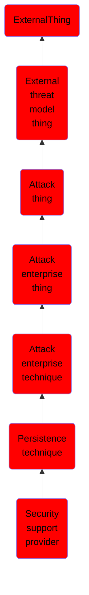

# Security support provider

## Overview

### Definition
Windows Security Support Provider (SSP) DLLs are loaded into the Local Security Authority (LSA) process at system start. Once loaded into the LSA, SSP DLLs have access to encrypted and plaintext passwords that are stored in Windows, such as any logged-on user's Domain password or smart card PINs. The SSP configuration is stored in two Registry keys: <code>HKLM\SYSTEM\CurrentControlSet\Control\Lsa\Security Packages</code> and <code>HKLM\SYSTEM\CurrentControlSet\Control\Lsa\OSConfig\Security Packages</code>. An adversary may modify these Registry keys to add new SSPs, which will be loaded the next time the system boots, or when the AddSecurityPackage Windows API function is called.

### Examples
Not defined.

### Aliases
Not defined.

### URI
http://d3fend.mitre.org/ontologies/d3fend.owl#T1101

### Subclass Of

- [ExternalThing](/docs/ontology/reference/model/ExternalThing/ExternalThing.md)
- [External threat model thing](/docs/ontology/reference/model/ExternalThing/External%20threat%20model%20thing/External%20threat%20model%20thing.md)
- [Attack thing](/docs/ontology/reference/model/ExternalThing/External%20threat%20model%20thing/Attack%20thing/Attack%20thing.md)
- [Attack enterprise thing](/docs/ontology/reference/model/ExternalThing/External%20threat%20model%20thing/Attack%20thing/Attack%20enterprise%20thing/Attack%20enterprise%20thing.md)
- [Attack enterprise technique](/docs/ontology/reference/model/ExternalThing/External%20threat%20model%20thing/Attack%20thing/Attack%20enterprise%20thing/Attack%20enterprise%20technique/Attack%20enterprise%20technique.md)
- [Persistence technique](/docs/ontology/reference/model/ExternalThing/External%20threat%20model%20thing/Attack%20thing/Attack%20enterprise%20thing/Attack%20enterprise%20technique/Persistence%20technique/Persistence%20technique.md)
- [Security support provider](/docs/ontology/reference/model/ExternalThing/External%20threat%20model%20thing/Attack%20thing/Attack%20enterprise%20thing/Attack%20enterprise%20technique/Persistence%20technique/Security%20support%20provider/Security%20support%20provider.md)

### Ontology Reference
- [d3fend](http://d3fend.mitre.org/ontologies/d3fend.owl#)

## Properties
