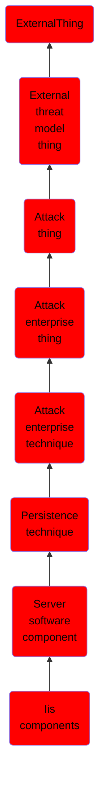

# Iis components

## Overview

### Definition
Adversaries may install malicious components that run on Internet Information Services (IIS) web servers to establish persistence. IIS provides several mechanisms to extend the functionality of the web servers. For example, Internet Server Application Programming Interface (ISAPI) extensions and filters can be installed to examine and/or modify incoming and outgoing IIS web requests. Extensions and filters are deployed as DLL files that export three functions: <code>Get{Extension/Filter}Version</code>, <code>Http{Extension/Filter}Proc</code>, and (optionally) <code>Terminate{Extension/Filter}</code>. IIS modules may also be installed to extend IIS web servers.(Citation: Microsoft ISAPI Extension Overview 2017)(Citation: Microsoft ISAPI Filter Overview 2017)(Citation: IIS Backdoor 2011)(Citation: Trustwave IIS Module 2013)

### Examples
Not defined.

### Aliases
Not defined.

### URI
http://d3fend.mitre.org/ontologies/d3fend.owl#T1505.004

### Subclass Of

- [ExternalThing](/docs/ontology/reference/model/ExternalThing/ExternalThing.md)
- [External threat model thing](/docs/ontology/reference/model/ExternalThing/External%20threat%20model%20thing/External%20threat%20model%20thing.md)
- [Attack thing](/docs/ontology/reference/model/ExternalThing/External%20threat%20model%20thing/Attack%20thing/Attack%20thing.md)
- [Attack enterprise thing](/docs/ontology/reference/model/ExternalThing/External%20threat%20model%20thing/Attack%20thing/Attack%20enterprise%20thing/Attack%20enterprise%20thing.md)
- [Attack enterprise technique](/docs/ontology/reference/model/ExternalThing/External%20threat%20model%20thing/Attack%20thing/Attack%20enterprise%20thing/Attack%20enterprise%20technique/Attack%20enterprise%20technique.md)
- [Persistence technique](/docs/ontology/reference/model/ExternalThing/External%20threat%20model%20thing/Attack%20thing/Attack%20enterprise%20thing/Attack%20enterprise%20technique/Persistence%20technique/Persistence%20technique.md)
- [Server software component](/docs/ontology/reference/model/ExternalThing/External%20threat%20model%20thing/Attack%20thing/Attack%20enterprise%20thing/Attack%20enterprise%20technique/Persistence%20technique/Server%20software%20component/Server%20software%20component.md)
- [Iis components](/docs/ontology/reference/model/ExternalThing/External%20threat%20model%20thing/Attack%20thing/Attack%20enterprise%20thing/Attack%20enterprise%20technique/Persistence%20technique/Server%20software%20component/Iis%20components/Iis%20components.md)

### Ontology Reference
- [d3fend](http://d3fend.mitre.org/ontologies/d3fend.owl#)

## Properties
