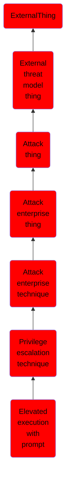

# Elevated execution with prompt

## Overview

### Definition
Adversaries may leverage the AuthorizationExecuteWithPrivileges API to escalate privileges by prompting the user for credentials.(Citation: AppleDocs AuthorizationExecuteWithPrivileges) The purpose of this API is to give application developers an easy way to perform operations with root privileges, such as for application installation or updating.  This API does not validate that the program requesting root privileges comes from a reputable source or has been maliciously modified. Although this API is deprecated, it still fully functions in the latest releases of macOS. When calling this API, the user will be prompted to enter their credentials but no checks on the origin or integrity of the program are made. The program calling the API may also load world writable files which can be modified to perform malicious behavior with elevated privileges.

### Examples
Not defined.

### Aliases
Not defined.

### URI
http://d3fend.mitre.org/ontologies/d3fend.owl#T1514

### Subclass Of

- [ExternalThing](/docs/ontology/reference/model/ExternalThing/ExternalThing.md)
- [External threat model thing](/docs/ontology/reference/model/ExternalThing/External%20threat%20model%20thing/External%20threat%20model%20thing.md)
- [Attack thing](/docs/ontology/reference/model/ExternalThing/External%20threat%20model%20thing/Attack%20thing/Attack%20thing.md)
- [Attack enterprise thing](/docs/ontology/reference/model/ExternalThing/External%20threat%20model%20thing/Attack%20thing/Attack%20enterprise%20thing/Attack%20enterprise%20thing.md)
- [Attack enterprise technique](/docs/ontology/reference/model/ExternalThing/External%20threat%20model%20thing/Attack%20thing/Attack%20enterprise%20thing/Attack%20enterprise%20technique/Attack%20enterprise%20technique.md)
- [Privilege escalation technique](/docs/ontology/reference/model/ExternalThing/External%20threat%20model%20thing/Attack%20thing/Attack%20enterprise%20thing/Attack%20enterprise%20technique/Privilege%20escalation%20technique/Privilege%20escalation%20technique.md)
- [Elevated execution with prompt](/docs/ontology/reference/model/ExternalThing/External%20threat%20model%20thing/Attack%20thing/Attack%20enterprise%20thing/Attack%20enterprise%20technique/Privilege%20escalation%20technique/Elevated%20execution%20with%20prompt/Elevated%20execution%20with%20prompt.md)

### Ontology Reference
- [d3fend](http://d3fend.mitre.org/ontologies/d3fend.owl#)

## Properties
