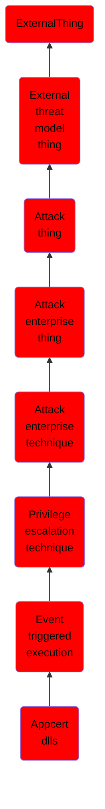

# Appcert dlls

## Overview

### Definition
Adversaries may establish persistence and/or elevate privileges by executing malicious content triggered by AppCert DLLs loaded into processes. Dynamic-link libraries (DLLs) that are specified in the <code>AppCertDLLs</code> Registry key under <code>HKEY_LOCAL_MACHINE\System\CurrentControlSet\Control\Session Manager\</code> are loaded into every process that calls the ubiquitously used application programming interface (API) functions <code>CreateProcess</code>, <code>CreateProcessAsUser</code>, <code>CreateProcessWithLoginW</code>, <code>CreateProcessWithTokenW</code>, or <code>WinExec</code>. (Citation: Elastic Process Injection July 2017)

### Examples
Not defined.

### Aliases
Not defined.

### URI
http://d3fend.mitre.org/ontologies/d3fend.owl#T1546.009

### Subclass Of

- [ExternalThing](/docs/ontology/reference/model/ExternalThing/ExternalThing.md)
- [External threat model thing](/docs/ontology/reference/model/ExternalThing/External%20threat%20model%20thing/External%20threat%20model%20thing.md)
- [Attack thing](/docs/ontology/reference/model/ExternalThing/External%20threat%20model%20thing/Attack%20thing/Attack%20thing.md)
- [Attack enterprise thing](/docs/ontology/reference/model/ExternalThing/External%20threat%20model%20thing/Attack%20thing/Attack%20enterprise%20thing/Attack%20enterprise%20thing.md)
- [Attack enterprise technique](/docs/ontology/reference/model/ExternalThing/External%20threat%20model%20thing/Attack%20thing/Attack%20enterprise%20thing/Attack%20enterprise%20technique/Attack%20enterprise%20technique.md)
- [Privilege escalation technique](/docs/ontology/reference/model/ExternalThing/External%20threat%20model%20thing/Attack%20thing/Attack%20enterprise%20thing/Attack%20enterprise%20technique/Privilege%20escalation%20technique/Privilege%20escalation%20technique.md)
- [Event triggered execution](/docs/ontology/reference/model/ExternalThing/External%20threat%20model%20thing/Attack%20thing/Attack%20enterprise%20thing/Attack%20enterprise%20technique/Privilege%20escalation%20technique/Event%20triggered%20execution/Event%20triggered%20execution.md)
- [Appcert dlls](/docs/ontology/reference/model/ExternalThing/External%20threat%20model%20thing/Attack%20thing/Attack%20enterprise%20thing/Attack%20enterprise%20technique/Privilege%20escalation%20technique/Event%20triggered%20execution/Appcert%20dlls/Appcert%20dlls.md)

### Ontology Reference
- [d3fend](http://d3fend.mitre.org/ontologies/d3fend.owl#)

## Properties
