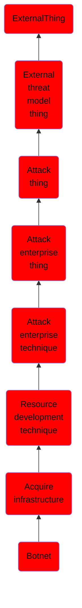

# Botnet

## Overview

### Definition
Adversaries may buy, lease, or rent a network of compromised systems that can be used during targeting. A botnet is a network of compromised systems that can be instructed to perform coordinated tasks.(Citation: Norton Botnet) Adversaries may purchase a subscription to use an existing botnet from a booter/stresser service. With a botnet at their disposal, adversaries may perform follow-on activity such as large-scale [Phishing](https://attack.mitre.org/techniques/T1566) or Distributed Denial of Service (DDoS).(Citation: Imperva DDoS for Hire)(Citation: Krebs-Anna)(Citation: Krebs-Bazaar)(Citation: Krebs-Booter)

### Examples
Not defined.

### Aliases
Not defined.

### URI
http://d3fend.mitre.org/ontologies/d3fend.owl#T1583.005

### Subclass Of

- [ExternalThing](/docs/ontology/reference/model/ExternalThing/ExternalThing.md)
- [External threat model thing](/docs/ontology/reference/model/ExternalThing/External%20threat%20model%20thing/External%20threat%20model%20thing.md)
- [Attack thing](/docs/ontology/reference/model/ExternalThing/External%20threat%20model%20thing/Attack%20thing/Attack%20thing.md)
- [Attack enterprise thing](/docs/ontology/reference/model/ExternalThing/External%20threat%20model%20thing/Attack%20thing/Attack%20enterprise%20thing/Attack%20enterprise%20thing.md)
- [Attack enterprise technique](/docs/ontology/reference/model/ExternalThing/External%20threat%20model%20thing/Attack%20thing/Attack%20enterprise%20thing/Attack%20enterprise%20technique/Attack%20enterprise%20technique.md)
- [Resource development technique](/docs/ontology/reference/model/ExternalThing/External%20threat%20model%20thing/Attack%20thing/Attack%20enterprise%20thing/Attack%20enterprise%20technique/Resource%20development%20technique/Resource%20development%20technique.md)
- [Acquire infrastructure](/docs/ontology/reference/model/ExternalThing/External%20threat%20model%20thing/Attack%20thing/Attack%20enterprise%20thing/Attack%20enterprise%20technique/Resource%20development%20technique/Acquire%20infrastructure/Acquire%20infrastructure.md)
- [Botnet](/docs/ontology/reference/model/ExternalThing/External%20threat%20model%20thing/Attack%20thing/Attack%20enterprise%20thing/Attack%20enterprise%20technique/Resource%20development%20technique/Acquire%20infrastructure/Botnet/Botnet.md)

### Ontology Reference
- [d3fend](http://d3fend.mitre.org/ontologies/d3fend.owl#)

## Properties
