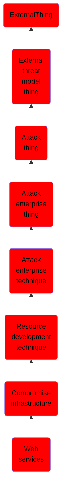

# Web services

## Overview

### Definition
Adversaries may compromise access to third-party web services that can be used during targeting. A variety of popular websites exist for legitimate users to register for web-based services, such as GitHub, Twitter, Dropbox, Google, SendGrid, etc. Adversaries may try to take ownership of a legitimate user's access to a web service and use that web service as infrastructure in support of cyber operations. Such web services can be abused during later stages of the adversary lifecycle, such as during Command and Control ([Web Service](https://attack.mitre.org/techniques/T1102)), [Exfiltration Over Web Service](https://attack.mitre.org/techniques/T1567), or [Phishing](https://attack.mitre.org/techniques/T1566).(Citation: Recorded Future Turla Infra 2020) Using common services, such as those offered by Google or Twitter, makes it easier for adversaries to hide in expected noise. By utilizing a web service, particularly when access is stolen from legitimate users, adversaries can make it difficult to physically tie back operations to them. Additionally, leveraging compromised web-based email services may allow adversaries to leverage the trust associated with legitimate domains.

### Examples
Not defined.

### Aliases
Not defined.

### URI
http://d3fend.mitre.org/ontologies/d3fend.owl#T1584.006

### Subclass Of

- [ExternalThing](/docs/ontology/reference/model/ExternalThing/ExternalThing.md)
- [External threat model thing](/docs/ontology/reference/model/ExternalThing/External%20threat%20model%20thing/External%20threat%20model%20thing.md)
- [Attack thing](/docs/ontology/reference/model/ExternalThing/External%20threat%20model%20thing/Attack%20thing/Attack%20thing.md)
- [Attack enterprise thing](/docs/ontology/reference/model/ExternalThing/External%20threat%20model%20thing/Attack%20thing/Attack%20enterprise%20thing/Attack%20enterprise%20thing.md)
- [Attack enterprise technique](/docs/ontology/reference/model/ExternalThing/External%20threat%20model%20thing/Attack%20thing/Attack%20enterprise%20thing/Attack%20enterprise%20technique/Attack%20enterprise%20technique.md)
- [Resource development technique](/docs/ontology/reference/model/ExternalThing/External%20threat%20model%20thing/Attack%20thing/Attack%20enterprise%20thing/Attack%20enterprise%20technique/Resource%20development%20technique/Resource%20development%20technique.md)
- [Compromise infrastructure](/docs/ontology/reference/model/ExternalThing/External%20threat%20model%20thing/Attack%20thing/Attack%20enterprise%20thing/Attack%20enterprise%20technique/Resource%20development%20technique/Compromise%20infrastructure/Compromise%20infrastructure.md)
- [Web services](/docs/ontology/reference/model/ExternalThing/External%20threat%20model%20thing/Attack%20thing/Attack%20enterprise%20thing/Attack%20enterprise%20technique/Resource%20development%20technique/Compromise%20infrastructure/Web%20services/Web%20services.md)

### Ontology Reference
- [d3fend](http://d3fend.mitre.org/ontologies/d3fend.owl#)

## Properties
