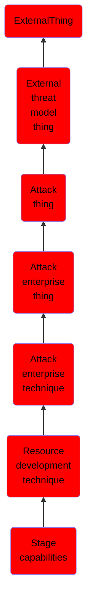

# Stage capabilities

## Overview

### Definition
Adversaries may upload, install, or otherwise set up capabilities that can be used during targeting. To support their operations, an adversary may need to take capabilities they developed ([Develop Capabilities](https://attack.mitre.org/techniques/T1587)) or obtained ([Obtain Capabilities](https://attack.mitre.org/techniques/T1588)) and stage them on infrastructure under their control. These capabilities may be staged on infrastructure that was previously purchased/rented by the adversary ([Acquire Infrastructure](https://attack.mitre.org/techniques/T1583)) or was otherwise compromised by them ([Compromise Infrastructure](https://attack.mitre.org/techniques/T1584)). Capabilities may also be staged on web services, such as GitHub or Pastebin, or on Platform-as-a-Service (PaaS) offerings that enable users to easily provision applications.(Citation: Volexity Ocean Lotus November 2020)(Citation: Dragos Heroku Watering Hole)(Citation: Malwarebytes Heroku Skimmers)(Citation: Netskope GCP Redirection)(Citation: Netskope Cloud Phishing)

### Examples
Not defined.

### Aliases
Not defined.

### URI
http://d3fend.mitre.org/ontologies/d3fend.owl#T1608

### Subclass Of

- [ExternalThing](/docs/ontology/reference/model/ExternalThing/ExternalThing.md)
- [External threat model thing](/docs/ontology/reference/model/ExternalThing/External%20threat%20model%20thing/External%20threat%20model%20thing.md)
- [Attack thing](/docs/ontology/reference/model/ExternalThing/External%20threat%20model%20thing/Attack%20thing/Attack%20thing.md)
- [Attack enterprise thing](/docs/ontology/reference/model/ExternalThing/External%20threat%20model%20thing/Attack%20thing/Attack%20enterprise%20thing/Attack%20enterprise%20thing.md)
- [Attack enterprise technique](/docs/ontology/reference/model/ExternalThing/External%20threat%20model%20thing/Attack%20thing/Attack%20enterprise%20thing/Attack%20enterprise%20technique/Attack%20enterprise%20technique.md)
- [Resource development technique](/docs/ontology/reference/model/ExternalThing/External%20threat%20model%20thing/Attack%20thing/Attack%20enterprise%20thing/Attack%20enterprise%20technique/Resource%20development%20technique/Resource%20development%20technique.md)
- [Stage capabilities](/docs/ontology/reference/model/ExternalThing/External%20threat%20model%20thing/Attack%20thing/Attack%20enterprise%20thing/Attack%20enterprise%20technique/Resource%20development%20technique/Stage%20capabilities/Stage%20capabilities.md)

### Ontology Reference
- [d3fend](http://d3fend.mitre.org/ontologies/d3fend.owl#)

## Properties
